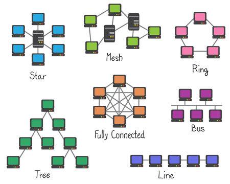
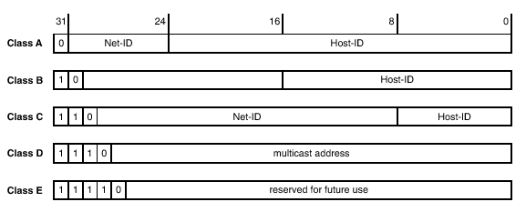
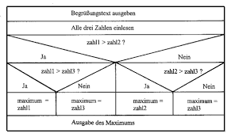
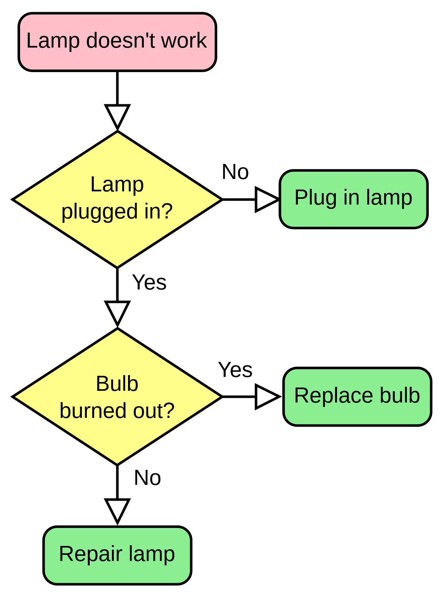

  
Quelle: [WKO Themenkatalog](https://www.wko.at/ooe/bildung-lehre/themenkatalog-informationstechnologie-v2-2023.pdf)
  
Manche Fragen/Themen wurden ausgelassen (Zu einfach, Frage die nicht einfach beantworten kann, etc.)

# A) Allgemeiner Teil - Informationstechnologie

## 1 Der Lehrbetrieb

### 1.1 Ergonomische Gestaltung eines Arbeitsplatzes

Kenntnisse über die ergonomische Einrichtung eines Bildschirmarbeitsplatzes 
- frontale Ausrichtung des Kopfes
- bequeme Haltung beim Sehen erreichen
- Bein- und Fußfreiraum, evt. Fußstütze
- höhenverstellbarer Arbeitsstuhl, kippsicher
- ausreichende Tischgröße fur Büroumgebung
  - empfohlen 160 x 80 cm

- Ergonomischer Bürostuhl (ggf. auf Nutzer anpassen)
- Höhenverstellbarer Tisch (ggf. auf Nutzer anpassen)
- ruhige Umgebung
- Beinfreiheit

Source: https://www.arbeitsinspektion.gv.at/Arbeitsstaetten-_Arbeitsplaetze/Ergonomie/Bildschirmarbeitsplatz.html#heading_Schnelleinstieg_zur_Errichtung_eines_Buero_Bildschirmarbeitsplatzes

Kenntnisse über den optimalen Aufstellungsort von Bildschirmen (Lichteinfall) 
- Beleuchtung: Vermeidung von Blendung & Reflexionen auf dem Bildschirm; indirektes Licht bevorzugt, vermeiden von direkter Sonneneinstrahlung

Kenntnisse der gesetzlichen Bestimmungen von Pausen bei Bildschirmarbeit 
- Bei 50 Minuten ununterbrochener Bildschirmarbeit eine Pause oder Tätigkeitswechsel von mindestens 10 Minuten

Kenntnisse über die ideale Höhe von Tisch/Tastatur, Bildschirmoberkante und Bildschirmabstand zum Benutzer
- Tischhöhe ca. 75cm
- Abstand zum Bildschirm:
  - ca. 50 - 70 cm
-  Bildschirm Oberkannte: 45 - 80 cm

Kenntnisse über Schutzmaßnahmen zur Vorbeugung körperlicher Schäden bei sitzender Tätigkeit, Kenntnisse über körperliche Entspannungsübungen bei sitzender Tätigkeit 
- Ergonomie am Arbeitsplatz: korrekte Höhe von Tisch und Stuhl, Bildschirm auf Augenhöhe, Unterlagen in Griffweite
- Regelmäßige Pausen: kurze Unterbrechungen alle 30-60 Minuten, Aufstehen, Strecken, kurzer Spaziergang
- Haltung: Füße flach auf dem Boden, Rücken gerade und an die Stuhllehne angelehnt, Knie im rechten Winkel
- Augenschutz: 20-20-20-Regel anwenden (alle 20 Minuten 20 Sekunden lang in 20 Fuß Entfernung schauen), Bildschirmhelligkeit und Kontrast anpassen

### 1.2 Arbeitssicherheit und Schutzmaßnahmen

Kenntnisse über Wirkungsweise und Gefahren des elektrischen Stroms
- Wirkungsweisen: Wärmewirkung, Leuchtwirkung, Magnetische Wirkung, Chemische Wirkung
- **Grundlagen elektrischer Strom**: Fluss von Elektronen durch einen Leiter.
- **Wirkungsweise**: Ermöglicht Beleuchtung, Antrieb von Motoren, Datenübertragung etc.
- **Gefahren**:
  - **Stromschlag**: Bei Kontakt mit leitenden Materialien; kann Verbrennungen, Herzrhythmusstörungen verursachen.
  - **Kurzschlüsse**: Schneller, unkontrollierter Stromfluss; kann Brände oder Geräteschäden hervorrufen.
  - **Elektrischer Bogen**: Stark leitender Luftkanal zwischen zwei Punkten; hohe Temperatur, kann Verbrennungen oder Brände verursachen.
  - **Überspannungen**: Zu hohe Spannung; schädigt elektrische Geräte und Anlagen.
- **Schutzmaßnahmen**:
  - Isolierung von Leitern.
  - Einsatz von FI-Schaltern und Sicherungen.
  - Erdung und Potentialausgleich.
  - Elektrische Geräte und Anlagen nach VDE-Vorschriften installieren und warten.

Kenntnisse über Verhalten und Maßnahmen bei einem Elektrounfall (Reihenfolge)
1. Eigene Sicherheit überprüfen: Stromquelle sicher abschalten oder sich von der Stromquelle entfernen.
2. Unfallstelle sichern: Absperrungen oder Warnhinweise anbringen, um weitere Unfälle zu vermeiden.
3. Rettungsdienst alamieren: Notruf (in den meisten Ländern 112) wählen und genaue Informationen über den Unfallort und die Situation geben.
4. Erste Hilfe leisten: Leben rettende Sofortmaßnahmen anwenden, falls geschult und ohne sich selbst in Gefahr zu bringen; betroffene Person berühren nur, wenn sichergestellt ist, dass keine Stromgefahr mehr besteht.

- Bei Hochspannung: Rettung nur durch Fachpersonal (auch aus der Ferne besteht gefährdungs Risiko)

Kenntnisse über Gefahren bei einem Brand und richtiges Verhalten beim Brandfall (Reihenfolge)
- **Erkennen von Brandgefahren:**
  - Leicht entzündliche Materialien identifizieren
  - Elektrische Geräte und Installationen überprüfen
  - Rauchen nur in erlaubten Bereichen
  
- **Vermeidung von Brandgefahren:**
  - Ordnung und Sauberkeit am Arbeitsplatz
  - Brandlasten minimieren
  - Gefahrstoffe sicher lagern
  
- **Verhalten im Brandfall:**  
  - **Alarmieren:**
    - Sofort Feuerwehr (112 in vielen Ländern) anrufen
    - Klare und präzise Informationen geben (Was brennt? Wo brennt es? Gibt es Verletzte?)

  - **Retten:**
    - Eigene Sicherheit zuerst
    - Personen aus dem Gefahrenbereich führen
    - Nicht selbst in Gefahr bringen

  - **Löschen:**
    - Nur bei kleinen Bränden und wenn sicher
    - Richtigen Feuerlöscher wählen (Wasser, Schaum, Pulver, CO2)
    - Löscharbeiten dem Fachpersonal überlassen, wenn Risiko zu hoch

  - **Evakuierung:**
    - Ruhe bewahren und vorgegebene Fluchtwege benutzen
    - Türen schließen, um Ausbreitung zu verlangsamen
    - Aufzüge meiden
  
- **Notfallpläne kennen:**
  - Evakuierungspläne
  - Standorte der Feuerlöscher
  - Sammelplatz außerhalb des Gebäudes

Kenntnisse über CO2- und Pulver-Feuerlöscher
- CO2 Löscher: -
  -  Wirkungsweise: Erstickung des Feuers durch Sauerstoffverdrängung und Kühlung
  - Vorteile: Rückstandsloses Löschen, keine Beschädigung elektrischer Anlagen
  - Nachteile: Begrenzter Einsatzbereich, Gefahr von Kälteverbrennungen, Erstickungsgefahr in kleinen Räumen
Pulver Löscher:
- Wirkungsweise: Unterbrechung der chemischen Reaktion des Feuers (Kettenabbruch)
- Vorteile: Breiter Einsatzbereich, schnelle Wirkung
- Nachteile: Pulverrückstände können Schäden verursachen, Sichtbehinderung, Wiederaufflammen möglich, nicht für Elektrische Anlagen geeignet (Serverraum)

Richtige Verwendung von Feuerlöschern bei elektrischen Anlagen
- **Strom abschalten:** Vor dem Löschen elektrischer Anlagen, wenn möglich, Stromversorgung unterbrechen.
- **Löschmittelwahl:** Zugelassene nicht-leitende Löschmittel verwenden, z.B. CO2 (Kohlendioxid), Löschpulver.
- **Vermeidung von Wasser:** Wassereinsatz vermeiden wegen hoher Leitfähigkeit und Gefahr eines elektrischen Schlages.
- **Sicherheitsabstand einhalten:** Beim Löschen empfohlenen Sicherheitsabstand zum Brandherd einhalten.
- **Kenntnis der Löschmittelkennzeichnung:** Löschmittelsymbole verstehen, um passenden Feuerlöscher zu identifizieren.
- **Löschtechnik beachten:** Von unten nach oben und von der Seite zur Mitte des Feuers löschen.
- **Gebrauchsanweisung lesen:** Anleitung des Feuerlöschers vorher kennen und im Notfall befolgen.
- **Wiederkehrende Prüfung:** Regelmäßige Überprüfung und Wartung der Feuerlöscher sicherstellen.
- **Löschmitteleignung prüfen:** Geeignetheit des Löschmittels für die spezifischen Materialien und Geräte im Brandfall beachten.
- **Schutzkleidung tragen:** Persönliche Schutzausrüstung anwenden, falls verfügbar, um vor Feuer und Löschmittel zu schützen.
  
Richtiger Umgang und korrekte Lagerung von Akkus oder Batterien
- **Temperaturbedingungen beachten**: Akkus/Batterien innerhalb der vom Hersteller empfohlenen Temperaturgrenzen lagern.
- **Trockene Lagerung**: Feuchtigkeit vermeiden, um Korrosion und Schäden zu verhindern.
- **Ladungszustand**: Ideal ist eine mittlere Ladekapazität für die Lagerung (ca. 40-60%).
- **Kontakte schützen**: Kurzschlüsse durch Abdecken der Pole verhindern.
- **Getrennte Lagerung**: Defekte Einheiten separat aufbewahren, um Schäden an anderen zu vermeiden.

Kenntnisse über umweltgerechte Entsorgung von Elektronikschrott, Toner, Akkus oder Batterien
- Verständnis für Schadstoffgehalte in Elektronik, Tonern, Akkus, und Batterien (z.B. Blei, Quecksilber, Cadmium)
- Wissen über die gesetzlichen Grundlagen für die Entsorgung (z.B. ElektroG, BatterieG)
- Kenntnis der separaten Sammlungssysteme für Wertstoffe und Gefahrstoffe (z.B. Rückgabestellen, Recyclinghöfe)

Kenntnisse über arbeitsrechtliche Gesetze (KJBG, ASchG, GlBG)
- **KJBG (Kinder- und Jugendlichen-Beschäftigungsgesetz):**
  - Regelt Arbeitszeiten und Beschäftigungsarten für Personen unter 18 Jahren.
  - Dient dem Schutz vor Überarbeitung und Gefährdung.
  - Legt fest, welche Arbeiten verboten oder eingeschränkt sind.
  - Bestimmt Pausenregelungen, Urlaubsanspruch und gesundheitliche Überwachung.

- **ASchG (ArbeitnehmerInnenschutzgesetz):**
  - Sorgt für Sicherheit, Gesundheitsschutz und Wohlbefinden der Arbeitnehmer am Arbeitsplatz.
  - Umfasst Vorschriften zur Vermeidung von Arbeitsunfällen und Berufskrankheiten.
  - Definiert Pflichten der Arbeitgeber wie Gefährdungsbeurteilung und Schutzmaßnahmen.
  - Regelungen zu Arbeitsplatzgestaltung, Arbeitsmittel und persönliche Schutzausrüstung.

- **GlBG (Gleichbehandlungsgesetz):**
  - Soll Diskriminierung aufgrund von Geschlecht, Alter, sexueller Orientierung, Religion, Weltanschauung oder ethnischer Zugehörigkeit verhindern.
  - Betrifft alle Phasen des Arbeitsverhältnisses, von der Stellenanzeige bis zur Kündigung.
  - Verbietet ungleiche Bezahlung für gleiche oder gleichwertige Arbeit.
  - Enthält Bestimmungen zu Belästigung am Arbeitsplatz und schafft Anspruch auf Schadenersatz bei Diskriminierung.
  

## 2 Kaufmännische Grundlagen

<!-- NOTE: Entfernt, da unnötig. -->

<!-- Kenntnisse über die Durchführung einer Preiskalkulation
Unter Kalkulation versteht man im Allgemeinen eine Berechnung.

- Im Rechnungswesen dient die Kalkulation
der Ermittlung der Stückkosten einer Ware, Dienstleistung oder eines Halbfabrikates (vgl. Kostenträgerstückrechnung)
- der Ermittlung der Produktionskosten einer Ware pro Periode (vgl. Kostenträgerzeitrechnung)
- der Ermittlung des Brutto- und Netto-Verkaufspreises abhängig von Vertriebskanal und Kundenrabattgruppe.

Kenntnisse über die Inhalte von Anbot, Auftragsbestätigung, Lieferschein, Rechnung
Angebot:
- exakte Bezeichnung der Dienstleistung/Produkts
- Preis und Anzahl/Dauer der Leistung
- Datum des Angebots & Gültigkeitsdatum
- Lieferzeitraum
- Zahlungsbedingungen

Auftragsbestätigung:
- Firmendaten des Auftragnehmers
- Daten Auftraggeber
- Datum
- Auftragsbestätigung in Betreff
- Datum der Auftragserteilung
- Beschreibung Umfang
- Liefertermine
- Zahlungen/Zahlungsbedingungen
- Lieferbedingungen

Lieferschein:
- Absender
- Empfänger
- Versanddatum
- Lieferdatum
- Lieferscheinnummer o. Rechnungsnummer auf den sich der Lieferschein bezieht

Rechnung:
- Name, Anschrift des Unternehmers
- Name und Anschrift des Empfängers
- Menge und handelsübliche Bezeichnung der Gegenstände
- Tag/Zeitraum der Lieferung
- Entgelt für die Lieferung/sonstige Leistung und den anzuwendenden Steuersatz, bei Steuerbefreiung oder Differenzbesteuerung einen Hinweis auf diese
- den auf das Entgelt entfallenden Steuerbetrag
- Ausstellungsdatum
- Fortlaufende Nummer
- Umsatzsteueridentifikationsnummer (UID-Nummer)

Kenntnisse über Bezahlmöglichkeiten
- Kauf auf Rechnung
- Vorkasse
- Nachnahme
- Lastschrift
- Kreditkarte
- PayPal
- Sofortüberweisung
- ApplePay/GooglePay/AmazonPayments

Kenntnisse über verkaufsbezogene rechtliche Bestimmungen

Führen von fachspezifischen Verkaufsgesprächen, Produktberatung

Kompetenz, technische Zusammenhänge beratend erklären zu können

Beratung und Erstellen kundenorientierter Softwarelösungen

Kenntnisse über richtigen Umgang bei Reklamationen

Richtiger Kundenumgang bei folgenreichen technischen Problemen
 -->
  

## 3 Fachliche Grundlagen

### 3.1 Technische Dokumentationen

Aufgabe und Strukturierung von Testläufen
- Planung mit Testplan:
  - Teststrategie (Umfang, Abdeckung, Risikoabschätzung)
  - Testdaten
  - Testorganisation
  - Testmetriken
  - Problemmanagement

Protokollieren technischer Arbeiten
- Dokumentation der durchgeführten Tätigkeiten und Arbeitsschritte
- Erfassung von verwendeten Materialien und Werkzeugen
- Aufzeichnung von Messwerten und Prüfergebnissen

<!-- Anwenden von Fachausdrücken (auch in englischer Sprache) -->

Inhalt einer technischen Dokumentation/eines technischen Protokolls
- **Zweck und Anwendungsbereich**: Beschreibt den Einsatzbereich und die Funktion des Produkts oder Systems.
- **Produktbeschreibung**: Detaillierte Darstellung der Komponenten, Materialien und Eigenschaften.
- **Technische Spezifikationen**: Genauigkeit, Maße, Toleranzen, technische Leistungsdaten.
- **Installationsanleitung**: Schrittweise Anweisungen für die sichere und korrekte Installation.

Aufbereitung einer technischen Dokumentation/eines technischen Protokolls
- Sammlung und Analyse aller relevanten Daten und Informationen
- Strukturierung und Gliederung des Inhalts nach thematischen oder chronologischen Gesichtspunkten
- Einhaltung technischer und stilistischer Vorgaben für Dokumentationen
- Einbeziehung von Diagrammen, Tabellen und Abbildungen zur Veranschaulichung

<!-- Kenntnisse über die Handhabung von Textverarbeitungssoftware/Screenshots -->

<!-- Anwendung der Schrittaufzeichnung/Step Recorder -->
<!-- NOTE: Depreceated -->

Beilagen technischer Dokumentationen (Testprotokoll, Netzwerkplan, …)
- **Testprotokoll:**
  - Dokumentiert Ergebnisse von durchgeführten Tests.
  - Enthält Datum, Testumgebung, Testfallbeschreibungen, durchgeführte Aktionen, beobachtete Ergebnisse, eventuelle Abweichungen.
  - Wichtig für Qualitätssicherung und Nachweis der Funktionsfähigkeit.

- **Netzwerkplan:**
  - Visuelle Darstellung der strukturierten Verkabelung und Geräte eines Netzwerks.
  - Zeigt Verbindungspunkte und -wege, Netzwerktopologie, IP-Adressen, Hardwarekomponenten.
  - Unabdingbar für Planung, Erweiterung, Fehleranalyse und Management der Netzwerkinfrastruktur.

- **Allgemein für Beilagen technischer Dokumentationen:**
  - Bieten ergänzende, detaillierte Informationen zum Hauptdokument.
  - Fördern Verständnis und Anwendbarkeit technischer Anweisungen oder Spezifikationen.
  - Wichtig für Einhaltung von Standards, Vorschriften und für Trainingszwecke.
  - Erleichtern Wartung, Diagnose und Störungsbehebung.

<!-- Gestaltung und Vorbereitung von Präsentationen -->
<!-- NOTE: Unimportant -->
  

### 3.2 Gesetzliche Bestimmungen/Datenschutz

Kenntnis über die aktuelle DSGVO (Datenschutzgrundverordnung)
- Europaweit geltende Verordnung zum Schutz personenbezogener Daten

Fachbetriff "Datenminimierung" im Zusammenhang mit der DSGVO
- Grundprinzip der EU-Datenschutz-Grundverordnung
- Sammlung und Verarbeitung personenbezogener Daten: so sparsam wie möglich

Fachbegriffe "betroffene Personen", Verantwortlicher, Auftragsverarbeiter
- Betroffene Person: Natürliche Personen, deren personenbezogene Daten verarbeitet werden

- Verantwortlicher: Eine natürliche oder rechtliche Person, Behörde oder andere Stelle, die allein oder gemeinsam mit anderen über die Zwecke und Mittel der Verarbeitung von personenbezogenen Daten entscheidet.

- Auftragsverarbeiter: ist eine natürliche oder juristische Person, Behörde, Einrichtung oder andere Stelle, die personenbezogene Daten im Auftrag des Verantwortlichen verarbeitet

Kenntnis über Rechte von "betroffene Personen" lt. DSGVO
- Recht auf Auskunft
- Recht auf Berichtigung
- Löschrecht (Recht auf Vergessenwerden)
- Recht auf Verarbeitungseinschränkung der Daten
- Widerspruchsrecht
- Datenübertragbarkeitsrecht -> Recht auf Datenauskunft

- Der Betroffene darf also erfahren, ob und welche personenbezogenen Daten von ihm verarbeitet werden, und entscheiden, ob, inwieweit und von wem sie verarbeitet werden.

Fachbegriff "personenbezogene und sensible Daten" lt. DSGVO
- Personenbezogene Daten: Informationen, die direkt oder indirekt einer natürlichen Person zugeordnet werden können (z.B. Name, Adresse, E-Mail, Telefonnummer).
- Sensible Daten: Spezielle Kategorie personenbezogener Daten mit höherem Schutzbedarf (z.B. Daten über Gesundheit, ethische Herkunft, politische Meinungen, religiöse Überzeugungen).

Bedeutung von Kopplungsverbot beim DSGVO
- Schützt Datensubjekte vor unangemessenem Druck, persönliche Daten preiszugeben
- Stellt sicher, dass die Einwilligung zur Datenverarbeitung freiwillig erfolgt
- Beispielsweise ist ein Angebot nicht an die Freigabe von persönlichen Daten gebunden.

Datenschutzbeauftragter lt. DSGVO und dessen Funktion
- Rolle: Überwachung und Sicherstellung der Einhaltung der Datenschutzgrundverordnung (DSGVO) sowie anderer Datenschutzvorschriften in Organisationen
- Ernennung: Notwendig für öffentliche Stellen oder Unternehmen, die umfangreich personenbezogene Daten verarbeiten, insbesondere wenn dies die Kerntätigkeit ist
- Aufgaben:
  - Beratung der Organisation und ihrer Mitarbeitenden bezüglich Datenschutzanforderungen
  - Schulung des Personals in Datenschutzangelegenheiten
  - Überwachung der Einhaltung der DSGVO, inkl. Zuweisung von Verantwortlichkeiten, Bewusstseinsschaffung und Schulungen
  - Beratung und Bewertung im Rahmen der Datenschutz-Folgenabschätzung (DSFA)
  - Zusammenarbeit mit der Aufsichtsbehörde und Funktion als Anlaufstelle für diese in allen Datenschutzfragen
- Unabhängigkeit: Muss seine Aufgaben unabhängig ausführen können; direkte Berichterstattung an die höchste Managementebene der Organisation
- Fachkunde und Berufsgeheimnis: Benötigt fundierte Kenntnisse im Datenschutzrecht und -praktiken; unterliegt der Geheimhaltungspflicht

Pflichten für Unternehmen bei bekannt gewordenen Datendiebstahl lt. DSGVO
- Benachrichtigung der zuständigen Datenschutz-Aufsichtsbehörde: innerhalb von 72 Stunden nach Kenntnisnahme des Datendiebstahls.
- Detaillierte Beschreibung des Vorfalls: Art des Datendiebstahls, voraussichtliche Anzahl und Kategorien der betroffenen Daten sowie deren Personen.

Kenntnisse über Grundbegriffe und Gültigkeitsbereich des Urheberrechtes
- **Definition**: Gesetzesmenge zum Schutz geistiger Schöpfungen in Literatur, Wissenschaft, Kunst und Software.
- **Werke**: Individuelle, originelle Schöpfungen (Texte, Musik, Bilder, Software).
- **Urheber**: Natürliche Person, die das Werk geschaffen hat.
- **Schutzdauer**: Lebenszeit des Urhebers + 70 Jahre nach Tod.
- **Rechte des Urhebers**:
  - **Verwertungsrechte**: Vervielfältigung, Verbreitung, öffentliche Wiedergabe.
  - **Persönlichkeitsrechte**: Entscheidung über Erstveröffentlichung, Anerkennung der Urheberschaft.
- **Freie Nutzung**: Zitate, Unterricht, Privatkopie (mit Einschränkungen).
- **Lizenzierung**: Erlaubnis zur Nutzung gegen Entgelt/Lizenzgebühren.
- **Urheberrechtsverletzungen**: Raubkopien, illegales Streaming, unerlaubte Verbreitung.

Kenntnisse über gesetzlicher Gewährleistungs- und Garantiebestimmungen und deren unterschiedlicher Anwendung bei Hardware- und Softwareproblemen
- **Gesetzliche Gewährleistung**:
  - Ist eine Pflicht des Verkäufers, dass das verkaufte Produkt bei Übergabe frei von Mängeln ist.
  - Dauer in der EU meist 2 Jahre ab Kaufdatum.
  - Bezieht sich auf Mängel, die bereits bei Übergabe vorhanden waren.
  - Verbraucher hat Anspruch auf kostenlose Reparatur, Ersatz, Preisminderung oder Rücktritt vom Kauf.
  
- **Garantie**:
  - Ist eine freiwillige Zusatzleistung des Herstellers oder Händlers.
  - Bedingungen und Dauer werden vom Garantiegeber bestimmt.
  - Oft als Marketinginstrument genutzt, kann über die gesetzliche Gewährleistung hinausgehen.
  - Deckt meist Reparatur oder Austausch bei Defekten ab, unabhängig vom Zeitpunkt des Entstehens.

Kenntnisse über das E-Commerce-Gesetz (ECG)
- Rechtliche Grundlage: Regelt den elektronischen Geschäftsverkehr in Österreich.
- Anwendungsbereich: Betrifft Anbieter von elektronischen Geschäfts- und Dienstleistungen.
- Impressumspflicht: Verlangt detaillierte Anbieterinformationen auf Websites.
- Haftung: Bestimmt Haftungsregeln für Inhalte und Links auf Websites.

Kenntnisse über das Telekom-Gesetz (TKG)
- Anrufe, Telefaxe und elektronische Post (z.B. E-Mails, SMS) zu Werbezwecken bzw. zu Zwecken der Direktwerbung bedürfen der vorherigen, jederzeit widerruflichen Einwilligung des Empfängers

Kenntnisse über Pflichtangaben eines Homepage-Betreibers (Impressum)
- Impressumspflicht: Gesetzliche Anforderung für Websites zur Bereitstellung bestimmter Informationen über den Betreiber.
- Ziel: Transparenz und Rechtssicherheit für Nutzer; Möglichkeit zur Kontaktaufnahme.
- Inhalt: 
  - Name und Anschrift des Betreibers (natürliche oder juristische Person).
  - Kontaktinformationen: E-Mail-Adresse, ggf. Telefonnummer.
  - Bei juristischen Personen: Vertretungsberechtigte (z.B. Geschäftsführer).
  - Handelsregister: Nummer und Ort, falls vorhanden.
  - Umsatzsteuer-Identifikationsnummer oder Wirtschafts-Identifikationsnummer, sofern vorhanden.
  - Bei bestimmten Berufsgruppen: Angaben zur zuständigen Kammer, Berufsbezeichnung und Bezug zu berufsrechtlichen Regelungen.
- Gilt für: Gewerbliche Websites, Blogs etc., die nicht ausschließlich persönlichen oder familiären Zwecken dienen.
- Sonderfälle: Für journalistisch-redaktionelle Inhalte sind zusätzlich verantwortliche Personen zu benennen.
- Wichtig: Fehlende oder unvollständige Impressumsangaben können Abmahnungen und Bußgelder nach sich ziehen.
- Prüfung: Regelmäßige Aktualisierung der Angaben im Impressum ist essentiell, um Konformität mit rechtlichen Anforderungen zu gewährleisten.

Kenntnisse über Pflichtangaben beim E-Mail-Verkehr von Unternehmen
- Gesetzliche Anforderung: Unternehmen müssen bestimmte Informationen in geschäftlichen E-Mails enthalten.
- Inhaltliche Pflichtangaben:
  - Vollständiger Name des Unternehmens
  - Rechtsform des Unternehmens
  - Sitz des Unternehmens (Adresse)
  - Registrierungsnummer (Handelsregister)
  - Umsatzsteuer-Identifikationsnummer (falls vorhanden)
  - Vertretungsberechtigte Personen (Geschäftsführung)
  - Kontaktdaten (Telefonnummer, E-Mail-Adresse)
- Zweck: Transparenz und Rechtssicherheit bei geschäftlichem E-Mail-Verkehr.
- Geltungsbereich: Für alle geschäftlichen E-Mails, unabhängig von der Versandart oder dem verwendeten Programm.

### 3.3 Informatik und Gesellschaft

Fachbegriff Big-Data
- Große Volumen: Bezieht sich auf Datensätze, die zu groß oder komplex sind, um von traditionellen Datenverarbeitungsanwendungen bewältigt zu werden.

Fachbegriff Web 2.0
- der Begriff beschreibt eine in sozio-technischer Hinsicht veränderte Nutzung des Internets, bei der dessen Möglichkeiten konsequent genutzt und weiterentwickelt werden
- Zweite Generation des Internets
- Interaktive und kollaborative Inhalte
- Dynamische Webseiten (im Gegensatz zu statischen Webseiten des Web 1.0)
- Social Media Plattformen als typische Vertreter

Fachbegriff Industrie 4.0
- Industrie 4.0 ist die Bezeichnung für Projekte zur umfassenden Digitalisierung der industriellen Produktion

Fachbegriff IoT
- Internetbasierte Vernetzung von physischen Objekten
- Ermöglicht diesen Objekten, Daten zu sammeln und auszutauschen
- Nutzung eingebetteter Systeme (Sensoren, Software)

<!-- Kenntnisse über Vor- und Nachteile bei der Nutzung von Sprachassistenten -->

Kenntnisse über e-Government, digitale Signatur und Handy-Signatur
- **e-Government**
  - Nutzung digitaler Technologien durch staatliche Institutionen
  - Bereitstellung von öffentlichen Diensten online
  - Vereinfachung der Interaktion zwischen Bürgern, Unternehmen und Verwaltung
  - Ziele: Effizienzsteigerung, Kostensenkung, bessere Zugänglichkeit

- **Digitale Signatur**
  - Elektronische Form der Unterschrift
  - Einsatz von kryptographischen Verfahren zur Identitätsüberprüfung
  - Sicherstellung der Unverfälschtheit und Urheberschaft von digitalen Dokumenten
  - Gleichwertig zur handschriftlichen Unterschrift (unter bestimmten gesetzlichen Voraussetzungen)

- **Handy-Signatur**
  - Spezifische Form der digitalen Signatur, basierend auf dem Einsatz eines Mobiltelefons
  - Nutzeridentifikation über eine mobile Anwendung oder ein SMS-Code-Verfahren
  - Ermöglicht rechtsgültige elektronische Unterzeichnung von Dokumenten und Transaktionen
  - Einsatz für e-Government Dienste, Online-Abwicklungen und Bestätigungen

<!-- Schutzmöglichkeiten von Cookie-Tracking und Cookieless-Tracking -->

Kenntnisse über die Gefahr von Identitätsdiebstahl
- Identitätsdiebstahl ist ein Verbrechen, bei dem ein Betrüger versucht, sich als jemand anderes auszugeben. Dazu verwendet er gestohlene Informationen wie Geburtsdaten oder Kreditkartennummern.

Fachbegriff Netzneutralität
- Gleichbehandlung aller Datenpakete
- Unabhängig von Quelle, Inhalt oder Ziel
- Keine Bevorzugung oder Benachteiligung von Diensten

Kenntnisse über Vor- und Nachteile bei Nutzung von biometrischen Daten
- Vorteile:
  - Hohe Sicherheit: Schwierig zu fälschen, da sie eindeutig einer Person zugeordnet sind.
  - Komfort: Schnelle und einfache Identifikation oder Authentifizierung, oft kontaktlos möglich.
  - Effizienz: Schneller Zugriff auf Systeme oder Räumlichkeiten, Reduzierung von Wartezeiten.
  - Einzigartigkeit: Jedes biometrische Merkmal ist individuell, macht Identitätsdiebstahl schwieriger.

- Nachteile:
  - Datenschutzbedenken: Sensible Persönlichkeitsmerkmale werden digital erfasst und gespeichert.
  - Fehleranfälligkeit: Falsch-positiv- oder Falsch-negativ-Raten können Sicherheit beeinträchtigen.
  - Anfälligkeit für Betrug: Hochentwickelte Fälschungen (Deepfakes, Nachbildungen) können Systeme täuschen.
  - Unumkehrbarkeit: Bei Datenlecks oder Diebstahl können biometrische Daten nicht wie Passwörter geändert werden.

<!-- Inhalte von Unternehmensrichtlinien für Nutzung von sozialen Netzwerken -->

### 3.4 Datenaustausch

Möglichkeiten des Datenaustausches
- Elektronische Form
- klassisch per Papier
- Sprache

- **E-Mail**: Versand von Dateien als Anhang.
- **Cloud-Speicher**: Hochladen und Teilen von Dateien über Internet-Dienste wie Google Drive oder Dropbox.
- **USB-Stick**: Tragbares Speichermedium für physische Übertragung zwischen Computern.
- **Bluetooth**: Drahtlose Technik für den Datenaustausch über kurze Distanzen zwischen Geräten.
- **NFC (Near Field Communication)**: Ermöglicht den Austausch von Daten durch einfaches Annähern von Geräten über sehr kurze Distanzen.
- **FTP (File Transfer Protocol)**: Protokoll zur Übertragung von Dateien zwischen Computern über ein Netzwerk.
- **Social Media Plattformen**: Teilen von Informationen, Bildern oder Videos über Plattformen wie Facebook, Instagram oder Twitter.
- **Instant Messaging Dienste**: Direkter Nachrichten- und Dateiaustausch über Apps wie WhatsApp oder Telegram.
- **Peer-to-Peer (P2P) Netzwerke**: Direkter Austausch von Dateien zwischen Nutzern ohne zentrale Vermittlungsstelle.
- **Datenaustauschformate**: Spezifikationen wie XML oder JSON ermöglichen den strukturierten Austausch von Daten zwischen unterschiedlichen Systemen.

Datenübertragung, Bandbreite
- Die Datenübertragung beschreibt die Methode wie Daten von einem Sender zum Empfänger transportiert werden (Analog, Digital).
- Die Bandbreite gibt an welche Menge an Daten in welchem Zeitraum über ein gewisses Medium übertragen wird.
  - Datenübertragungsrate - Theoretisch Mögliche (Theoretisch 1Gbit möglich)
  - Datendurchsatz - Effektiv Vorhanden (Es geht nur 700mbit)
  - Bandbreite -> Frequenzen

Sichere Verbindungen, Verschlüsselung
- Verschlüsselung ist die von einem Schlüssel abhängige Umwandlung von „Klartext" genannten Daten in einen „Geheimtext", so dass der Klartext aus dem Geheimtext nur unter Verwendung eines geheimen Schlüssels wiedergewonnen werden kann.
- **Authentifizierung**: Sicherstellung, dass die Kommunikationspartner echt sind, oft durch Zertifikate realisiert.
- **Anwendungsbereiche**: Online-Banking, E-Mail-Verschlüsselung, sichere Webseitenzugriffe (HTTPS), VPNs.

- **Integrität**: Überprüfung, dass Daten während der Übertragung nicht verändert wurden, z.B. mittels Hash-Funktionen.

- **Protokolle**: TLS (Transport Layer Security) und SSL (Secure Sockets Layer) für sichere Internetverbindungen.
  
Fachbegriff VPN
- Virtual Private Network
- Ermöglicht sicheren Datenverkehr über öffentliches Internet
- Nutzt Verschlüsselung zur Datenschutzgewährleistung

Fachbegriff Intranet
- Privates Netzwerk innerhalb einer Organisation
- Zugriff nur für Mitglieder/Mitarbeiter der Organisation

Kenntnisse über Schnittstellen, Übertragungstechnologie

- Definition und Funktion: Schnittstellen und Übertragungstechnologien sind die Mittel und Methoden, die für die Kommunikation zwischen verschiedenen Hardwarekomponenten, Systemen oder Netzwerken verwendet werden.

- Arten von Schnittstellen: 
  - Physikalische (Hardware-Schnittstellen): USB, HDMI, Ethernet
  - Virtuelle/Software-Schnittstellen: APIs (Application Programming Interfaces)

- Übertragungsmedien: 
  - Kabelgebunden: Kupferkabel (z.B. Twisted-Pair), Glasfaserkabel
  - Kabellos: WLAN (Wi-Fi), Bluetooth, Infrarot

- Protokolle:
  - Bestimmen Regeln für die Datenübertragung (z.B. TCP/IP für Internetkommunikation, FTP für Dateiübertragungen)

- Datenrate: 
  - Maßeinheit für die Geschwindigkeit der Datenübertragung, angegeben in Bit pro Sekunde (bps), Kbps, Mbps, Gbps

- Anwendungsgebiete:
  - Datenaustausch zwischen Geräten (z.B. PC und Drucker)
  - Netzwerkkommunikation (z.B. zwischen Servern und Clients)
  - Fernsteuerung und Monitoring von Systemen über das Internet

- Datenschnittstelle - Daten als Schnittstellen zwischen Programmen. Maschinenschnittstelle - zwischen physischen Systemen. Hardwareschnittstelle - zwischen physischen Systemen der Computertechnik.

- Kupfer (max. länge 100m), Glasfaser und Wireless (Radiowellen)

Vor- und Nachteile Hosting-/Cloud-Lösungen

Vorteile:
- Flexibilität: Schnelle Anpassung der Ressourcen an den Bedarf.
- Kosteneffizienz: Zahlung nur für genutzte Ressourcen, keine Investitionen in Hardware.
- Skalierbarkeit: Einfache Skalierung der IT-Ressourcen nach oben oder unten.
- Verfügbarkeit: Hohe Verfügbarkeit und Zugriff von überall möglich.
- Wartung: Wartung und Updates werden vom Anbieter durchgeführt.
- Backup und Disaster Recovery: Meist integrierte Lösungen für Datensicherung und Wiederherstellung.

Nachteile:
- Abhängigkeit vom Anbieter: Spezifische Risiken durch Bindung und dessen Geschäftsfähigkeit.
- Sicherheit und Datenschutz: Bedenken bezüglich der Sicherheit der Daten, abhängig von den Maßnahmen des Anbieters und der Lokation der Daten.
- Latenzzeiten: Möglicherweise längere Antwortzeiten durch Datenübertragung über das Internet.
- Kosten bei hoher Nutzung: Bei hohem Datenverkehr oder Speicherbedarf können die Kosten ansteigen.
- Einschränkungen der Anpassbarkeit: Mögliche Einschränkung bei der Personalisierung von Anwendungen oder Diensten.

<!-- Voraussetzungen zur Nutzung von Clouddiensten -->

## 4 Grundlagen in der Informationstechnik

Fachbegriffe Hardware, Software
- **Hardware**: Physikalische Komponenten eines Computersystems (z.B. CPU, RAM, Festplatten).
- **Software**: Programme und Betriebssysteme, die auf Hardware laufen und diese steuern (Anwendungssoftware, Systemsoftware).

Fachbegriffe Eingabe(gerät), Ausgabe(gerät) und deren Zusammenhang (EVA-Prinzip)
- **Eingabegerät**:
  - Geräte oder Komponenten, die Daten oder Befehle in eine für den Computer verständliche Form umwandeln.
  - Beispiele: Tastatur, Maus, Scanner, Mikrofon.
  - Funktion: Benutzereingaben aufnehmen und an den Rechner weiterleiten.

- **Ausgabegerät**:
  - Geräte, die verarbeitete Daten vom Computer in eine für den Benutzer verständliche oder nutzbare Form umsetzen.
  - Beispiele: Monitor, Drucker, Lautsprecher.
  - Funktion: Verarbeitete Informationen darstellen oder ausgeben.

- **EVA-Prinzip**:
  - Steht für Eingabe, Verarbeitung, Ausgabe.
  - Beschreibt die grundlegende Funktionsweise von Computern.
  - Prozess: Daten werden über Eingabegeräte eingegeben, im Rechner verarbeitet und über Ausgabegeräte ausgegeben.
  - Kernprinzip der Informationsverarbeitung.

Unterscheidung zwischen Analog- und Digitaltechnik
- Analog: Stufenlos, Bsp: Tacho mit Zeiger (Physikalische Werte)
- Digital: Stufig, je nach genauigkeit, in Werte mit Stufen,
  - Binär: 1 oder 0, ein oder aus

Kenntnis der Logik-Schaltungen (AND, OR, XOR, NOT) und deren Wahrheitstabellen
- NOT:
  - ist der Schalter nicht geschlossen, fließt Strom durch den Stromkreis.

- AND:
  - Mindestens zwei Schalter/Taster benötigt.
  Wenn diese in Reihe geschalten sind kann nur Strom fließen, wenn beide gleichzeitig geschlossen sind.

- OR:
  - Mindestens zwei Schalter/Taster benötigt. Wenn diese Parallel geschalten sind kann Strom fließen, wenn einer der beiden oder beide Schalter gleichzeitig geschlossen sind.

- XOR:
  - Kann durch zwei Wechselschalter mit umgekehrter Anschlussbelegung realisiert werden. Ein Stromfluss im Hauptstromkreis ist auf diese Weise nur dann möglich, wenn entweder der eine oder der andere Schalter geschlossen ist. Sind beide Schalter geschlossen oder geöffnet, kann kein Strom fließen.

Kenntnis des Zeichensatzes ASCII
- ASCII = American Standard Code for Information Interchange

- 7 Bit Zeichenkodierung, dient als Grundlage für spätere, auf mehr Bits basierende Zeichenkodierungen.
Bis heute in Verwendung. Besteht aus 128 Zeichen (Buchstaben, Ziffern, Satzzeichen, etc.) wovon 33 Zeichen nicht druckbar sind (Zeilenvorschub, Tabulatorzeichen, etc.)

Kenntnis der Einheiten Bit, Byte
- Ein Bit ist die kleinste Einheit in der Informatik. Es sind nur zwei Zustände möglich. 1 oder 0.
- 8 Bit bilden ein Byte.

Kenntnis der Begriffe Kilobyte, Megabyte, Gigabyte, Terabyte, Petabyte, Exabyte
- Datenmengen werden in Dezimalpräfix angegeben.

- Ein Kilobyte hat 1000 Byte, ein Megabyte hat 1000 Kilobyte, etc.

- Kilobyte (KB): 10^3 -> 1.000 Bytes
- Megabyte (MB): 10^6 -> 1.000.000 Bytes
- Gigabyte (GB): 10^9 -> 1.000.000.000 Bytes

Kenntnis der Begriffe Kibibyte, Mebibyte, Gibibyte, Tebibyte, Pebibyte, Exbibyte
- Datenmengen werden im Binärpräfix angegeben.

- Ein Kibibyte hat 1024 Byte, ein Mebibyte hat 1024 Kibibyte, etc.

- Kibibyte (KiB): 2^10 -> 1.024 Bytes
- Mebibyte (MiB): 2^20 -> 1.048.576 Bytes
- Gibibyte (GiB): 2^30 -> 1.073.741.824 Bytes

Kenntnis der gebräuchlichen Zahlensysteme in der IT und deren Verwendung
- Zehnersystem:
  - Basis 10
  - (0-9) Werte Pro Stelle

- Binärsystem:
  - Bestehend aus den Ziffern 1 und 0
  - Basiswert = 2
  - folgt Zweierpotenzreihe (2, 4, 8, 16, etc.)

- Hexadezimalsystem:
  - Bestehend aus 16 Zeichen (0-9, A-F)
  - Zeichen A-F entsprechen Dezimal 10-15
  - Potenzreihe der Basis 16

<!-- Umwandlung zwischen Binär-, Dezimal- und Hexadezimalzahlen -->

## 5 Benutzerendgeräte und Peripheriegeräte

### 5.1 Hardwaresysteme

Kenntnisse über den Zusammenbau eines PC-Systems aus einzelnen Bauteilen
Kern-Bestandteile eines jeden PCs:
- Auswahl von Komponenten: CPU, Mainboard, RAM, GPU, Stromversorgung, Festplatten/Speicher, Gehäuse, Kühlung
- Kompatibilitätsprüfung: Sockeltyp für CPU und Mainboard, RAM-Typ und -Geschwindigkeit, Stromanschlüsse, physische Dimensionen

Fachbegriff CPU
- Zentrale Einheit eines Computers
- Verarbeitet Anweisungen von Programmen

- Am bekanntesten sind Prozessoren für Computer oder computerähnliche Geräte, in denen sie Befehle ausführen. Am weitesten verbreitet sind Prozessoren heutzutage als integrierte Schaltungen in Form von Mikroprozessoren und Mikrocontrollern in eingebetteten Systemen.

Kenntnisse über Begriffe "flüchtiger Speicher" und "nichtflüchtiger Speicher"
- Flüchtiger Speicher:
  - Speichert Daten temporär
  - Inhalt geht bei Abschaltung der Stromzufuhr verloren
  - Typisches Beispiel: RAM (Random Access Memory)
  - Wird für laufende Prozesse und Arbeitsdaten verwendet

- Nichtflüchtiger Speicher:
  - Bewahrt Daten auch ohne Stromzufuhr
  - Langfristige Datenspeicherung
  - Beispiele: SSD (Solid State Drive), HDD (Hard Disk Drive), ROM (Read Only Memory)
  - Einsatz für Betriebssystem, Programme, Nutzerdaten

Kenntnisse über den Speicherbaustein ROM
- ROM = Read-Only-Memory
- Steht für "Read-Only Memory"
- Enthält permanent gespeicherte Daten, die nicht oder nur schwer veränderbar sind
- Wird in der Regel für die Speicherung der Firmware oder des BIOS in Computern und anderen Geräten verwendet
- Nicht flüchtig: Speichert Daten auch ohne Stromversorgung

Fachbegriff Cache
- Zwischenpüffer
- Zwischenspeicher
- Schneller Zugriff auf oft genutzte Daten oder Befehle
- Reduziert Zugriffszeit auf Daten gegenüber Hauptspeicher oder Festplatte

Fachbegriff RAM, Flash-RAM und Kenntnisse über aktuelle RAM-Technologien

**RAM (Random Access Memory):**
- Flüchtiger Speicher: Inhalte gehen bei Stromausschaltung verloren.
- Zugriff: Direkter Zugriff auf jede Speicherzelle, gleiche Zugriffszeit für alle Zellen.
- Verwendung: Als Arbeitsspeicher in Computern, speichert temporäre Daten und Programme während des Betriebs.
- Typen: DRAM (Dynamic RAM), SRAM (Static RAM).

**Flash-RAM:**
- Nicht-flüchtiger Speicher: Inhalte bleiben auch ohne Stromversorgung erhalten.
- Zugriff: Daten werden in Blöcken gelöscht und geschrieben, langsamer als RAM.
- Verwendung: Speicherlösung für USB-Sticks, SSDs, Smartphones.
- Vorteil: Keine beweglichen Teile, robust, energiesparend.

**Aktuelle RAM-Technologien:**
- DDR4: Aktueller Standard für Desktop, verbesserte Geschwindigkeit und Energieeffizienz gegenüber DDR3.
- DDR5: Nächste Generation, bietet höhere Geschwindigkeiten, größere Kapazitäten, verbesserte Energieeffizienz.
- LPDDR (Low Power DDR): Speziell für mobile Geräte, optimiert auf niedrigen Energieverbrauch.
- GDDR (Graphics DDR): Speziell für Grafikkarten entwickelt, höhere Bandbreite für Grafikverarbeitung.

Fachbegriffe HDD, SSD, SHDD

**HDD (Hard Disk Drive):**
- Magnetische Speichertechnologie
- Physische Datenträger (rotierende Scheiben)
- Mechanische Bewegung von Lesekopf/Schreibkopf
- Höhere Zugriffszeit im Vergleich zu SSDs
- Günstiger pro Gigabyte
- Anfälliger gegenüber Erschütterungen

**SSD (Solid State Drive):**
- Flash-Speicher-Technologie (keine beweglichen Teile)
- Daten werden auf NAND-Flash-Speicherchips gespeichert
- Schnellerer Datenzugriff und Bootzeit als bei HDDs
- Weniger anfällig gegenüber Erschütterungen
- Höhere Kosten pro Gigabyte
- Begrenzte Schreibzyklen

**SHDD (Solid State Hybrid Drive):**
- Kombination aus HDD und SSD
- Nutzt eine HDD für Massenspeicher und eine SSD als Cache für häufig genutzte Daten
- Bietet ein Gleichgewicht zwischen Kosten, Kapazität und Geschwindigkeit
- Verbessert die Leistung gegenüber traditionellen HDDs durch schnelleren Zugriff auf häufig genutzte Daten
- Nicht so schnell wie reine SSDs, aber kostengünstiger bei vergleichbarer Speicherkapazität

Fachbegriffe BIOS, UEFI
- Beide stellen die Firmware des Computers dar. Sind somit eine Schnittstellen Definition.

BIOS = Basic Input Output System
- BIOS (Basic Input/Output System):
  - Firmware, die beim Starten des Computers ausgeführt wird
  - Initialisiert Hardware-Komponenten
  - Bietet ein Menü zur Konfiguration von Systemeinstellungen
  - Lädt das Betriebssystem von einem Speichermedium
  - Verwendet eine textbasierte Benutzeroberfläche
  - Benutzt MBR

- UEFI (Unified Extensible Firmware Interface):
  - Moderner Ersatz für BIOS
  - Unterstützt größere Festplatten und schnelleres Booten
  - Kann Betriebssysteme direkt starten (ohne Bootloader)
  - Bietet eine grafische Benutzeroberfläche mit Maussteuerung
  - Ermöglicht das Erstellen von Treibern und Anwendungen, die vor dem Betriebssystemstart ausgeführt werden
  - Unterstützt Secure Boot, um die Systemintegrität zu schützen
  - Benutzt GPT

Kenntnisse über die Bedeutung von "Plug & Play"
- Automatische Erkennung und Konfiguration von Hardware durch das Betriebssystem
- Keine manuelle Installation von Treibern notwendig
- Erleichterte Installation und Inbetriebnahme von Peripheriegeräten (z.B. Drucker, Tastaturen)

eAufbau und die Funktionsweise einer Grafikkarte
- Hauptzweck: Umwandlung von Daten in Bilder, die auf dem Bildschirm angezeigt werden können.
- GPU (Graphics Processing Unit): Gehirn der Grafikkarte, führt Rechenoperationen für die Bildverarbeitung und -erstellung durch.
- VRAM (Video Random Access Memory): Dedizierter Speicher für Grafikdaten; je höher, desto besser die Leistung bei hohen Auflösungen und detaillierten Texturen.
- Kühlsystem: Enthält oft Kühlkörper und Lüfter, um die Wärme abzuführen, die von der GPU erzeugt wird.
- Stromanschlüsse: Manche Grafikkarten benötigen zusätzliche Energie, die durch 6-Pin- oder 8-Pin-Stecker vom Netzteil geliefert wird.

Kenntnisse über die aktuellen Grafikstandards
- HD-TV | 1280x720
- Full-HD | 1920x1080
- UHD/2k | 2560x1440
- WQHD/4k | 3840x2160

Fachbegriffe HDMI, DVI, DisplayPort
- High Definition Multimedia Interface
  - Digitale Schnittstelle für Audio- und Videosignale
  - Unterstützt hohe Auflösungen bis 4K und höher
  - Überträgt sowohl Bild als auch Ton in einem Kabel

- Digital Visual Interface
  - Schnittstelle überwiegend für die Übertragung von Videosignalen
  - Unterstützt digitale (DVI-D) und analoge (DVI-A) Übertragung; DVI-I integriert beide Standards
  - Keine Audioübertragung - separater Audioanschluss nötig

- DisplayPort
  - Digitaler Displaystandard für Audio- und Videosignale
  - Hohe Übertragungsraten, unterstützt höhere Auflösungen und Bildwiederholraten als HDMI
  - Ermöglicht Verbindung mehrerer Monitore über eine einzige Ausgangsbuchse (Multi-Stream-Transport)

Aufbau und die Funktionsweise eines Grafikspeichers (Video-RAM)
- VRAM = Video RAM

- bestehend aus Zwei Speichern. Ein „normaler" zum wahlfreien Lesen und Schreiben (random access) und einer zum sequentiellen Lesen (Videosignal-Erzeugung).

Kenntnisse über Standards von Speicherkarten (Flash)
- Secure Digital Memory Card (SD, miniSD, microSD)

- CompactFlash (CF Typ I, CompactFlash Typ II, CompactFlash ATA Serial Transfer (CFast) Typ I, CFast Typ II)

Kenntnisse über mobile Datenträger (magnetisch, optisch, elektronisch), deren Bauformen und Kapazitäten
- **Magnetisch**:
  - Festplatte (HDD): Verwendet magnetische Datenspeicherung, unterschiedliche Größen (2,5“ für Laptops, 3,5“ für Desktops).
  - Kassette/Band: Für Backup großer Datenmengen, langsamer Zugriff.
  - Kapazitäten: Von wenigen GB bis zu mehreren TB.

- **Optisch**:
  - CD (Compact Disc): 700 MB.
  - DVD (Digital Versatile Disc): 4,7 GB (Single Layer), 8,5 GB (Dual Layer).
  - Blu-ray Disc: 25 GB (Single Layer), 50 GB (Dual Layer), bis 128 GB bei neueren Formaten.
  - Verwendet Laser zum Lesen/Schreiben.

- **Elektronisch** (Flash-Speicher):
  - USB-Stick: Kompakt, tragbar, bis zu 2 TB.
  - SD-Karte (Secure Digital): Verschiedene Formate (SD, microSD), bis zu 1 TB.
  - SSD (Solid State Drive): Schnelle Zugriffszeiten, stoßresistent, bis zu mehreren TB.

- **Merkmale**:
  - Zugriffsgeschwindigkeit variiert je nach Technologie und Bauform.
  - Lebensdauer: Magnetisch/optisch tendenziell abnehmend bei häufigem Beschreiben, elektronisch hohe Schreib-/Lesezyklen.
  - Portabilität: Unterschiedlich, von sehr klein und leicht (USB-Stick) bis zu größer und sperriger (externe HDD).
  - Datensicherheit: Abhängig von physischer Haltbarkeit und Technologie (z.B. Verschlüsselungsmöglichkeiten bei Flash-Speichern).

Fachbegriff SATA-Schnittstelle
- Standard für Verbindung und Datenübertragung zwischen Computer und Speichergeräten
- Vollständig: Serial ATA (Advanced Technology Attachment)

- SATA-Versionen: 
  - SATA I (1.5 Gb/s)
  - SATA II (3 Gb/s)
  - SATA III (6 Gb/s)

<!-- Funktion und Aufbau der seriellen Schnittstelle -->
<!-- NOTE: Duplikat von 1.1 -->

Funktionsweise einer Tastatur, optischen Maus

**Funktionsweise einer Tastatur:**
- Eingabegerät mit Tasten für Zeichen, Zahlen, Symbole und Funktionen.
- Drücken einer Taste führt zu elektrischem Signal.
- Signal wird via Encoder in Daten umgewandelt, die vom Computer verstanden werden.
- Anschluss über USB oder drahtlos.
- Rollover- und Anti-Ghosting-Technik erkennen Mehrfachtastatureingaben korrekt.

**Funktionsweise einer optischen Maus:**
- Nutzt Lichtquelle (meist LED) und Fotozelle zur Bewegungserkennung.
- Licht wird auf Unterfläche gestrahlt und reflektiert.
- Kamera (optischer Sensor) macht kontinuierlich Bilder der Oberfläche.
- Bewegungsänderungen werden durch Vergleichen der Bilder identifiziert.
- Daten über Bewegung und Klicks werden an den Computer gesendet.
- Funktioniert auf verschiedenen Oberflächen ohne Mauspad.
Vor- und Nachteile von Funk-Tastaturen, Funk-Mäusen
- Voteile:
  - Beweglichkeit
  - Kein Kabelwirrwarr
  - Signal in der Regel verschlüsselt

- Nachteile:
  - Batterien werden verbraucht
  - u.U. Funktstörungen

Funktionsprinzip eines Laser-Druckers
- Bildtrommel (Photoleitertrommel) wird elektrostatisch gleichmäßig aufgeladen
- Laserstrahl belichtet gezielt die Trommel entsprechend der Druckdaten; belichtete Bereiche verlieren Ladung
- Tonerpulver wird auf die Trommel gerollt und haftet nur an unbelichteten, geladenen Bereichen
- Papier wird über Trommel geführt und durch elektrostatische Anziehung zieht das Papier den Toner an
- Fixiereinheit erhitzt das Papier, schmilzt den Toner und verbindet ihn fest mit dem Papier
- Restliche Ladung wird gelöscht und überschüssiger Toner gereinigt, Vorbereitung für den nächsten Druckvorgang

Funktionsprinzip eines Tintenstrahldruckers
- Verwendung kleiner Düsen, um Tinte auf Papier zu sprühen.
- Steuerung erfolgt digital, basierend auf dem zu druckenden Dokument.
- Zwei Haupttechnologien: Thermisch und Piezo-elektrisch.
  - Thermisch: Erhitzung der Tinte in der Düse erzeugt Dampfblase, Druck stößt einen Tintentröpfchen heraus.
  - Piezo-elektrisch: Anlegen einer Spannung verformt ein Piezoelement, erzeugt Druck und schießt Tintentröpfchen heraus.
- Auflösung gemessen in DPI (Dots per Inch), bestimmt Feinheit des Druckbildes.
- CMYK-Farbsystem (Cyan, Magenta, Yellow, Key/Black) für Farbdruck.
- Geeignet für hochwertigen Farbdruck und Fotos.
- Nachfüllbare Patronen oder Tintentanks zur Verringerung der Betriebskosten.
- Wartung umfasst Reinigung der Düsen bei Verstopfung.

Funktionsprinzip eines Scanners, Kenntnisse über verschiedene Arten von Scannern
- **Allgemeines Funktionsprinzip eines Scanners:**
  - Lichtquelle beleuchtet Vorlage (Dokument, Bild).
  - Reflektiertes Licht wird mittels Sensoren (CCD oder CMOS) erfasst.
  - Optische Systeme (Linsen) fokussieren reflektiertes Licht auf Sensor.
  - Sensoren wandeln Lichtsignale in elektrische Signale um.
  - Elektrische Signale werden digitalisiert und als Bilddatei verarbeitet.
- **Arten von Scannern und deren Spezifika:**
  - **Flachbettscanner:**
    - Vorlage liegt auf Glasplatte, Sensorleiste bewegt sich darunter.
    - Hohe Auflösung, vielseitig einsetzbar (Dokumente, Fotos, Bücher).
  - **Durchlichtscanner:**
    - Spezialisiert auf Durchsichtsvorlagen (Negative, Dias).
    - Lichtquelle hinter der Vorlage, erfasst durchscheinendes Licht.
  - **Einzugscanner (Dokumentenscanner):**
    - Vorlagen werden automatisch eingezogen, sensorbasierte Erfassung im Durchgang.
    - Hohe Geschwindigkeit, ideal für große Dokumentenmengen.
  - **Handscanner:**
    - Manuelle Führung über Vorlage, oft begrenzte Scanbreite.
    - Nützlich für große Objekte oder schwer zugängliche Bereiche.
  - **3D-Scanner:**
    - Erfassung räumlicher Objekte, Nutzung von Lasern oder strukturiertem Licht.
    - Erzeugt digitale 3D-Modelle aus realen Objekten.

Funktion und Spezifikation der USB-Schnittstellen (2.0, 3.0, 3.1, 3.2, …)
- Universal Serial Bus
- Serielles Bussystem für die Verbindung eines Computers mit externen Geräten.

- **USB 2.0:**
  - Einführung: April 2000
  - Datenübertragungsrate: Bis zu 480 Mbit/s
  - Farbe meist Schwarz oder Grau
  - Kompatibilität: Abwärtskompatibel zu USB 1.1

- **USB 3.0 (auch bekannt als USB 3.1 Gen 1 / USB 3.2 Gen 1):**
  - Einführung: November 2008
  - Datenübertragungsrate: Bis zu 5 Gbit/s
  - Farbe meist Blau
  - Einführung von zusätzlichen Daten- und Stromleitungen
  - Verbesserungen: Höhere Energieversorgung und verbesserte Energieeffizienz
  - Rückwärtskompatibilität mit USB 2.0

- **USB 3.1 (auch bekannt als USB 3.1 Gen 2 / USB 3.2 Gen 2):**
  - Einführung: Juli 2013
  - Datenübertragungsrate: Bis zu 10 Gbit/s
  - Verbesserungen: Verdoppelung der Datenübertragungsgeschwindigkeit gegenüber USB 3.0
  - Ermöglicht höhere Stromlieferfähigkeit
  - Rückwärtskompatibilität mit Vorgängerversionen

- **USB 3.2:**
  - Einführung: September 2017
  - Technologieeinführung: Multi-Lane-Betrieb (Verwendung von zwei Datenleitungen für höhere Übertragungsraten)
  - Versionen:
    - USB 3.2 Gen 1x2: Bis zu 10 Gbit/s
    - USB 3.2 Gen 2x2: Bis zu 20 Gbit/s
  - Rückwärtskompatibilität mit Vorgängerversionen

### 5.2 Betriebssysteme und Software

Fachbegriff Betriebssystem
- Software, die Grundfunktionen für die Nutzung von Computern bereitstellt
- Schnittstelle zwischen Hardware und Anwendungssoftware
- Verwaltet Ressourcen wie Prozessorzeit, Speicherplatz und Eingabe-/Ausgabegeräte
- Beispiele: Windows, MacOS, Linux, Android, iOS

Kenntnis der am Markt führend verbreiteten Betriebssysteme
- Windows, macOS, Linux, Android, iOS

<!-- Kenntnisse über Desktop-Betriebssysteme -->

Fachbegriff Firmware
- Betriebssystemunabhängig, läuft direkt auf der Hardware
- Vorinstallierte Software direkt auf einem Gerät (z.B. Router, Smartphones)
- Befindet sich auf einem nichtflüchtigen Speichermedium

Fachbegriffe Systemprogramm, Anwendungsprogramm
- Systemprogramm: 
  - Software, die grundlegende Funktionen zum Betrieb, Steuerung und Verwaltung der Computerhardware bereitstellt.
  - Umfasst Betriebssysteme, Treiber, Dienstprogramme.

- Anwendungsprogramm: 
  - Direkt vom Benutzer für bestimmte Zwecke genutzt (z.B. Textverarbeitung, Tabellenkalkulation, Grafikbearbeitung).
  - Läuft auf einem Betriebssystem.

Fachbegriff Multitasking-Betriebssystem
- Ermöglicht die gleichzeitige Ausführung mehrerer Prozesse oder Programme durch einen Computer.
- Verwaltet Ressourcenzuteilung (CPU-Zeit, Speicher) effizient zwischen den verschiedenen Aufgaben.

Fachbegriffe Single-User-System, Multi-User-System
- Single-User-System: 
  - Zu einem Zeitpunkt nur einen Benutzer unterstützt.
- Multi-User-System: 
  - Gleichzeitig mehrere Benutzer unterstützen kann, die über verschiedene Terminals auf den Computer zugreifen.

Kenntnis der Windows Command-Line (inkl. einfacher Befehle)
- Definition: Command-Line Interface (CLI) von Windows, bekannt als "Command Prompt".
- Grundbefehle:
  - `dir`: Auflisten von Dateien und Verzeichnissen im aktuellen Arbeitsverzeichnis.
  - `cd`: Wechseln des aktuellen Verzeichnisses. Beispiel: `cd Documents` navigiert in das Verzeichnis “Documents”.
  - `md` oder `mkdir`: Erstellen eines neuen Verzeichnisses.
  - `del` oder `erase`: Löschen von Dateien. 
  - `rmdir` oder `rd`: Entfernen von Verzeichnissen.
  - `copy`: Kopieren von Dateien.
  - `move`: Verschieben oder Umbenennen von Dateien oder Verzeichnissen.
  - `ren`: Umbenennen einer Datei oder eines Verzeichnisses.
  - `cls`: Löschen des Inhalts im Command Prompt Fenster.
- Erweiterte Befehle / Nutzung:
  - `ping`: Testen der Netzwerkverbindung zu einem anderen Netzwerkgerät.
  - `ipconfig`: Anzeigen von Netzwerkkonfigurationen und IP-Adressen.
  - `tasklist`: Anzeigen aller laufenden Prozesse.
  - `find` und `findstr`: Suchen von Text innerhalb von Dateien.

Kenntnis über die Powershell (inkl. einfacher Befehle)
- PowerShell ist ein mächtiges Skript- und Automatisierungstool von Microsoft, das über die Funktionalitäten der herkömmlichen Command-Line hinausgeht. 

- Grundlegende Befehle:
  - `Get-Command`: Listet alle verfügbaren Befehle
  - `Get-Help`: Anzeigen von Hilfsdokumentationen zu Befehlen
  - `Get-Service`: Listet alle Systemdienste
  - `Start-Service`, `Stop-Service`: Starten/Stoppen von Diensten
  - `Get-Process`: Listet laufende Prozesse
  - `Stop-Process`: Beendet einen Prozess
  - `Set-ExecutionPolicy`: Ändert Sicherheitsrichtlinien für Skriptausführungen
  - `Copy-Item`: Kopieren von Dateien und Verzeichnissen
  - `Remove-Item`: Löschen von Dateien und Verzeichnissen
  - `New-Item`: Erstellung neuer Dateien und Verzeichnisse

- Wichtige Merkmale:
  - Pipelining: Durchleitung von Befehlsergebnissen als Input an weitere Befehle
  - Objektbasierte Input- und Output-Daten, nicht bloß Text
  - Anpassbar durch Skripts und selbstdefinierte Funktionen

Kenntnisse über grafische Oberflächen unter Linux
- GNOME, KDE Plasma, XFCE, LXDE

Fachbegriff Dateisystem
- Struktur zur Organisation und Verwaltung von Daten auf Speichermedien
- Es gibt: FAT16, FAT32, exFAT, NTFS(Windows)

Fachbegriffe FAT, NTFS
- FAT -> File Allocation Table
- Eigenschaften
- Für USB Sticks

  - FAT16 (max 4 Gigabyte)

  - FAT12 (max 4 Gigabyte Datei)

  - exfat (max 512 Terabyte)

  - FAT12 (max 16 Terabyte)

NTFS:
- New Technology File System
- max. Datei Größe: 16TB
- Proprietäres Dateisystem von MS
- Erlaubt Komprimierung & Verschlüsselung
  - Einführung vom MFT (Master File Table

### 5.3 Betreuung von mobiler Hardware

Technische Merkmale von Smartphones
- Prozessor (CPU): Herzstück des Smartphones, verantwortlich für die Ausführung von Befehlen. Aktuelle Modelle bieten oft mehrere Kerne (Multi-Core) für verbesserte Leistung.
- Speicher: Unter Speicher versteht man sowohl den RAM (Arbeitsspeicher), der temporäre Daten hält, als auch den internen Speicher für dauerhafte Daten wie Apps, Fotos und Musik.
- Display: Größe und Auflösung variieren, wobei OLED- und LCD-Technologien dominieren. Höhere Auflösungen bieten schärfere Bilder.
- Kamera: Die Qualität und Funktionen der eingebauten Kameras sind wichtige Verkaufsargumente, mit Merkmalen wie Mehrfachlinsensystemen und fortschrittlichen Bildverarbeitungsfunktionen.
- Konnektivität: Umfasst Mobilfunkstandards (4G LTE, 5G), WLAN, Bluetooth und NFC für drahtlose Kommunikation und Zahlungen.
- Betriebssystem: 
  - Android: Google 
  - iOS: Apple

Technische Merkmale von Tablets
- Ähneln Smartphones, allerdings mit größeren Displays, die sich besser für das Betrachten von Medien und die Produktivität eignen.
- Oft mit ähnlichen Prozessoren und Speicherkonfigurationen wie Smartphones ausgestattet, jedoch können einige Modelle mit speziellen Stiften (z. B. Apple Pencil, Samsung S Pen) für Notizen oder Zeichnungen verwendet werden.
- Tablets bieten in der Regel eine längere Akkulaufzeit als Smartphones aufgrund ihrer größeren Akkus.

Kenntnisse über die Akku-Technologien (NiMh/LiPo/LiIon)
- NiMH (Nickel-Metallhydrid): 
  - Ältere Technologie, weniger verbreitet in modernen Geräten wegen des "Memory-Effekts" und geringerer Energiedichte.
- LiPo (Lithium-Polymer): 
  - Bietet eine flexible Form, ideal für tragbare Elektronik. Bekannt für gute Energiedichten und leichten Bau.
- LiIon (Lithium-Ionen): 
  - Die am weitesten verbreitete Technologie in mobilen Geräten, bekannt für hohe Energiedichte und lange Lebensdauer ohne signifikanten Memory-Effekt.

Kenntnisse über kapazitive Touchscreens
- Leitfähigkeit über des menschlichen Körpers

Kenntnisse über verbaute Sensorik und dessen Nutzungsmöglichkeiten
- Beschleunigungssensor: Erkennt Bewegungen und Ausrichtung des Geräts, nützlich für Spiele und Bildschirmrotation.
- Gyroskop: Misst oder reagiert auf Drehbewegungen, verbessert die Präzision bei der Erfassung der Bewegung.
- Näherungssensor: Erkennt, wenn sich das Gerät nah am Körper des Benutzers befindet, und deaktiviert den Bildschirm während des Telefonierens.
- Umgebungslichtsensor: Passt die Bildschirmhelligkeit automatisch an das Umgebungslicht an.

Fachbegriff Multitouch

- Mehrere Eingaben auf dem Bildschirm möglich (Mehrere Finger)

Kenntnisse über Bluetooth Standards
- Drahtlose Technologie für kurze Distanzen (bis zu 100 Meter)
- Ermöglicht Kommunikation zwischen Geräten wie Smartphones, Computern, Kopfhörern

<!-- Kenntnisse über Betriebssysteme mobiler Geräte (Android, IOS, …) -->

Fachbegriff QR-Code
- Optisches Kennzeichnungssystem
- Besteht aus schwarz-weißen Quadraten
- Kann von Geräten ausgelesen werden (z.B. Smartphone-Kamera)
- Speichert Informationen (z.B. URLs, Visitenkarten, Texte)
- Zweidimensional (2D-Code)
- Schnelle und einfache Übertragung von Daten
- Anwendungen: Marketing, Ticketing, Zahlungsvorgänge, Produktinformationen

Vor- und Nachteile von geschlossenen Systemen mit Betriebssystem und App-Store
- Vorteile
  - **Sicherheit:** Strenge Kontrollen und Überprüfungen von Apps minimieren das Risiko von Malware.
  - **Stabilität:** Einheitliche Hardware- und Softwarestandards führen zu weniger Konflikten und Fehlern.
  - **Einfachheit:** Klare Gestaltung von Betriebssystem und Store ermöglicht eine einfache Bedienung.

- Nachteile
  - **Kosten:** Höhere Preise für Apps und Geräte aufgrund exklusiver Marktbedingungen.
  - **Weniger Auswahl:** Limitiertes App-Angebot, da nur von Betreiber zugelassene Apps verfügbar sind.
  - **Eingeschränkte Individualisierung:** Begrenzte Möglichkeiten, das System an persönliche Wünsche anzupassen.

Fachbegriff Roaming
- Nutzung eines Mobilfunknetzes außerhalb des Heimatnetzes

Kenntnisse über Vor- und Nachteile von Daten-Roaming
- **Vorteile:**
  - Internetzugang im Ausland: Zugriff auf E-Mails, soziale Medien, Nachrichten usw.
  - Keine Notwendigkeit für lokale SIM-Karten: Vereinfacht die Kommunikation bei Reisen
  - Standortbezogene Dienste: Navigation, lokale Empfehlungen, Notdienste
  - Bequemlichkeit: Nahtlose Nutzung des Mobilgeräts ohne Unterbrechung

- **Nachteile:**
  - Hohe Kosten: Oft deutlich teurer im Vergleich zu Inlandsdaten
  - Unbewusster Datenverbrauch: Hintergrund-Updates/App-Nutzung kann Kosten verursachen

Kenntnisse über Verschlüsselungs- und Schutztechnologien von mobilen Endgeräten
- **PINs und Passwörter**: Einfachste Form der Sicherheit, um den Zugang zum Gerät zu beschränken.
- **Biometrische Verfahren**: Einsatz von Fingerabdruck-, Gesichtserkennungs- oder Iris-Scanning-Technologie für den Zugangsschutz.
- **Mobile Device Management (MDM)**: Softwarelösungen zur zentralen Verwaltung und Sicherheitskontrolle von mobilen Geräten innerhalb einer Organisation.

Kenntnisse über Virenschutz und Backupmöglichkeit bei mobilen Endgeräten
- **Virenschutz:** 
  - Installation und regelmäßige Aktualisierung einer Antivirus-Software
  - Überprüfung von Apps und Dateien auf Malware vor dem Download
  - Vermeidung des Klickens auf verdächtige Links oder Anhänge in Emails
  - Einsatz von VPNs (Virtuelle private Netzwerke) für sichere Internetverbindungen

- **Backupmöglichkeiten:**
  - Cloud-Dienste: Automatische Sicherung von Daten in Online-Speichern wie Google Drive, iCloud oder OneDrive
  - Lokales Backup: Kopieren von Daten auf externe Speichermedien wie USB-Sticks oder externe Festplatten
  - Einstellung der automatischen Backup-Funktionen im Betriebssystem des mobilen Endgeräts
  - Überprüfung der Backup-Integrität: Regelmäßige Tests der Backup-Daten auf Vollständigkeit und Wiederherstellbarkeit

### 5.4 Anwenderkenntnisse

<!-- Anwendung von Tabellenkalkulations-Software (Excel, Calc, ...) inkl. Formeln/Funktionen -->

<!-- Anwendung von Textverarbeitungs-Software (Word, Writer, ...) inkl. Formatiermöglichkeiten -->

<!-- Anwendung von Bildbearbeitungs-Software -->

Kenntnis der Unterschiede von offenen, proprietären und plattformunabhängigen Dateiformaten

- **Offene Dateiformate:**
  - Frei zugänglich und dokumentiert
  - Keine Beschränkungen bezüglich der Nutzung
  - Kompatibilität über verschiedene Programme und Betriebssysteme hinweg
  - Beispiel: PDF, ODT

- **Proprietäre Dateiformate:**
  - Eigentum eines speziellen Herstellers oder einer Firma
  - Zugriff und Verwendung häufig lizenzgebunden
  - Kann Einschränkungen bei der Kompatibilität mit Software anderer Anbieter aufweisen
  - Beispiel: DOCX (Microsoft Word), PSD (Adobe Photoshop)

- **Plattformunabhängige Dateiformate:**
  - Verwendbar über verschiedene Betriebssysteme und Endgeräte hinweg
  - Nicht abhängig von der verwendeten Hardware
  - Sollten nicht mit offenen Formaten verwechselt werden; ein plattformunabhängiges Format kann sowohl offen als auch proprietär sein
  - Beispiel: HTML, SVG

### 5.5 Programmiersprachen

Kenntnisse über gängige Programmiersprachen und deren Anwendungsmöglichkeiten
- Python
- C++
- Haskell
- Java
- Rust

<!-- Unterschied prozedurale und objektorientierte Programmierung

Fachbegriff Implementierung

Fachbegriff Compiler

Fachbegriff Interpreter -->

<!-- COMMENT: Programmiererspezifische Sachen kommen wahrscheinlich nicht dran -->

### 5.6 Fehleranalyse/Verwenden von Systemtools

Bedienung und Analyse des Event-Viewer (Windows)
- `eventvwr.msc`

Auffinden und Analysieren von Messages-Logs (Linux)
- Verwendung von Standard-Log-Ordner: /var/log
- Spezifische Datei für Systemmeldungen: /var/log/messages (abhängig von Distribution, z.B. Debian basierte verwenden /var/log/syslog)
- Einsatz von Kommandozeilentools zur Ansicht und Analyse: less, cat, grep, tail, head
- Beispiel: `tail -f /var/log/messages` zur Echtzeitüberwachung oder `grep 'error' /var/log/messages` zur Fehlersuche
- Bedeutung der Log-Level verstehen: von Debugging ("debug") bis kritischen Fehlern ("crit" oder "alert")
- Wichtigkeit der Datums- und Zeitangaben für die Chronologie der Ereignisse
- Nutzung von `logrotate` zur Verwaltung und Archivierung von Log-Dateien zur Vermeidung von Speicherplatzproblemen
- Verständnis der Konfiguration des Syslog-Dienstes (rsyslog, syslog-ng) für angepasste Log-Anforderungen

Anwendung des Kommandos ping (Linux/Windows) und dessen Paramete
- Paramter
  - `-n` (Windows) / `-c` (Linux): Anzahl der zu sendenden Echo-Anforderungen
  - `-t` (Windows): Sendet Echo-Anforderungen fortlaufend bis zum Abbruch
  - `-i` (beide): Lebensdauer (TTL) der Pakete, beeinflusst Routing-Verhalten
  - `-w` (Windows) / `-W` (Linux): Timeout für jede Antwort in Millisekunden
  - `-l` (Windows) / `-s` (Linux): Größe der Echo-Anforderungsnachricht in Bytes

Anwendung der Kommandos ipconfig (Windows)/ifconfig (Linux) und deren Parameter
  - **ipconfig (Windows)**:
    - Ohne Parameter: Zeigt IP-Adresse, Subnetzmaske und Standardgateway für alle Adapter.
    - `/all`: Detaillierte Informationen zu jedem Adapter (inkl. MAC-Adresse, DNS-Server usw.).
    - `/release`: Gibt die aktuelle IP-Adresse für den angegebenen Adapter frei.
    - `/renew`: Erneuert die IP-Adresse für alle Adapter oder einen spezifischen Adapter.
    - `/flushdns`: Löscht den DNS-Resolver-Cache.

  - **ifconfig (Linux)**:
    - Ohne Parameter: Zeigt die aktuelle Konfiguration aller aktiven Netzwerkschnittstellen.
    - `<Interface>`: Zeigt die Konfiguration für ein spezifisches Interface (z.B. eth0).
    - `<Interface> down`: Deaktiviert das angegebene Interface.
    - `<Interface> up`: Aktiviert das angegebene Interface.
    - `netmask <Wert>`: Legt die Subnetzmaske für das Interface fest.
    - `inet addr:<Adresse>`: Weist dem Interface eine spezifische IP-Adresse zu.

Anwendung der Kommandos traceroute (Windows)/tracert (Linux) und deren Parameter
- Windows: `tracert`
- Linux/Unix: `traceroute`

- Parameter:
  - `-h` (maximale Anzahl Hops): Begrenzt, wie viele Übergänge (Hops) maximal verfolgt werden.
  - `-d` (nicht auflösen): Verhindert die Auflösung von Adressen zu Hostnamen, zeigt stattdessen IP-Adressen.
  - `-w` (Wartezeit): Legt fest, wie lange auf eine Antwort von jedem Hop gewartet werden soll (in Millisekunden).
  - `-n` (nur numerisch): Unterdrückt die Namensauflösung, zeigt nur die IP-Adressen an.
  - `-I` (ICMP): Nutzt ICMP-Echoanfragen anstelle von UDP-Datagrammen (Linux/Unix).
  - `-T` (TCP): Verwendet TCP-SYN-Pakete für die Traceroute-Analyse (Linux/Unix, manchmal auch Windows).
  
<!-- Analyse und Behebung von Hardware-Fehlern -->

<!-- Vorgangsweise bei einem Druckerdefekt -->

<!-- Behebung einer Netzwerkunterbrechung -->

<!-- Fehlersuche bei fehlender Internet-Verbindung -->

<!-- Vorgangsweise zur Feststellung von Fehlern an einzelnen Bauteilen -->

## 6 Netzwerke

### 6.1 Netzwerktechnik

Fachbegriff [Netzwerk](https://de.wikipedia.org/wiki/Rechnernetz)
- Zusammenschluss verschiedener technischer, primär selbstständiger elektronischer Systeme (insbesondere Computern, aber auch Sensoren, Aktoren, Agenten und sonstigen funktechnischen Komponenten), der die Kommunikation der einzelnen Systeme untereinander ermöglicht.

Kenntnis der Netzwerktopologien wie Stern, Ring, Bus, Baum, Masche
- **Stern (Star):**
  - Zentraler Knotenpunkt, an den alle anderen Knoten angeschlossen sind
  - Kommunikation läuft über zentralen Knoten
  - Hohe Zuverlässigkeit, da Ausfall eines Knotens nicht zum Ausfall des gesamten Netzwerks führt
  - Einfache Fehlererkennung und -isolierung

- **Ring:**
  - Knoten sind in einem geschlossenen Kreislauf verbunden
  - Daten werden sequenziell von einem Knoten zum nächsten übertragen
  - Verwendet Token-Passing-Verfahren für den Zugriff auf das Übertragungsmedium
  - Ein Ausfall eines Knotens oder einer Verbindung kann das gesamte Netzwerk lahmlegen

- **Bus:**
  - Alle Knoten sind an ein gemeinsames Übertragungsmedium angeschlossen (den Bus)
  - Einfache und kostengünstige Verkabelung
  - Potenzielles Bottleneck bei hoher Netzwerklast
  - Bei Ausfall des zentralen Kabels fällt das gesamte Netzwerk aus

- **Baum (Tree):**
  - Hierarchische Struktur, ähnlich wie bei einem umgedrehten Baum
  - Kombination aus Stern- und Bus-Topologien
  - Zentraler Knoten (Wurzel), von dem aus verzweigte Verbindungen (Äste) zu anderen Knoten führen
  - Ermöglicht einfache Erweiterung des Netzwerks und effiziente Kommunikation

- **Masche (Mesh):**
  - Jeder Knoten ist mit einem oder mehreren anderen Knoten direkt verbunden
  - Hohe Ausfallsicherheit durch redundante Pfade
  - Erhöhter Aufwand bei der Verkabelung und Konfiguration
  - Eignet sich besonders für Netzwerke, in denen Ausfallsicherheit kritisch ist

Kenntnis der Vor- und Nachteile der jeweils eingesetzten Netzwerktopologien

**Stern-Topologie:**
- Vorteile:
  - Einfaches Hinzufügen oder Entfernen von Geräten ohne Netzwerkstörung.
  - Einfache Fehlererkennung und Isolierung.
  - Zentrale Steuerung ermöglicht effiziente Netzwerkverwaltung.

- Nachteile:
  - Abhängigkeit von einem zentralen Punkt (Switch/Hub) – bei dessen Ausfall funktioniert das gesamte Netzwerk nicht.
  - Hohe Kosten für Kabel und Hardware bei großen Netzwerken wegen der Zentralisierung.

**Ring-Topologie:**
- Vorteile:
  - Jedes Gerät hat genau zwei Nachbarn für die Kommunikation, was die Leitungsverlegung vereinfacht.
  - Können Daten mit geringer Verzögerung übertragen, da jede Nachricht in eine Richtung um den Ring läuft.

- Nachteile:
  - Ausfall eines einzigen Gerätes oder Kabels kann das ganze Netzwerk lahmlegen.
  - Änderungen im Netzwerk (Hinzufügen/Entfernen von Geräten) führen zu Netzwerkunterbrechungen.

**Bus-Topologie:**
- Vorteile:
  - Einfach zu installieren und zu erweitern.
  - Weniger Kabel erforderlich als bei Stern-Topologie, kostengünstiger.

- Nachteile:
  - Begrenzte Kabellänge und Anzahl von Geräten.
  - Störungen oder Schäden am Hauptkabel beeinträchtigen das gesamte Netzwerk.
  - Schwierige Fehlerdiagnose und -isolierung.

**Mesh-Topologie:**
- Vorteile:
  - Hohe Fehlertoleranz durch redundante Verbindungen.
  - Verbesserte Datenübertragungsgeschwindigkeit und -zuverlässigkeit.
  - Kein zentraler Ausfallpunkt.

- Nachteile:
  - Hoher Verkabelungs- und Hardwareaufwand wegen vieler redundanter Verbindungen.
  - Komplexe Installation und Konfiguration.

**Hybridtopologien:**
- Vorteile:
  - Kombiniert Vorteile verschiedener Topologien für optimierte Leistung und Flexibilität.
  - Skalierbar und effizient für große Netzwerke.

- Nachteile:
  - Hohe Komplexität in Planung und Management.
  - Kann teurer in der Implementierung sein im Vergleich zu Einzeltopologien.

Funktionsprinzip eines Routers, Switches
**Router:**
- Verbindet unterschiedliche logische Netzwerke (z.B. lokales Netzwerk mit dem Internet).
- Verwendet IP-Adressen zur Wegfindung von Datenpaketen zwischen Netzwerken.
- Arbeitet auf der Vermittlungsschicht (Layer 3) des OSI-Modells.
- Nutzt Routing-Tabellen zur Entscheidung des besten Pfades für Datenpakete.
- Kann Netzwerkadressübersetzung (NAT) durchführen, um private IP-Adressen in öffentliche umzuwandeln.

**Switch:**
- Verbindet Geräte innerhalb desselben Netzwerks (z.B. Computer, Drucker in einem Büronetzwerk).
- Arbeitet auf der Datensicherungsschicht (Layer 2) des OSI-Modells, einige Modelle auch auf Schicht 3.
- Verwendet MAC-Adressen zur Zuordnung von eingehenden Daten an das richtige Zielgerät.
- Unterstützt das Erstellen von virtuellen Netzwerken (VLANs) zur Segmentierung des Netzwerks.
- Leitet Datenpakete nur an das Zielgerät weiter, nicht an alle Geräte im Netzwerk, was die Effizienz und Sicherheit erhöht.

Kenntnis des Fachbegriffes Subnetzmaske und deren technischen Zusammenhänge
- Zweck: Einteilung von IP-Netzwerken in kleinere, verwaltbare und isolierte Netzsegmente (Subnetze).
- Funktion: Trennt die IP-Adresse in Netzwerk- und Hostanteil.
- Struktur: Besteht aus 32 Bits, ähnlich wie eine IPv4-Adresse.
- Notation: Kann in zwei Formaten dargestellt werden - dezimales Format (z.B. 255.255.255.0) oder CIDR-Notation (z.B. /24).
- Berechnung: Anzahl der gesetzten Bits (1en) in der Maske definiert die Größe des Netzwerkanteils; restliche Bits (0en) für den Hostanteil.
- Anwendung: Wird verwendet, um Broadcast-Domains zu reduzieren, Netzwerksicherheit zu erhöhen und IP-Adressraum effizienter zu nutzen.
- Effekt: Bestimmt, wie viele Subnetze und Hosts pro Subnetz in einem Netzwerk verfügbar sind.
- Wichtig für: Netzwerkdesign, Fehlerbehebung in Netzwerken, IP-Adressierung und Routing.

Kenntnisse über das OSI-Modell
- Grundstruktur der Netzwerkkommunikation
- Unterteilung in 7 Schichten (Ebenen)
  1. Physikalische Ebene (Physical Layer): Übertragung roher Bits über ein Medium
  2. Sicherungsebene (Data Link Layer): Zuverlässige Übertragungsabschnitte, Adressierung von Endgeräten, Fehlererkennung und -korrektur
  3. Netzwerkebene (Network Layer): Vermittlung und Wegewahl (Routing) im Gesamtnetzwerk, Adressierung und Paketweiterleitung
  4. Transportschicht (Transport Layer): Überprüfung der vollständigen Datenübertragung, Flusskontrolle, Fehlerbehandlung
  5. Sitzungsschicht (Session Layer): Aufbau, Steuerung und Abbau von Verbindungen zwischen Anwendungen
  6. Darstellungsschicht (Presentation Layer): Transformation der Daten in ein für die Anwendungsschicht geeignetes Format, Verschlüsselung
  7. Anwendungsschicht (Application Layer): Bereitstellung von Netzwerkdiensten für Endbenutzeranwendungen

Einordnung von Protokollen in das OSI-Modell
- TCP und UDP: Schicht 4 (Transport)
- IP (IPv4/IPv6): Schicht 3 (Netzwerk)
- Ethernet, Wi-Fi: Schicht 2 (Datenverbindung)
- HTTP, FTP, SMTP: Schicht 7 (Anwendung)

Einordnung von Netzwerk- und Hardwaregeräten in das OSI-Modell
- OSI-Modell: Abstrakte Darstellung von Netzwerkfunktionen in 7 Schichten (Layers) zur Vereinfachung der Netzwerkkommunikationsprozesse.

- Schicht 1 (Physical Layer): Behandelt physikalische Verbindung und Medien; Geräte wie Kabel, Hubs, Repeater.

- Schicht 2 (Data Link Layer): Verantwortlich für die Datenübertragung zwischen benachbarten Netzwerkknoten; Geräte wie Switches, Bridges.

- Schicht 3 (Network Layer): Steuert die Datenübermittlung und -wege im Netzwerk; Geräte wie Router, Layer-3-Switches.

- Schicht 4 (Transport Layer): Überwacht die Datensegmentierung, Übertragungssicherheit; oft softwarebasiert, keine spezifischen Hardware-Geräte zugeordnet.

- Schicht 5 (Session Layer): Ermöglicht Aufbau, Steuerung und Abbau von Verbindungen zwischen Anwendungen; hauptsächlich durch Software und Protokolle realisiert.

- Schicht 6 (Presentation Layer): Beinhaltet Darstellung, Verschlüsselung und Kompression von Daten; hauptsächlich softwarebasiert, keine direkten Hardware-Geräte.

- Schicht 7 (Application Layer): Schnittstelle zu Netzwerkdiensten für Endanwendungen; beinhaltet Software wie Webbrowser, E-Mail-Clients.

Kenntnisse über die Protokollfamilie TCP/IP
- TCP (Transmission Control Protocol): Verantwortlich für die Aufteilung von Nachrichten in Pakete, Übermittlung und korrekte Zusammenfügung am Ziel
- IP (Internet Protocol): Zuständig für die Adressierung und Versendung von Paketen an korrekte Empfängeradresse
- Schichtenmodell: Verteilung auf vier Schichten (Anwendung, Transport, Internet, Netzwerkzugang)
- Port-Nummern: Identifizierung spezifischer Dienste auf einem Empfängergerät (z.B. HTTP auf Port 80)

Fachbegriff IPv4-Adresse und deren Aufbau
- Internetprotokoll der vierten Version
- Bestandteil des TCP/IP-Protokollstapels
- Dient der eindeutigen Identifizierung eines Geräts im Netzwerk
- Aufbau aus 32 Bit, strukturiert in 4 Oktetten
- Darstellung in Dezimalform, getrennt durch Punkte (z.B., 192.168.1.1)
- Bereich: 0.0.0.0 bis 255.255.255.255
- Unterteilung in Netzwerk- und Hostanteil
- Nutzung von Subnetzmasken zur Segmentierung
- Adressbereiche für private und öffentliche Netze definiert
- Begrenzte Anzahl, Erweiterung durch IPv6 notwendig

Kenntnisse über IPv6-Adressierung
- IPv6: Nachfolger von IPv4, entwickelt, um den Mangel an verfügbaren Adressen zu adressieren.
- Adresslänge: 128 Bit, ermöglicht theoretisch 3.4 x 10^38 einzigartige Adressen.
- Format: Acht Gruppen von jeweils vier Hexadezimalziffern, getrennt durch Doppelpunkte (z.B. 2001:0db8:85a3:0000:0000:8a2e:0370:7334).
- Vereinfachung: Führende Nullen innerhalb einer Gruppe können weggelassen werden; eine oder mehrere aufeinanderfolgende Gruppen von Nullen können durch "::" ersetzt werden, aber nur einmal pro Adresse.
- Adresstypen: Unicast (einzigartiges Endgerät), Multicast (Gruppe von Geräten), Anycast (nächstgelegenes von mehreren Endgeräten). Broadcast wie in IPv4 existiert nicht.
- Automatische Konfiguration: Stateless Address Autoconfiguration (SLAAC) für die automatische Konfiguration von Geräten.
- Privacy Extensions: Für die Generierung von temporären, sich verändernden Adressen zum Schutz der Privatsphäre.
- Link-lokale Adressen: Beginnen mit fe80::/10, nur im lokalen Netzwerk gültig, nicht im gesamten Internet.
- Globale Unicast-Adressen: Beginnen mit 2000::/3, weltweit eindeutige und routbare Adressen.
- Unique Local Adressen (ULA): Beginnen mit fc00::/7, für die Verwendung in privaten Netzwerken.

Unterscheidung von public/private IP-Adressen
- **Public IP-Adressen**:
  - Weltweit einzigartig.
  - Von der ICANN (Internet Corporation for Assigned Names and Numbers) verwaltet.
  - Ermöglicht direkte Verbindung zum Internet.
  - Notwendig für Server, die im Internet erreichbar sein sollen.

- **Private IP-Adressen**:
  - Innerhalb eines lokalen Netzwerks (LAN) einzigartig, global aber mehrfach vergeben.
  - Nicht direkt aus dem Internet erreichbar.
  - Bestimmte Bereiche sind ausschließlich für private Nutzung reserviert.
  - Ermöglichen Mehrfachnutzung der öffentlich begrenzten Adressen durch NAT (Network Address Translation).

Kenntnis der privaten IP-Adress-Bereiche

Private:
Klasse A: 10.0.0.0 bis 10.255.255.255 (10/8)
Klasse B: 172.16.0.0 bis 172.31.255.255 (172.16/12)
Klasse C: 192.168.0.0 bis 192.168.255.255 (192.168/16)

Netzklassen: (veraltete Lehre)
Klasse A: 0.0.0.0 – 127.255.255.255
Klasse B: 128.0.0.0 – 191.255.255.255
Klasse C: 192.0.0.0 – 223.255.255.255
Klasse D: 224.0.0.0 – 239.255.255.255
Klasse E: 240.0.0.0 – 255.255.255.255

| Kategorie | Klasse  | IP-Adressbereich             |
|-----------|---------|------------------------------|
| Privat    | A       | 10.0.0.0 bis 10.255.255.255  |
|           | B       | 172.16.0.0 bis 172.31.255.255|
|           | C       | 192.168.0.0 bis 192.168.255.255|
| Öffentlich| A       | 0.0.0.0 – 127.255.255.255    |
|           | B       | 128.0.0.0 – 191.255.255.255  |
|           | C       | 192.0.0.0 – 223.255.255.255  |
|           | D       | 224.0.0.0 – 239.255.255.255  |
|           | E       | 240.0.0.0 – 255.255.255.255  |

Fachbegriff MAC-Adresse und deren Aufbau
- Eindeutige Identifikationsnummer für Netzwerk-Hardware
- Steht für "Media Access Control"
- 48 Bits (6 Bytes) lang
- Typischerweise in hexadezimaler Form dargestellt
- Aufbau: XX:XX:XX:YY:YY:YY oder XX-XX-XX-YY-YY-YY
- Die ersten 3 Bytes (XX:XX:XX) - Herstellerkennung (OUI – Organizationally Unique Identifier)
- Die letzten 3 Bytes (YY:YY:YY) - von Hersteller zugewiesene eindeutige Nummer für das Gerät
- Wird für die Adressierung in lokalen Netzwerken verwendet (z.B. Ethernet, Wi-Fi)

Fachbegriff Ethernet
- Standard für kabelgebundene Datenübertragungstechnologien in lokalen Netzwerken (LANs)
- Ermöglicht die Verbindung von Geräten wie Computern, Druckern und Routern
- Überträgt Daten über Koaxialkabel, verdrillte Zweidrahtleitungen oder Lichtwellenleiter
- Nutzt ein Protokoll zur Kollisionsvermeidung (CSMA/CD – Carrier Sense Multiple Access with Collision Detection)
- Basiert auf Paketvermittlung für die Datenübertragung
- Übertragungsgeschwindigkeiten reichen von 10 Mbit/s bis zu mehreren Gigabit/s
- IEEE 802.3 definiert die technischen Standards und Varianten

Fachbegriff xDSL
- Sammelbezeichnung für digitale Übertragungstechniken über Kupferdoppeladern
- Unterscheidet sich in verschiedene Technologien, z.B. ADSL, SDSL, VDSL
  - ADSL: "Asymmetric Digital Subscriber Line" – ungleiche Download- und Upload-Geschwindigkeit, typisch für Privathaushalte
  - SDSL: "Symmetric Digital Subscriber Line" – gleiche Download- und Upload-Geschwindigkeit, häufig in Unternehmen genutzt
  - VDSL: "Very High Bitrate Digital Subscriber Line" – sehr hohe Übertragungsraten, Weiterentwicklung von ADSL

Unterscheidung der Fachbegriffe Upload, Download
- **Upload**:
  - Datenübertragung von einem lokalen Computer zu einem entfernten Server
  - Beispielsweise das Hochladen von Fotos auf eine Cloud
  - Sender: Nutzer; Empfänger: Internetseite/Server

- **Download**:
  - Datenübertragung von einem entfernten Server zu einem lokalen Computer
  - Beispielsweise das Herunterladen von Musik oder Software
  - Sender: Internetseite/Server; Empfänger: Nutzer

Fachbegriff WLAN
- Drahtloses Lokales Netzwerk
- Standard IEEE 802.11
- Verschlüsselungsmethoden: WEP, WPA, WPA2, WPA3
- Reichweite: typischerweise bis 100 Meter im Innenbereich
- Frequenzbänder: 2,4 GHz oder 5 GHz
- Einsatz: Internetzugang, Dateiaustausch, Netzwerkdienste
- Zugangspunkt (Access Point) verbindet WLAN-Geräte mit kabelgebundenem Netzwerk
- SSID (Service Set Identifier) zur Netzwerkidentifikation

Fachbegriff Access-Point
- Wireless Switch
- Sendet traffic an jeden Teilnehmer (Broadcast)
  
### 6.2 Netzwerkdienste

Aufbau eines Active-Directorys
- **Grundkonzept**: Hierarchische Struktur zur Verwaltung von Netzwerkressourcen innerhalb einer Windows-Server-Domäne.
- **Domain Services**: Zentraler Dienst, der Authentifizierung und Autorisierung für Benutzer und Geräte in einem Netzwerk bietet.
- **Domänen**: Bilden die Grundebene, in der Sicherheitsrichtlinien, Benutzerkonten und Computerressourcen organisiert sind.
- **Baum**: Mehrere Domänen, die eine gemeinsame Namenskonvention teilen und eine Vertrauensbeziehung untereinander haben.
- **Gesamtstruktur (Forest)**: Sammlung von einem oder mehreren Bäumen. Teilen einen globalen Katalog, Schema und Vertrauensstellungen.
- **Organisationseinheiten (OU)**: Container innerhalb einer Domäne, genutzt zur Gruppierung von Benutzern, Gruppen und Computern. Ermöglichen eine delegierte Verwaltung.
- **Schema**: Definiert Objekte und Attribute innerhalb des Verzeichnisses. Ist gesamtstrukturweit und einmalig.
- **Globaler Katalog**: Enthält eine Teilmenge der Attribute aller Objekte im Verzeichnis aller Domänen. Wichtig für Anfragen über Domänengrenzen hinweg.
- **Vertrauensstellungen**: Ermöglichen Zugriff und Ressourcennutzung über Domänen und Gesamtstrukturen hinweg.
- **Gruppenrichtlinien**: Richtlinien, angewendet auf OU, Domänen oder Gesamtstrukturen, um Sicherheit und Konfiguration von Computern und Benutzern zentral zu verwalten.
- **Replikation**: Sicherstellung, dass Änderungen im Verzeichnis auf allen Domänencontrollern aktuell sind.

Funktionsprinzip eines Domain-Controllers
- Zentrale Verwaltungsinstanz in einem Windows Netzwerk
- Authentifizierung: Überprüft Identität der Benutzer mittels Anmeldedaten
- Autorisierung: Bestimmt, auf welche Ressourcen ein Benutzer zugreifen darf
- Speichert Benutzerkonten und Sicherheitsrichtlinien in einer Datenbank
- Stellt ein Verzeichnisdienst dar (Active Directory)
- Replikation: Teilt Informationen mit anderen Domain-Controllern zur Synchronisierung und Ausfallsicherheit
- Implementiert Gruppenrichtlinien, um Einstellungen auf Computern und Benutzerkonten netzweit durchzusetzen
- Verwaltet die DNS-Namensauflösung innerhalb der Domäne
- Unterstützt bei der Organisation von Objekten (Benutzer, Computer, Drucker) in einer hierarchischen Struktur
 
Kenntnisse über den Netzwerkdienst DHCP
- Dynamische Zuweisung von IP-Adressen an Netzwerkgeräte
- Vermindert manuelle Konfigurationsaufwände
- Ermöglicht automatische, temporäre oder dauerhafte IP-Zuweisungen
- Besteht aus Server (weist IPs zu) und Client (empfängt IP)
- Unterstützt Netzwerkmanagement durch Leasing-Konzept
- Automatische Konfiguration weiterer Netzwerkeinstellungen  
  - Subnetzmaske 
  - Gateway
  - DNS
- Nutzt UDP-Ports 67 (Server) und 68 (Client) für die Kommunikation
- Beinhaltet Prozesse: Discover, Offer, Request, Acknowledgment (DORA)

- Ablauf:
  - Discover (Client -> Server)
  - Offer (Client <- Server)
  - Request (Client -> Server)
  - Ack (Client <- Server)

- DISCOVER: Client sendet eine Broadcast-Anfrage nach Adress-Angeboten an alle DHCP Server im Netz.

- OFFER: DHCP-Server antworten mit entsprechenden Werten.

- REQUEST: Client fordert eine der angebotenen IP-Adressen (inkl. weiteren Daten wie Lease Zeit, etc.) von einem der antwortenden DHCP-Server.

- ACK: DHCP-Server bestätigt DHCP-Request

Funktionsprinzip eines Proxy-Servers
- Zwischenspeicherung: Nimmt Anfragen von Clients entgegen und sendet diese gegebenenfalls an den Zielserver weiter.
- Antwortweiterleitung: Leitet Antworten vom Zielserver an den ursprünglichen Client weiter.
- Caching: Speichert Kopien von häufig angeforderten Ressourcen, um die Ladezeiten zu verkürzen und Bandbreite zu sparen.

Funktionsprinzip eines Webservers
- Wartet auf HTTP-Anfragen von Clients (z.B. Webbrowser).
- Sucht nach den angeforderten Ressourcen (z.B. HTML-Seiten, Bilder, Videos).
- Stellt eine HTTP-Antwort zusammen, die die angeforderten Daten oder eine Fehlermeldung enthält.
- Sendet die Antwort an den anfragenden Client zurück.

Kenntnis des DNS-Dienstes und dessen hierarchischen Aufbaues
- Domain Name System
- **Grundfunktion**: Übersetzung von Domainnamen in IP-Adressen.
- **Hierarchischer Aufbau**: Strukturiert in mehrere Ebenen von Domains, beginnend mit der Top-Level-Domain (TLD) bis hin zur Second-Level-Domain und weiteren Subdomains
- **Root-Server**: Startpunkt der Namensauflösung, verweist auf die authoritative Server der TLDs (z.B. .com, .org)
- **TLD-Server**: Verwaltet Informationen zu den Domains der jeweiligen Top-Level-Domain
- **Authoritative Nameserver**: Hält Informationen zu spezifischen Domains bereit, einschließlich der zugehörigen IP-Adressen
- **Zonen**: Teile des DNS-Namensraums, die verwaltet und auf authoritative Nameservern gespeichert werden
- **Caching**: Zwischenspeichern von DNS-Anfragen zur Beschleunigung zukünftiger Anfragen
- **Recursive Server**: Führen DNS-Anfragen im Auftrag von Clients durch und durchlaufen die DNS-Hierarchie, um die gewünschte Information zu finden
- **DNS-Record-Typen**: Verschiedene Arten von Datensätzen, z.B. 
  - A (Adressrecord für IPv4), 
  - AAAA (Adressrecord für IPv6), 
  - MX (Mail Exchange für E-Mail-Dienste), 
  - CNAME (Canonical Name für Aliasnamen)

Fachbegriffe Domain, Sub-Domain und Top-Level-Domain
- Domain:
  - Ein einzigartiger Name, der einen Internetbereich (Website, E-Mail-Adresse usw.) identifiziert.
  - Funktioniert nach dem Domain Name System (DNS), um numerische IP-Adressen in lesbare Namen umzuwandeln.
  - Beispiel: example.com

- Sub-Domain:
  - Eine Erweiterung der Hauptdomain, die zur Organisation oder Strukturierung von Bereichen innerhalb einer Website dient.
  - Ermöglicht die Erstellung separater Abschnitte oder Dienste auf einer Website, ohne eine neue Domain registrieren zu müssen.
  - Beispiel: blog.example.com

- Top-Level-Domain (TLD):
  - Der letzte Abschnitt eines Domainnamens, rechts vom letzten Punkt.
  - Gibt die Kategorie oder den geografischen Bereich einer Domain an.
  - Allgemeine Kategorien (gTLDs) umfassen .com, .org, .net, während länderspezifische (ccTLDs) wie .de, .uk, .us existieren.

Kenntnis der Web-Protokolle HTTP und HTTPS
- HTTP (Hypertext Transfer Protocol): 
  - Grundlegendes Protokoll für den Datenaustausch im World Wide Web.
  - Erlaubt das Übertragen von Webinhalten (z.B. HTML-Seiten, Bilder) zwischen Webserver und Browser.
  - Funktioniert auf Anfrage-Antwort-Basis zwischen Client und Server.
  - Standard-Port: 80.

- HTTPS (HTTP Secure):
  - Erweiterung von HTTP mit Fokus auf Sicherheit.
  - Verschlüsselt die übertragenen Daten, um Datensicherheit und Datenschutz zu gewährleisten.
  - Nutzt TLS (Transport Layer Security) bzw. SSL (Secure Sockets Layer) für die Verschlüsselung.
  - Wichtig für den Schutz sensibler Daten (z.B. beim Online-Banking, Einkaufen).
  - Standard-Port: 443.

- Unterschiede zwischen HTTP und HTTPS:
  - Sicherheit: HTTPS bietet durch Verschlüsselung einen höheren Datensicherheitsstandard.
  - Portnummern: HTTP verwendet Port 80, während HTTPS Port 443 nutzt.
  - Geschwindigkeit: Durch den Verschlüsselungsprozess kann HTTPS minimal langsamer als HTTP sein.
  - Vertrauen: Websites mit HTTPS zeigen in der Browserleiste ein Schloss-Symbol, was das Vertrauen der Benutzer stärkt.

Funktionsprinzip eines Mail-Servers
- Empfangen von E-Mails: Nimmt Nachrichten von anderen Servern oder vom Nutzer über das Internet/Netzwerk entgegen.
- Speichern von E-Mails: Hält Nachrichten in Postfächern bereit, bis diese abgerufen oder weitergeleitet werden.
- Weiterleitung von E-Mails: Leitet eingehende Nachrichten an andere Server weiter, falls der Empfänger auf einem anderen Server liegt.
- Bereitstellung für den Abnehmer: Erlaubt dem Nutzer, seine E-Mails mittels E-Mail-Clients unter Verwendung von Protokollen wie IMAP oder POP3 abzurufen.
- Senden von E-Mails: Versendet Nachrichten im Auftrag des Nutzers an andere Server/Adressaten über das Internet, verwendet dabei das Simple Mail Transfer Protocol (SMTP).

Kenntnis der Mailprotokolle POP3/POP3S, IMAP/IMAPS und SMTP/SMTPS
- **POP3 (Post Office Protocol Version 3)**:
  - Nutzt vorrangig Port 110 (Standard) oder 995 (Sicher/SSL).
  - Ermöglicht den Download von E-Mails auf lokale Geräte.
  - Nach dem Herunterladen werden E-Mails in der Regel vom Server gelöscht.
  - Bietet keine Synchronisation; Lese-/Ungelesen-Status bleibt lokal.

- **IMAP (Internet Message Access Protocol)**:
  - Nutzt vorrangig Port 143 (Standard) oder 993 (Sicher/SSL).
  - Ermöglicht den Zugriff und die Verwaltung von E-Mails direkt vom Server.
  - Ermöglicht die Synchronisation über mehrere Geräte hinweg (Status, Ordner).
  - E-Mails bleiben auf dem Server gespeichert, solange sie nicht explizit gelöscht werden.

- **SMTP (Simple Mail Transfer Protocol)**:
  - Nutzt vorrangig Port 25 (Standard), 587 (Sicher/Submission) oder 465 (veraltet, SSL).
  - Dient zum Senden von E-Mails von einem Klienten zu einem Mailserver oder zwischen Mailservern.
  - Basisprotokoll für den E-Mail-Verkehr.

Kenntnisse über FTP/FTPS
- FTP: Protokoll für den Transfer von Dateien zwischen Computern über ein Netzwerk (Internet oder LAN).
- FTPS: Erweiterung von FTP, bietet Verschlüsselung durch SSL (Secure Sockets Layer) oder TLS (Transport Layer Security) für erhöhte Sicherheit.
- Nutzungsweise: Verwendung von FTP-Clients oder Kommandozeilenwerkzeugen zur Verbindung mit FTP-Servern.
- Zweck: Übertragung von Datendateien, Webseitenmaterial, Software-Updates und anderen digitalen Ressourcen.
- Funktionen: Ermöglicht das Hochladen (Upload) und Herunterladen (Download) von Dateien, das Erstellen und Löschen von Verzeichnissen sowie das Anzeigen von Verzeichnisinhalten.
- Portnummern: Standardmäßig verwendet FTP Port 21 für Befehle und Port 20 für Datenübertragung; FTPS kann zusätzlich andere Ports für verschlüsselte Verbindungen nutzen.
- Authentifizierung: Erfordert üblicherweise einen Benutzernamen und ein Passwort für den Zugang zu einem FTP-Server; anonyme Zugänge sind ebenfalls möglich.
- Passive und Aktive Modi: Bestimmen, wie die Verbindung zwischen Client und Server für Datenübertragung aufgebaut wird.

Kenntnisse über SSL
- Steht für Secure Sockets Layer
- Verschlüsselung von Datenübertragungen im Netz
- Sichert Integrität und Vertraulichkeit der Daten
- Authentifizierung von Server (und optional Client)
- Verwendung von asymmetrischer (für Authentifizierung) und symmetrischer Verschlüsselung (für Datenübertragung)
- Basis für HTTPS, sichere Variante von HTTP
- SSL-Zertifikate von Zertifizierungsstellen (CAs) ausgestellt
- Wurde durch TLS (Transport Layer Security) abgelöst, Begriffe oft synonym verwendet

Fachbegriff Cloud-Computing und Beispiele für marktbekannte Cloud-Dienste
- Dienstmodelle:
  - Software as a Service (SaaS): Anwendungssoftware über das Internet
  - Platform as a Service (PaaS): Entwicklungs- und Bereitstellungsumgebungen
  - Infrastructure as a Service (IaaS): IT-Infrastruktur wie Speicher, Netzwerke, Server

- Beispiele für marktbekannte Cloud-Dienste:
  - Amazon Web Services (AWS): Bietet umfassendes Cloud-Computing-Portfolio (IaaS, PaaS)
  - Microsoft Azure: Viele Cloud-Services (IaaS, PaaS, SaaS)
  - Google Cloud Platform: Spezialisiert auf Big Data, Machine Learning, und Speicherlösungen (IaaS, PaaS)
  - Dropbox: Cloud-Speicher für Dateien (SaaS)
  - Salesforce: Cloud-basierte CRM-Software (SaaS)

Kenntnisse über Private/Public/Hybrid Cloud
- **Private Cloud**:
  - Exklusiv für eine Organisation
  - Kann intern oder durch Dritte betrieben werden
  - Bietet Kontrolle und Sicherheit
  - Hohe Anpassbarkeit

- **Public Cloud**:
  - Von Dritten bereitgestellte Ressourcen über das Internet
  - Kosten nach Verbrauch
  - Skalierbarkeit und Flexibilität
  - Weniger Kontrolle über Daten und Sicherheit

- **Hybrid Cloud**:
  - Kombination aus Private und Public Cloud
  - Erlaubt Daten- und Anwendungsportabilität
  - Bietet Flexibilität und Skalierungsoptionen
  - Eignet sich für dynamische oder veränderliche Arbeitslasten

Fachbegriffe IaaS, PaaS, SaaS
**IaaS (Infrastructure as a Service):**
- Bereitstellung von IT-Infrastrukturen wie Servern, Speichersystemen und Netzwerkkomponenten über das Internet
- Nutzer können auf diese Ressourcen on-demand zugreifen und zahlen nach Nutzung
- Skalierbarkeit, flexible Nutzung
- Beispiele: Amazon Web Services (AWS), Microsoft Azure

**PaaS (Platform as a Service):**
- Bereitstellung einer Plattform und Umgebung, um Anwendungen zu entwickeln, zu testen und zu hosten
- Umfasst Betriebssysteme, Entwicklungs-Tools, Datenbankmanagement
- Nutzer konzentrieren sich auf die Entwicklung, ohne sich um Unterhaltung der Infrastruktur kümmern zu müssen
- Beispiele: Google App Engine, Heroku

Kriterien und Voraussetzungen für den Einsatz von Cloud-Diensten
- **Sicherheitsanforderungen**: Datenschutzgesetze beachten, Verschlüsselungsstandards, Zwei-Faktor-Authentifizierung.
- **Datensouveränität**: Sicherstellen, dass Daten gemäß lokalen Gesetzen und Vorschriften behandelt werden.
- **Verfügbarkeit**: Dienst muss hohe Betriebszeit garantieren, Ausfallzeiten minimieren.
- **Skalierbarkeit**: Flexibilität, Ressourcen je nach Bedarf zu erweitern oder zu reduzieren.
- **Kosten**: Klare Verständnis der Kostenstruktur; versteckte Gebühren identifizieren.
- **Integration**: Kompatibilität mit bestehender Infrastruktur und Software.
- **Performance**: Zufriedenstellende Geschwindigkeit und Latenzzeiten für Anwendungen.
- **Compliance**: Einhaltung branchenspezifischer Standards und Vorschriften.
- **Anbieter-Reputation**: Vertrauenswürdigkeit und Zuverlässigkeit des Anbieters.
- **Datensicherung und Wiederherstellung**: Robuste Mechanismen für Backup und Disaster Recovery.
- **Kundensupport**: Zugang zu umfassendem, rechtzeitigem Support.
- **Service Level Agreement (SLA)**: Klare Vereinbarungen zu Leistung, Verfügbarkeit und Support.

**SaaS (Software as a Service):**
- Bereitstellung von Anwendungssoftware über das Internet
- Nutzer greifen über einen Webbrowser auf die Software zu, keine Installation auf lokalen Geräten notwendig
- Typischerweise auf Abonnementbasis
- Beispiele: Google Workspace, Microsoft 365

### 6.3 IT-Security und Betriebssicherheit
Kenntnisse über Gefahren von Viren, Würmern, Trojanern, Spyware, Hackern, Phishing
- Viren: Schadsoftware, die sich selbst repliziert und verbreitet, indem sie Dateien oder Boot-Sektoren infiziert.
- Würmer: Selbstständig verbreitende Schadprogramme, die Netzwerke ausnutzen, ohne eine Wirtsdatei zu benötigen.
- Trojaner: Malware, getarnt als legitime Software, gewährt unbemerkt Zugriff auf das infizierte System.
- Spyware: Software, die Daten eines Nutzers ohne dessen Wissen sammelt und an Dritte weiterleitet.
- Hacker: Personen, die sich unbefugten Zugang zu Computernetzwerken verschaffen, um Daten zu stehlen oder Schaden anzurichten.
- Phishing: Täuschungstechnik, meist per E-Mail, um an sensible Nutzerdaten wie Passwörter oder Kreditkarteninformationen zu gelangen.

Fachbegriff Zero-Day-Exploit
- Schwachstelle in Software, unbekannt beim Hersteller
- Ausgenutzt am Tag der Entdeckung, bevor Patch existiert
- Keine Verteidigung vorhanden bei Erstausnutzung
- Entdeckung erschwert, da keine Signaturen 

<!-- Kenntnisse über Einschränkungsmöglichkeiten bei Benutzerkonten -->

Fachbegriff Multifaktor-Authentifizierung
- Kombination von mindestens zwei verschiedenen Authentifizierungsformen
- Typische Formen: Wissen (Passwort), Besitz (Smartphone), Inhärenz (Biometrie)

Kenntnis der Sicherheits-Unterschiede zw. Hardware- und Software-Firewall
- **Hardware-Firewall**:
  - Physisches Gerät, meist zwischen dem Internet und dem internen Netzwerk platziert
  - Bietet Schutz für das gesamte Netzwerk
  - Schwieriger zu umgehen, da sie unabhängig vom Betriebssystem arbeitet
  - Beispiel: FortiGate

- **Software-Firewall**:
  - Installiert auf einzelnen Computern oder Servern
  - Bietet Schutz auf der Anwendungsebene, kann spezifische Programme kontrollieren
  - Einfacher zu umgehen durch Malware, die das Betriebssystem angreift
  - Meist kostengünstiger, flexibler in der Konfiguration und Anpassung
  - Beispiel: Windows Defender

Funktion einer Hardware-Firewall
- Schutz von Netzwerken vor unbefugtem Zugriff
- Überwachung und Kontrolle des ein- und ausgehenden Datenverkehrs
- Trennung und Absicherung unterschiedlicher Netzwerksegmente
- Blockieren schädlicher Datenpakete und Anfragen nach vordefinierten Sicherheitsregeln
- Verhinderung von DDoS-Angriffen und anderen Netzwerkbedrohungen
- Gewährleistung der Netzwerksicherheit durch regelmäßige Updates und Patches
- Möglichkeit zur Erstellung von VPN-Verbindungen für sicheren Fernzugriff
- Protokollierung des Datenverkehrs für Analyse und forensische Untersuchungen

<!-- Kenntnisse über notwendige Einstellungen bei Virenscanner -->

Kenntnisse über Möglichkeiten Client-PCs vor Missbrauch zu schützen
- Keine Admin Rechte für Normale benutzer
- Regelmäßige Sicherheitsupdates
- Virenscanner

Kenntnisse über sichere Planung von Backups
- Verständnis unterschiedlicher Backup-Strategien (Voll-, Differenziell-, Inkrementell)
- Festlegung einer Backup-Häufigkeit basierend auf Datenkritikalität
- Auswahl geeigneter Speichermedien und -orte (lokale, externe, Cloud-basierte Speicher)
- Implementierung der 3-2-1-Backup-Regel (mindestens 3 Kopien der Daten, auf 2 verschiedenen Medien, mit 1 Off-Site-Kopie)
- Sicherstellung von Datensicherheit und Zugriffskontrollen (Verschlüsselung, Passwortschutz)
- Überprüfung von Backup-Integrität und -Wiederherstellbarkeit regelmäßig
- Automatisierung von Backup-Prozessen zur Konsistenz und Minimierung von menschlichen Fehlern
- Kenntnisse über gesetzliche und branchenspezifische Vorschriften bezüglich Datenaufbewahrung und Datenschutz
- Planung von Kapazitäten und Wachstum, um zukünftige Datenmengen sichern zu können
- Erstellung und Pflege eines Disaster Recovery Plans, einschließlich Backup-Testszenarien und -Übungen

Kenntnisse über verschiedene Backup-Prinzipien
- **Vollständige Sicherung**: Kopiert alle ausgewählten Daten; umfassend, jedoch zeitaufwendig und speicherintensiv.

- **Inkrementelle Sicherung**: Speichert nur die Daten, die sich seit der letzten Sicherung jeglicher Art geändert haben; spart Zeit und Speicherplatz, erfordert aber alle vorhergehenden Sicherungssets für eine vollständige Wiederherstellung.

- **Differenzielle Sicherung**: Erfasst Änderungen seit der letzten vollständigen Sicherung; benötigt mehr Speicherplatz als inkrementelle Sicherungen, allerdings nur die letzte vollständige und die letzte differenzielle Sicherung für die Wiederherstellung.

- **Spiegelsicherung**: Erstellt eine exakte Kopie der Quelldaten; einfach in der Wiederherstellung, verbraucht jedoch viel Speicherplatz und reflektiert sofort alle Änderungen, auch unerwünschte (z.B. Datenlöschung).

- **Synthetische Voll-Sicherung**: Kombiniert vorherige vollständige und inkrementelle Sicherungen zu einer neuen vollständigen Sicherung; reduziert die Notwendigkeit, reguläre vollständige Sicherungen durchzuführen, und verringert die Belastung des Netzwerks.

- **Kontinuierliche Datensicherung (Continuous Data Protection, CDP)**: Sichert fortlaufend oder in sehr kurzen Abständen geänderte Daten für eine nahezu sofortige Wiederherstellungsmöglichkeit; sehr gut für kritische Systeme geeignet, aber speicherintensiv.

Kenntnisse über Backup-Medien und deren richtiger Lagerung
- **Definition und Zweck**: Datensicherung auf physischen oder digitalen Speichermedien zur Wiederherstellung bei Datenverlust.
  
- **Typen von Backup-Medien**:
  - Magnetische Speicher: Bandlaufwerke (Tapes)
  - Optische Speicher: CDs, DVDs, Blu-ray Discs
  - Festplatten: Externe HDDs und SSDs
  - Flash-Speicher: USB-Sticks, Speicherkarten
  
- **Richtige Lagerung**:
  - **Temperatur**: Kühle, stabile Umgebung (idealerweise zwischen 10°C und 25°C).
  - **Feuchtigkeit**: Niedrige relative Luftfeuchtigkeit (zwischen 20% und 50%).
  - **Magnetfelder**: Vermeidung von Lagerung in der Nähe starker Magnetfelder.
  - **Staub und Schmutz**: Saubere, staubfreie Lagerung, Einsatz von geschlossenen Aufbewahrungsboxen.
  - **Direktes Sonnenlicht**: Vermeiden, um Datenträger nicht zu beschädigen oder Datenverlust zu riskieren.
  - **Physikalische Sicherheit**: Diebstahlsichere und vor Umwelteinflüssen geschützte Lagerung.

Fachbegriff DMZ
- Abkürzung für Demilitarisierte Zone (Demilitarized Zone) in Netzwerktechnologien
- Physikalischer oder logischer Netzwerkabschnitt
- Trennt internes Netzwerk einer Organisation vom öffentlichen Internet
- Enthält öffentlich zugängliche Server (z.B. Web-, E-Mail-Server)
- Erhöht Sicherheit durch zusätzliche Schutzschicht
- Ermöglicht externen Nutzerzugriff auf definierte Dienste, ohne internes Netzwerk freizugeben
- Oft durch zwei Firewalls gesichert: eine zwischen internem Netzwerk und DMZ, die andere zwischen DMZ und öffentlichem Internet
- Einsatz für effektive Trennung sensibler Datenbereiche von extern zugänglichen Diensten

Fachbegriff Stateful Packet Inspection
- Firewall-Sicherheitstechnologie
- Überprüft sowohl den Kopf (Header) als auch die Datenlast (Payload) eingehender Pakete
- Verfolgt und speichert den Status aktiver Verbindungen (Kontextüberwachung)
- Erlaubt oder blockiert Datenpakete basierend auf Zustand, Port und Protokoll der Verbindung
- Höheres Sicherheitsniveau als Stateless Packet Inspection, die nur Kopfdaten überprüft
- Erhöht den Schutz gegen komplexe Angriffe wie Spoofing oder Angriffe auf Anwendungsebene

Funktionsweise eines Port-Scanners
- Überprüfung von Netzwerkschnittstellen eines Zielsystems auf offene, geschlossene oder gefilterte Zugangspunkte
- Einsatz verschiedener Techniken, um den Status von TCP- oder UDP-Ports festzustellen
- Typische Methoden: TCP-SYN (Halboffene Verbindung), TCP-Connect (Vollständige Verbindungsaufnahme), UDP-Scanning (für UDP-Ports)
- Automatisierte Zuordnung von Diensten zu erkannten offenen Ports
- Ziel: Sicherheitsbewertung, Netzwerküberwachung oder Identifikation von Schwachstellen
- Kann von Netzwerkadministratoren zur Sicherheitsprüfung oder von Angreifern für unautorisierte Exploration genutzt werden
- Ergebnis: Liste von Ports und deren Zustand (offen, geschlossen, gefiltert), einschließlich potenzieller Dienste, die an diesen Ports laufen

Kenntnisse über Sicherheitstechnologie TLS
- Transport Layer Security
- Verschlüsselungsprotokoll für sichere Internetkommunikation
- Nachfolger von Secure Sockets Layer (SSL)
- Ermöglicht verschlüsselte Datenübertragung zwischen Webserver und Browser
- Schützt Datenintegrität und verhindert Abhören/Mitmischen von Daten
- Verwendung bei HTTPS, E-Mail, VoIP, Instant Messaging
- Verwendet asymmetrische Kryptographie für den Schlüsselaustausch
- Bietet Authentifizierung des Servers (optional auch des Clients)
- Verschiedene Verschlüsselungsalgorithmen unterstützt
- Aktuelle Version: TLS 1.3 (Stand 2023)

Fachbegriff CA in Zusammenhang mit Zertifikaten
- Abkürzung für Certificate Authority
- Institution oder Organisation, die digitale Zertifikate ausstellt
- Verantwortlich für Identitätsüberprüfung von Personen oder Organisationen
- Signiert digitale Zertifikate, um Echtheit und Integrität zu gewährleisten
- Wird im Kontext der Public-Key-Infrastruktur (PKI) eingesetzt
- Wichtig für die Sicherung von Datenübertragungen im Internet
- Stellt Root- und Intermediate-Zertifikate bereit, die Vertrauensketten aufbauen
- Ermöglicht verschlüsselte Kommunikation und sichere Transaktionen online

Fachbegriffe Private Key und Public Key
- **Private Key:**
  - Einzigartiger, geheimer Schlüssel, der einem Nutzer gehört.
  - Wird zur Entschlüsselung von Daten verwendet, die mit dem korrespondierenden Public Key verschlüsselt wurden.
  - Dient auch zur Signatur digitaler Daten, um Authentizität und Integrität zu beweisen.
  - Sollte sicher aufbewahrt und niemals öffentlich geteilt werden.

- **Public Key:**
  - Ein öffentlich zugänglicher Schlüssel, der mit einem spezifischen Private Key gepaart ist.
  - Wird zur Verschlüsselung von Daten verwendet, die nur mit dem korrespondierenden Private Key entschlüsselt werden können.
  - Kann auch dazu genutzt werden, die Signatur zu überprüfen, die mit dem Private Key erstellt wurde.
  - Kann ohne Risiko öffentlich geteilt werden, um sichere Kommunikation und Datenaustausch zu ermöglichen.

<!-- Sicherstellen von Datenvertraulichkeit bei gemeinsamen Netzlaufwerken -->

Erarbeiten von Berechtigungskonzepten im Active Directory
- Sicherheitsgruppen: Erstellung und Verwaltung von Gruppen zum Zuweisen von Berechtigungen und Zugriffsrechten.
- Zugriffssteuerungslisten (ACLs): Spezifizierung der Zugriffsrechte auf Objekte für Benutzer und Gruppen.
- Prinzip der minimalen Rechte: Berechtigungen so einschränken, dass Benutzer nur die für ihre Aufgaben notwendigen Rechte erhalten.

Festlegen von Gruppenrichtlinien Active Directory
- Zentralisierte Verwaltung und Konfiguration von Betriebssystemen, Anwendungssettings und Benutzereinstellungen innerhalb einer AD-Domäne
- Ermöglicht Administratoren, Sicherheitseinstellungen und andere Betriebseinstellungen für Benutzer und Computer durchzusetzen
- Anwendung über Domänen, Standorte und Organisationseinheiten hinweg
- Unterstützt die Delegation von administrativen Aufgaben

<!-- Erzwingen von Passwortrichtlinien -->

Kenntnisse über User Account Control (UAC)
- Sicherheitskomponente in Microsoft Windows Betriebssystemen
- Verhindert unautorisierte Änderungen am System
- Anforderung der Administratorbestätigung oder -anmeldedaten für bestimmte Aktionen
- Startet Anwendungen im eingeschränkten Modus, um Rechte-Eskalation zu vermeiden

<!-- Kenntnisse über Möglichkeiten Client-PCs vor Missbrauch zu schützen -->

Kenntnisse über Methoden der sicheren Löschung von Daten
- Physische Vernichtung des Datenträgers (z. B. durch Schreddern)

- Überschreiben der Daten, um den ursprünglichen Inhalt gelöschter Dateien technisch nicht mehr rekonstruieren zu können. Wird auch als sicheres Löschen oder physisches Löschen bezeichnet.

- Inhalte von Unternehmensrichtlinien für Datenträgerentsorgung
  - Schutzklasse 1: normaler Schutzbedarf (z.B. Telefonlisten, Notizen etc.)
  - Schutzklasse 2: Hoher Schutz (z.B. Personal- und Finanzdaten)
  - Schutzklasse 3: sehr hoher Schutzbedarf (z.B. Daten, die zu einer Gefahr für Leib und Leben führen können, wenn sie in falsche Hände geraten)

  - Sicherheitsstufe 1: Allgemeine Daten (z.B. Papiere und Filme, optische und magnetische Datenträger, Festplatten)
  - Sicherheitsstufe 2: Interne Daten (z.B. Aushänge und Formulare)
  - Sicherheitsstufe 3: Sensible Daten (Unterlagen mit vertraulichen Daten, wie sie in jedem Unternehmen und jeder Behörde anfallen)
  - Sicherheitsstufe 4: (z.B. Gehaltsabrechnungen, Personaldaten)
  - Sicherheitsstufe 5: Geheim zu haltende Daten (z.B. existentielle Sicherheit)
  - Sicherheitsstufe 6: Geheime Hochsicherheitsdaten (z.B. geheimdienstliche und militärische Bereiche)
  - Sicherheitsstufe 7: Top Secret Hochsicherheitsdaten (strengstens geheimzuhaltende Daten mit höchsten Sicherheitsvorkehrungen)

- Innerhalb der Unternehmen muss sich nun z.B. der Datenschutzbeauftragte Gedanken machen, welche Unterlagen/Daten welchen Schutzklassen mit welcher Sicherheitsstufe zuzuordnen sind.

## 7 Qualitäts- und Projektmanagement

### 7.1 Projektplanung

Fachbegriff Projektmanagement
- Initiieren, Planen, Steuern, Kontrollieren und Abschließen von [Projekten](https://de.wikipedia.org/wiki/Projektmanagement)

Definition von Projekten
- Zeitlich befristetes Vorhaben mit spezifischen Zielen zur i.d.R Erbringung von einem neuartigem Werk.

Fachbegriff Pflichtenheft und notwendiger Inhalt
- Detaillierte Anforderungen und Spezifikationen des Auftraggebers. Ist die "Antwort" auf die Anfrage vom Auftraggeber, spezifiziert welche Teile umsetzbar sind und welche nicht

Fachbegriff Lastenheft und notwendiger Inhalt
- Wünsche und Anforderungen des Auftraggebers. Ist die WUnschvorstellung die vom Auftraggebers an den Auftragnehmer gestellt wird.

Kenntnisse über [Spannungsfelder in einem Projekt](https://www.agile-master.de/magisches-dreieck-projektmanagement/)
- Projekte bestehen in einem Spannungsfeld welches drei Faktoren (Dimensionen) abddeckt:
  - Zeit
  - Kosten
  - Ressourcen (& Qualität)

<!-- Kenntnisse über den Fachbegriff Primäres Projektziel -->

<!-- Kenntnisse über Vor- und Nachteile einer Projektorganisation -->

Ziel einer Projektdokumentation
- Sicherstellen der Nachvollziehbarkeit von Entscheidungen und Prozessen
- Erleichterung der Kommunikation innerhalb des Projektteams und mit Stakeholdern
- Ermöglichung der Überprüfung und Einhaltung von Standards und Vorgaben

Fachbegriff Struktogramm
- Visualisierung von Algorithmen und Prozessabläufen.

Fachbegriff Ablaufdiagramm (Flowchart)
- Darstellung von Prozessen und Entscheidungspfaden.

<!-- Kenntnisse über wesentliche Schritte einer Projektplanung -->

<!-- Kenntnisse über die Eigenschaften eines Projektleiters, Aufgaben eines Projektleiters -->

<!-- Kenntnisse über Dokumentationen eines Projektes -->

Fachbegriff Projektauftrag
- Dokument zur offiziellen Initiierung eines Projekts
- Beinhaltet Projektziele, -umfang, -hintergrund
- Definiert Ressourcen, Budget, Zeitplan

Fachbegriff Projektstrukturplan
- Hierarchische Gliederung aller Aufgaben eines Projekts

Fachbegriff Arbeitspaket
- Kleinste Einheit eines Projektstrukturplans

Fachbegriff Meilenstein
- Festgelegter Punkt im Projektplan
- Markiert wesentliches Ereignis oder bedeutenden Fortschritt
- Keine Dauer, sondern ein spezifischer Zeitpunkt

Unterschiede internes/externes Projekt
- **Internes Projekt**:
  - Zielgruppe: Innerhalb der eigenen Organisation
  - Finanzierung: In der Regel durch das eigene Unternehmen

- **Externes Projekt**:
  - Zielgruppe: Außerhalb der eigenen Organisation (z.B. Kunden, öffentliche Einrichtungen)
  - Finanzierung: Durch externe Auftraggeber oder durch öffentliche Mittel

<!-- Kenntnisse über die Projektkostenplanung -->

### 7.2 Projektmethoden, Tools

<!-- NOTE: Entfernt. Programmierer spezifisch. -->

<!-- Kenntnisse über Softwareprozessmodelle

Kenntnisse über den Aufbau des Wasserfallmodells

Probleme, die beim Wasserfallmodell auftreten können

Kenntnisse über den Aufbau des V-Modells

Kenntnisse über Vor- und Nachteile des V-Modells

Kenntnisse über Agiles Projektmanagement

Fachbegriff Scrummaster

Fachbegriff Productowner

Fachbegriff Backlog

Fachbegriff Sprint

Fachbegriff Stakeholder

Fachbegriff Daily Scrum/Daily Standup

Fachbegriff User Story/Story Board

Fachbegriff Softwareentwurf

Stadien der Softwareentwicklung

Fachbegriff Prototyp

Fachbegriff Soll-Ist-Analyse

Fachbegriff Versionsverwaltung -->
<!-- NOTE: Programmierersachen entfernt. -->
  

## 8 Qualitätssicherung

<!-- NOTE: Entfernt. Programmierer spezifisch. -->

<!-- Kenntnisse über den Zweck von Code-Reviews -->

<!-- Fachbegriff Schreibtischtest -->

<!-- Kenntnisse über Black-Box-Test, White-Box-Test, wesentliche Unterschiede -->
<!-- NOTE: Security Sachen kommen wahrscheinlich nicht dran. -->

<!-- Kenntnisse über wichtige Qualitätsmerkmale der Softwarefunktionalität -->

<!-- Kenntnisse über Changemanagement -->

<!-- Fachbegriff Versionierung und deren Nutzen -->

<!-- Kenntnisse über Problemmanagement -->

# B) Spezieller Teil - Schwerpunkt Systemtechnik

## 1 Benutzerendgeräte und Peripheriegeräte (Vertiefung)

### 1.1 Hardwaresysteme

Fachbegriff Multicore-Prozessor
- Integrierte Schaltung: Enthält zwei oder mehr unabhängige Prozessorkerne
- Parallelverarbeitung: Ermöglicht gleichzeitige Verarbeitung mehrerer Aufgaben
- Effizienzsteigerung: Verbessert die Gesamtleistung des Systems durch Aufteilung der Last auf mehrere Kerne

Unterschiede Desktop-/Server-Prozessoren
- Anwendungsbereich: Desktop-Prozessoren sind für Endbenutzer-Computersysteme konzipiert, Server-Prozessoren für Datenzentren und Enterprise-Anwendungen.
- Kerne: Server-Prozessoren haben in der Regel mehr Kerne, um parallele Verarbeitung und eine verbesserte Leistung bei Server-Anwendungen zu ermöglichen.
- Threads: Server-Varianten unterstützen oft mehr Threads pro Kern, was eine bessere Multitasking-Fähigkeit ermöglicht.
- Cache-Speicher: Server-Prozessoren haben typischerweise höhere Cache-Speichergrößen, um Datenzugriffszeiten zu reduzieren und die Datenverarbeitungsleistung zu verbessern.
- Energieverbrauch: Server-Varianten sind oft für Effizienz bei kontinuierlicher, hoher Auslastung optimiert, während Desktop-Versionen einen Kompromiss zwischen Leistung und Energieverbrauch bieten.
- Stabilität & Zuverlässigkeit: Server-Prozessoren unterliegen strengeren Validierungsprozessen, da sie für rund-um-die-Uhr-Betrieb und kritische Anwendungen entworfen sind.
- Unterstützte Speicherarten: Server-Prozessoren unterstützen in der Regel ECC (Error-Correcting Code) RAM, der Fehler im Speicher erkennen und korrigieren kann, um die Systemzuverlässigkeit zu erhöhen.
- Preis: Aufgrund der höheren Leistungsfähigkeit, Zuverlässigkeit und der Unterstützung von zusätzlichen Technologien sind Server-Prozessoren in der Regel teurer.

Aufbau und Funktionsweise eines Mainboards
- Hauptplatine in Computern, verbindet zentrale Komponenten
- CPU Sockel
- RAM Sockel/Steckplatz
- 24 Pin ATX Stecker
- CMOS Batterie
- Chipsatz (South- und Northbridge)
- Erweiterungssteckplätze (in der Regel PCIe)
- I/O-Shield

Fachbegriff Chipset
- Funktioniert als Kommunikationsschnittstelle zwischen Prozessor, Speicher und anderen Peripheriegeräten
- Beinhaltet Steuerungslogiken für verschiedene Schnittstellen wie USB, SATA, PCI-Express
- Unterteilt in Northbridge und Southbridge in älteren Systemarchitekturen:
   - Northbridge: Verbindung von CPU, RAM und Grafikkarte
   - Southbridge: Verwaltung von I/O-Geräten wie Festplatten, Soundkarten

Fachbegriffe Jumper, DIP-Schalter
- Jumper
  - Kleine Steckbrücken
  - Verbinden zwei Kontakte auf einer Platine elektrisch
  - Ermöglichen manuelle Konfiguration von Hardwareeinstellungen

- DIP-Schalter
  - Dual In-line Package Schalter
  - Mehrere einzelne Schalter zusammengefasst in einem kleinen Gehäuse
  - Erlauben manuelle Konfiguration von Hardwareeinstellungen, ähnlich wie Jumper

Kenntnisse über den Fachbegriff Formfaktor in Zusammenhang mit Mainboards
Formfaktoren:
- ATX
- microATX
- mini-ITX
- BTX
- DTX

<!-- Kenntnisse über ATX/Micro-ATX-Formfaktor in Zusammenhang mit Mainboards -->

Funktionsweise von auf Mainboards befindlichen Bussystemen
- Übertragungspfad zwischen verschiedenen Komponenten eines Computers.
- Verbindung von Prozessor, Arbeitsspeicher, Festplatten und Peripheriegeräten.
- Übermittlung von Daten und Steuersignalen.
- Unterschiedliche Arten vorhanden: PCIe, USB, SATA, etc. für spezifische Anwendungen.

Kenntnisse über die wesentlichen UEFI-Einstellungen
- UEFI: Nachfolger des BIOS, bietet erweiterte Funktionen und eine Benutzeroberfläche
- Bootreihenfolge: Ermöglicht Festlegung, von welchem Gerät das System startet
- Secure Boot: Sicherheitsfeature, das nur signierte Betriebssystem-Ladevorgänge erlaubt
- Fast Boot: Beschleunigt den Systemstart durch Minimierung von Routinetests
- Legacy Support: Ermöglicht Kompatibilität mit älteren Betriebssystemen, die nicht UEFI-fähig sind
- Laufwerksmodus: Auswahl zwischen AHCI und RAID für SATA-Geräte, beeinflusst Leistung und Funktionalität
- TPM-Support: Einstellung für die Nutzung des Trusted Platform Modules, relevant für Sicherheitsfunktionen
- Virtualisierung: Aktivierung der Hardware-Unterstützung für virtuelle Maschinen
- USB-Konfiguration: Einstellungen für USB-Ports, z.B. Legacy-Unterstützung
- Netzwerkeinstellungen: Konfiguration von Netzwerkoptionen, z.B. PXE-Boot
- Speicherübertaktung: Einstellungen für das Übertakten von RAM, einschließlich Frequenz und Spannung

Funktionsprinzip eines Plotters
- Zeichnungsgerät für Vektordaten
- Umwandlung digitaler Daten in physische Grafiken
- Beweglicher Zeichenkopf oder -stift auf X- und Y-Achse programmierbar
- Steuerung über Vektorgrafikformate (z.B. DXF, HPGL)
- Einsatzbereiche: Architekturpläne, Engineering-Zeichnungen, Schneidplotter für Folien
- Zwei Haupttypen: Flachbett- und Rollenplotter
- Präzision durch schrittweise Bewegung auf Linealführungen oder Rollen
- Ermöglicht kontinuierliches Zeichnen von Linien und Kurven im Gegensatz zum punktweisen Druck von herkömmlichen Druckern

Funktionsprinzip der Bubblejet-Technik/Piezo-Technik (Tintenstrahldrucker)
**Bubblejet-Technik:**
- **Heizelemente:** In der Düse integrierte Heizelemente erwärmen die Tinte kurzfristig.
- **Blasenbildung:** Die Tinte verdampft teilweise und bildet eine Blase.
- **Tropfenausstoß:** Durch den Druck der expandierenden Blase wird ein Tintentröpfchen ausgestoßen.
- **Düsenschluss:** Die Blase kollabiert, neuer Tintentropfen wird nachgezogen.

**Piezo-Technik:**
- **Piezoelektrische Elemente:** Düsen enthalten piezoelektrische Kristalle oder Keramiken.
- **Formveränderung:** Beim Anlegen einer Spannung ändern diese Elemente ihre Form.
- **Druckerzeugung:** Die Formveränderung erzeugt Druck in der Tintenkammer.
- **Tropfenausstoß:** Durch den Druck wird ein Tintentröpfchen gezielt ausgestoßen.
- **Präzise Steuerung:** Ermöglicht feine Kontrolle über Tropfengröße und -platzierung.

Funktionsprinzip eines 3D-Druckers
- Ein 3D-Drucker ist ein Gerät, in dem ein Verfahren zur Anwendung kommt, bei dem ein Material Schicht für Schicht aufgetragen wird und ein dreidimensionaler Gegenstand erzeugt wird. Beim Aufbau finden nicht selten auch chemische oder physikalische Schmelz- beziehungsweise Härtungsprozesse statt.

- **Heizung und Extrusion (bei FDM)**: Erhitzen des Materials bis zum Schmelzpunkt und exaktes Auftragen durch die Druckdüse auf die Druckplatte oder die bereits gedruckten Schichten.
- **Lichtaushärtung (bei SLA/DLP)**: Einsatz von UV-Licht zur Aushärtung von flüssigem Harz, Schicht für Schicht.
- **Pulverbettfusion (bei SLS/SLM)**: Selektives Verschmelzen/Sintern von Pulverpartikeln durch Laserstrahlung.

Fachbegriffe Interpolation, TWAIN, OCR im Zusammenhang mit Scannern
- **Interpolation bei Scannern:**
  - Verfahren zur Verbesserung der Bildqualität
  - Erhöht die Bildauflösung durch Berechnung neuer Pixelwerte basierend auf den Werten benachbarter Pixel
  - Wird eingesetzt, um scheinbar höhere Auflösungen zu erzielen oder um Bilder für verschiedene Ausgabegrößen zu optimieren

- **TWAIN:**
  - Standard-Schnittstelle für den Datenaustausch zwischen Softwareanwendungen und Bildgebungsgeräten wie Scannern
  - Ermöglicht die direkte Steuerung des Scanners aus kompatiblen Programmen heraus
  - Sorgt für Kompatibilität und vereinfachte Bedienung unterschiedlicher Scannertypen unter einer Vielzahl von Betriebssystemen

- **OCR (Optische Zeichenerkennung):**
  - Technologie zur Umwandlung gescannter Bilder von gedrucktem oder geschriebenem Text in maschinenlesbaren Text
  - Ermöglicht die Bearbeitung, Durchsuchung und digitale Speicherung von Dokumenten in Textform
  - Verbessert die Zugänglichkeit und Effizienz im Umgang mit papierbasierten Informationen

Kenntnisse über Funktionsweise und Leistungsdaten eines Netzteiles
- Die Leistung/Nennleistung ist die von Herstellern garantierte maximale Leistungsabgabe (500 Watt, 1000W, etc.)

- Der Wirkungsgrad gibt an wieviel Leistung bei einer Gewissen Last durch Hitzenetwicklung verloren geht.

Aufbau und Funktionsweise einer HDD (Umdrehungszahl, Zugriffszeit, Schnittstellen, ...)
- HDD = Hard Disk Drive

- Bestandteile:
  - Schreib-Lese-Kopf
  - Schreib-Lese-Kopf-Arm
  - Magnet Platte
  - Motor für Kopfpositionierung
  - Armelektronik

- Die üblichen Umdrehungsgeschwindigkeiten sind folgende:
  - 10.000 Umdrehungen pro Minute (U/min)
  - 7.200 U/Min
  - 5.400 U/Min

- Schnittstellen:
  - SATA
  - PATA
  - IDE
  - SCSI
  - SAS (Serial Attached SCSI)

Aufbau und Funktionsweise einer SSD
- SSD = Solid State Drive
- Basis: Solid-State-Drive (SSD) basiert auf Flash-Speicher, keine beweglichen Teile im Gegensatz zu HDDs.
- Anbindung: Meist über SATA, PCIe oder NVMe für schnelleren Datenaustausch.

Fachbegriffe TLC, MLC, SLC in Zusammenhang mit SSD
- **SLC (Single-Level Cell)**:
  - Speichert 1 Bit pro Zelle
  - Höchste Geschwindigkeit unter SSD-Technologien
  - Beste Lebensdauer und Haltbarkeit
  - Höchste Kosten pro Gigabyte

- **MLC (Multi-Level Cell)**:
  - Speichert 2 Bits pro Zelle
  - Guter Kompromiss zwischen Geschwindigkeit, Haltbarkeit und Kosten
  - Geringere Schreib-/Lesegeschwindigkeit als SLC
  - Geringere Lebensdauer als SLC, aber für viele Anwendungen ausreichend

- **TLC (Triple-Level Cell)**:
  - Speichert 3 Bits pro Zelle
  - Höhere Speicherdichte und günstiger als SLC und MLC
  - Langsamere Schreibgeschwindigkeiten und geringere Lebensdauer
  - Geeignet für Consumer-Produkte, wo Kosten wichtiger sind als höchste Leistung

Kenntnis der aktuellen SATA-Standards
- SATA = Serial ATA
  - ist eine Computer-Schnittstelle für den Datenaustausch mit Festplatten und anderen Speichergeräten.
- SATA 1 = 1,5 GB/s
- SATA 2 = 3 GB/s
- SATA 3 = 6 GB/s

Fachbegriff Modem
- Gerät zur Umwandlung digitaler Daten in analoge Signale für die Übertragung über Telefon- oder Kabelnetze
- Modem = MOdulator und DEmodulator
- Ermöglichung der Internetverbindung durch Umwandlung von Signalen (Modulation beim Senden, Demodulation beim Empfangen)

- ist ein Kommunikationsgerät, um digitale Signale über weite Übertragungswege zwischen zwei digitalen Endgeräten auszutauschen. Vom sendenden Modem wird ein digitales Signal auf eine Trägerfrequenz im Hochfrequenzbereich aufmoduliert, vom empfangenden Modem wird daraus die ursprüngliche Information durch Demodulieren zurückgewonnen.

Fachbegriff BD-ROM
- BD = Blue-ray Disc
- Speichermedium aus der Blu-ray-Disc-Familie
- Read-Only-Version, das heißt, die Daten können nur gelesen und nicht verändert oder überschrieben werde

Kenntnisse über Schreibformate BD-R, BD-RE
- BD-R: steht für "Blu-ray Disc Recordable"
  - Einmal beschreibbare Speichermedien
  - Einsatz für dauerhafte Datensicherung
  - Hohe Speicherkapazität: Standardgrößen 25 GB (Single Layer) und 50 GB (Dual Layer)

- BD-RE: steht für "Blu-ray Disc Recordable Erasable"
  - Mehrfach beschreib- und löschbare Speichermedien
  - Flexibel für wiederholtes Beschreiben und Löschen von Daten
  - Etwas geringere Speicherkapazität im Vergleich zu BD-R durch Lösch-/Beschreibungsmechanismus
  - Speicherkapazitäten oft identisch zu BD-R: 25 GB und 50 GB

Kenntnisse über Regionalcodes in Zusammenhang mit DVD/BD
- Regionalcodes: System zur Einschränkung der Wiedergabe von DVDs und Blu-rays (BD) auf bestimmte geografische Regionen
- Ziel: Kontrolle der Filmveröffentlichung, Preisgestaltung und länderspezifische Inhalte
- DVD-Regionen: Weltweit in 6 Hauptregionen unterteilt
- Blu-ray-Regionen: 3 Regionen (A, B, C)

Kenntnis der Technologie von LCD-Bildschirmen
- LCD steht für „Liquid Crystal Display“
- Funktionsweise: Verwendung von Flüssigkristallen, die Licht modulieren
- Aufbau: Mehrere Schichten, u.a. Polarisationsschichten, Flüssigkristallschicht, Farbfilter, Hintergrundbeleuchtung
- Lichtdurchlässigkeit: Steuerung durch Anlegen elektrischer Spannung an Flüssigkristalle
- Anzeigenarten: Passiv (keine eigene Lichtquelle, abhängig von externem Licht) und Aktiv (mit Hintergrundbeleuchtung)
- Farbdarstellung: Kombination von roten, grünen und blauen Subpixeln
- Vorteile: Flache Bauweise, geringer Stromverbrauch, geringe Strahlung, gute Lesbarkeit auch bei direktem Licht
- Nutzung: In einer breiten Palette von Geräten, von Uhren und Taschenrechnern bis zu Monitoren, Fernsehern und Smartphone-Bildschirmen
- Herausforderungen: Begrenzter Betrachtungswinkel, Langsamere Reaktionszeit im Vergleich zu einigen alternativen Technologien

Fachbegriff Full-HD bzw. UHD
**Full-HD:**
- Auflösung: 1920 x 1080 Pixel
- Aspektverhältnis: 16:9
- Heutiger Standard für hochauflösende Bildschirme und Inhalte
- Bietet klare, detailreiche Bilder für Fernseher und Monitore

**UHD (Ultra High Definition):**
- Auch bekannt als 4K
- Auflösung: 3840 x 2160 Pixel
- Doppelte horizontale und vertikale Auflösung im Vergleich zu Full-HD
- Sorgt für extrem scharfe und detaillierte Bilder
- Geeignet für größere Bildschirme, um das Seherlebnis zu verbessern

Kenntnisse über die Schnittstellen HDMI, Display-Port und Thunderbolt
- **HDMI (High-Definition Multimedia Interface):**
  - Digitale Schnittstelle für Audio- und Videosignale.
  - Häufig verwendet für Fernseher, Monitore, Spielkonsolen.
  - Unterstützt HD und 4K Auflösungen.
  - Übertragung von Steuerdaten (CEC) möglich.
  - Mehrere Versionen (1.0 bis 2.1), mit zunehmender Bandbreite und Funktionen.

- **DisplayPort:**
  - Digitale Schnittstelle zur Übertragung von Audio- und Videosignalen.
  - Vorwiegend für Computermonitore und professionelle IT-Umgebungen.
  - Unterstützt höhere Auflösungen und Bildwiederholraten im Vergleich zu HDMI.
  - Daisy-Chaining (Verbindung mehrerer Monitore hintereinander) möglich.
  - Hat eine „Mini“-Version für kleinere Geräte.

- **Thunderbolt (1 bis 4):**
  - Kombination aus Datenübertragung, Videoausgabe und Stromversorgung in einem Kabel.
  - Basierend auf Mini DisplayPort (Thunderbolt 1 und 2) bzw. USB-C (Thunderbolt 3 und 4).
  - Höhere Datenübertragungsraten als USB und HDMI.
  - Ermöglicht das Anschließen von High-Speed-Peripheriegeräten wie externen Festplatten, Displays und Dockingstationen.
  - Unterstützt Daisy-Chaining von bis zu sechs Geräten.
  - Kompatibilität mit vorherigen Versionen teilweise gegeben, abhängig von der Version.

Funktion und Aufbau der seriellen Schnittstell
- Bekannt als RS232 oder COM Port
- Übertragungsart: Daten werden bitweise nacheinander über eine Leitung gesendet.
- Schnittstellenstandard: Bekannte Beispiele sind RS-232, RS-422, RS-485.
- Verbindung: Kann zwischen einem Computer und einem Peripheriegerät oder zwischen zwei Computern erfolgen.
- Anschlüsse: Typischerweise verwendet für Modems, Mäuse, Drucker und andere externe Geräte vor der Verbreitung von USB.
- Übertragungsgeschwindigkeit: Gemessen in Baud (Signalwechsel pro Sekunde); kann variieren, üblich sind Geschwindigkeiten wie 9600 oder 115200 Baud.
- Anzahl der Leitungen: Mindestens drei (Senden, Empfangen, Masse); oft mehr, um Signale für Flusskontrolle und Steuerung zu unterstützen.
- Flusskontrolle: Kann softwarebasiert (XON/XOFF) oder hardwarebasiert (RTS/CTS) sein, dient zur Vermeidung von Datenverlusten.
- Datenformat: Typischerweise bestehend aus Startbit, Datenbits (5 bis 9), optional einem Paritätsbit und Stopbits (1 oder 2).
- Einsatz: Häufig in industriellen Umgebungen und bei der seriellen Kommunikation älterer Geräte.
- Ersatz: Wird zunehmend durch modernere Schnittstellen wie USB, Ethernet oder drahtlose Verbindungen ersetzt.

- Datenbits auf Datenbus parallel vorhanden -> Serielle Schnittstelle überträgt Datenbits nacheinander -> Deshalb wird Parallel-Seriell-Wandlung notwendig -> Datenwort wird aus Speicher in Schnittstellenspeicher geschrieben -> Wird dann aufgeteilt und die Datenbits einzeln übertragen.

Funktion der USB-Schnittstelle und aktuelle USB-Spezifikationen
USB = Universal Serial Bus
- ist ein serielles Bussystem zur Verbindung eines Computers mit externen Geräten.

- USB 2.0 = 480 Mbit/s
- USB 3.0 = 5 Gbit/s
- USB 3.1 = 10 Gbit/s
- USB 3.2 (USB C) = 20 Gbit/s
- USB 4 = 40 Gbit/s

Funktion und Spezifikation der Firewire-Schnittstelle
- Zweck: Schnelle Datenübertragung zwischen Geräten (z.B. Computer, Kameras, externe Festplatten)
- Ursprung: Entwickelt von Apple (Ende der 1980er Jahre); auch bekannt als IEEE 1394
- Übertragungsgeschwindigkeit: Verschiedene Versionen mit 100, 200, 400 (IEEE 1394a), 800 (IEEE 1394b) Mbps bis zu 3,2 Gbps (IEEE 1394-2008)
- Kabeltypen: 4 oder 6 Adern; 6-adrige Kabel bieten Stromversorgung
- Maximale Kabellänge: 4,5 Meter für optimale Übertragungsgeschwindigkeit; kann durch Verwendung von Repeatern erweitert werden
- Hot Plugging: Ermöglicht das Verbinden/Trennen von Geräten ohne Neustart des Computers
- Peer-to-Peer-Fähigkeit: Geräte können direkt miteinander kommunizieren, ohne über einen Computer zu gehen
- Einsatzbereiche: Multimedia, Videoediting, Audioübertragung, in professionellen und Heimanwendungen

### 1.2 Betriebssysteme und Software

Kenntnisse über Server-Betriebssysteme
  - Windows Server
  - Ubuntu Server
  - Red Hat Enterprise Linux
  - Fedora

Fachbegriff Firmware
- Unter Firmware v- Permanente Software, die in Hardware eingebettet ist
- Steuert und koordiniert die Hardware-Komponenten eines Geräts
- Typischerweise in nicht-flüchtigen Speicherchips gespeichert (z.B. ROM, EEPROM)ersteht man Software, die in elektronischen Geräten eingebettet ist und dort grundlegende Funktionen leistet.

- Vom Hersteller auf Festwertspeicher abgelegte und vom Benutzer nicht veränderbares Programm.

Kenntnis der durch das Betriebssystem gesteuerten Energiespar-Möglichkeiten
- Es gibt drei Energiesparpläne:
  - Ausgeglichen
  - Energiesparmodus
  - Höchstleistung

- Desktop-PCs Bildschirmabschaltung nach x-Minuten usw.
- Notebook z. b. Laufzeitverlängerung Akku

Kenntnisse über die Linux-Shell Bash
- Bash, die Bourne-again shell, ist eine freie Unix-Shell unter GPL. Als Shell ist Bash eine Mensch-Maschine-Schnittstelle, die eine Umgebung bereitstellt, in der zeilenweise Texteingaben und -ausgaben möglich sind.
- Kommandozeileninterpreter: Ermöglicht die Interaktion mit dem Betriebssystem über Textbefehle.
- Skripterstellung: Fähigkeit, Shell-Skripte zu schreiben für die Automatisierung von Aufgaben.
- Befehlsausführung: Kenntnisse über grundlegende und fortgeschrittene Befehle zur Dateiverwaltung, Prozesssteuerung und Systemüberwachung.

Fachbegriff Journaling-Dateisystem
- Ein Journaling-Dateisystem ist ein Dateisystem, das alle Änderungen vor dem eigentlichen Schreiben in einem dafür reservierten Speicherbereich, dem Journal, aufzeichnet.

Fachbegriff CIFS
- Server Message Block (SMB), in einer Ur-Version auch als Common Internet File System (CIFS) bezeichnet, ist ein Netzprotokoll für Datei-, Druck- und andere Serverdienste in Rechnernetzen.

Fachbegriff ext4
- Das ext4 (englisch fourth extended filesystem) ist das vierte extended filesystem, das für den Linux-Kernel entwickelt wurde. Es ist der Nachfolger von ext3 und wie dieses ein Journaling-Dateisystem.

Fachbegriff APFS
- Das Apple File System ist ein im Juni 2016 von Apple als Nachfolger von HFS+ vorgestelltes Dateisystem. Zuerst war das Dateisystem nur für iOS verfügbar.

### 1.3 Betreuung von mobiler Hardware

Kenntnisse über MDM
- MDM: Management von mobilen Geräten in Organisationen
- Ermöglicht sichere Verteilung und Verwaltung von Apps, Daten und Konfigurationen
- Unterstützung verschiedener Betriebssysteme (z.B. iOS, Android)
- Beinhaltet Sicherheitsrichtlinien und Compliance-Management
- Fernwartung und -löschung verlorener oder gestohlener Geräte
- Konfiguration von E-Mail, WLAN, VPN und anderen Diensten auf Geräten
- Erleichtert die Installation und Aktualisierung von Anwendungen
- Ermöglicht die Überwachung und Berichterstattung zur Gerätenutzung
- Unterstützt bei der Einhaltung von Datenschutzbestimmungen
- Wichtiger Bestandteil bei der Umsetzung von BYOD (Bring Your Own Device)-Richtlinien

Fachbegriff Convertible
- Convertible - ist ein Laptop, der sich über einen Klapp-, Dreh-, Schiebe- oder Klickmechanismus auch in Form eines Tablet-Computers nutzen lässt.

Kenntnis der Merkmale von Mobile-Prozessoren
  - Geringere Leistungsaufnahme wie Desktop CPUs
  - haben weniger Leistung um weniger Hitze zu erzeugen
  - Teilweise ARM Chips

Fachbegriffe E-Ink, OLED
- E-Ink:
  - so werden Anzeigetechniken bezeichnet, mit denen versucht wird, das Aussehen von Tinte bzw. Farbe auf Papier nachzubilden. Reflektieren das Licht wie normales Papier, es sind also passive Anzeigen.

- OLED:
  - steht für „Organic Light Emitting Diode". OLEDs verfügen über einen kohlenstoffhaltigen Film, der im Panel vor der Glasscheibe platziert ist.
  Im Unterschied zu LCD Panels emittieren OLED Panels bei angelegter Spannung ihr eigenes Licht und sind nicht auf eine externe Hintergrundbeleuchtung angewiesen.

Fachbegriff Edge, 3G bzw. UMTS, 4G bzw. LTE, 5G

**EDGE (Enhanced Data Rates for GSM Evolution):**
- Erweiterung des GSM-Netzes.
- Ermöglicht höhere Datenübertragungsraten als GPRS.
- Datenraten bis zu 384 kbit/s.
- Eingesetzt für mobile Internetzugänge vor der Verbreitung von 3G.

**3G bzw. UMTS (Universal Mobile Telecommunications System):**
- Dritte Generation der Mobilfunktechnologie.
- Ermöglicht höhere Datenübertragungsgeschwindigkeiten.
- Typische Datenraten von 384 kbit/s bis zu mehreren Mbit/s.
- Unterstützt Sprach- und Videoanrufe sowie Datenübertragungen.

**4G bzw. LTE (Long Term Evolution):**
- Vierte Generation der Mobilfunktechnologie.
- Deutlich höhere Datenübertragungsgeschwindigkeiten im Vergleich zu 3G.
- Datenraten von mehreren 10 Mbit/s bis zu 1 Gbit/s.
- Verbesserte Kapazität und Effizienz.

**5G:**
- Fünfte Generation der Mobilfunktechnologie.
- Extrem hohe Datenübertragungsgeschwindigkeiten (im Bereich von Gbit/s).
- Sehr geringe Latenz.
- Unterstützung für eine massive Anzahl von Geräten.
- Ermöglicht Technologien wie IoT, autonome Fahrzeuge und erweiterte Realität.

Fachbegriff HSDPA
- Das Verfahren ermöglicht DSL-ähnliche Datenübertragungsraten im Mobilfunknetz.
- Erweiterung von UMTS für schnelleren Datenverkehr
- Steht für High Speed Downlink Packet Access
- Ermöglicht höhere Downloadgeschwindigkeiten bis zu 14 Mbit/s
- Basiert auf paketvermittelten Datentransfer
- Verbessert Internet-Browsing und Multimedia-Streaming auf mobilen Geräten
- Nutzt fortschrittliche Modulation und Codierungsverfahren
- Führt zu effizienterer Nutzung des vorhandenen Frequenzspektrums
- Ermöglicht simultane Sprach- und Datenübertragungen
- Wurde weiterentwickelt zu HSPA+ für noch höhere Geschwindigkeiten

Fachbegriff NFC
- Nahfeldkommunikationstechnologie
- Drahtloser Datenaustausch
- Kurze Distanz (<10 cm)
- Ermöglicht kontaktloses Bezahlen

Fachbegriff GPS/GPS-Tracking
- GPS = Global Positioning System
- Ist ein globales Navigationssatellitensystem zur Positionsbestimmung
- Globales Positionsbestimmungssystem
- Verwendung von Satelliten zur Bestimmung des Standorts auf der Erde
- Funktioniert durch den Empfang von Signalen von mindestens vier Satelliten
- Ermöglicht Echtzeit-Ortung und Bewegungsverfolgung

<!-- Kenntnisse über Daten-Zugriffsschutzmöglichkeiten bei Diebstahl von mobilen Endgeräten -->

### 1.4 Server-, Storage- und Rechenzentren

Kenntnis der Unterschiede von Rackmount-Server und Blade-Server
- **Rackmount-Server**:
  - Individuell in Serverracks einbaubar.
  - Benötigt spezifische Kühlungs- und Stromversorgungsmaßnahmen pro Gerät.
  - Flexibler bei der Hardware-Konfiguration und -Erweiterung.
  - Eignet sich für breites Spektrum an Anwendungen.

- **Blade-Server**:
  - Modulare Einheiten, die in ein Blade-Gehäuse (Blade-Chassis) eingesetzt werden.
  - Teilen sich im Gehäuse Ressourcen wie Stromversorgung, Kühlung und Netzwerkanbindungen.
  - Hohe Dichte an Rechenleistung in weniger Raum.
  - Schnelleres Deployment und einfachere Verwaltung durch zentralisierte Ressourcen, aber weniger Flexibilität bei der Hardware-Konfiguration.

Fachbegriff SAN
- Abkürzung für Storage Area Network
- Dient der zentralisierten Datenspeicherung in Netzwerken
- Bietet schnellen, blockbasierten Speicherzugriff
- Verbindet Server und Speicherressourcen direkt
- Ermöglicht das Teilen von Speicherressourcen zwischen mehreren Servern
- Nutzt oft Fibre Channel oder iSCSI-Protokolle für die Datenübertragung
- Erhöht die Effizienz und Flexibilität der Speicherinfrastruktur
- Unterstützt Disaster Recovery und Business Continuity durch Datenreplikation und -spiegelung
- Skalierbar, ermöglicht einfache Erweiterung des Speicherplatzes
- Wird primär in Unternehmensumgebungen eingesetzt

Kenntnisse über NAS-Systeme und deren Einsatzbereiche
- Definition: Netzwerkgebundene Speichersysteme, die eine zentrale Datenspeicherlösung in einem Netzwerk bieten.
- Funktionsweise: Verbindung über das Netzwerk ermöglicht den simultanen Datenzugriff für mehrere Nutzer und Geräte.
- Einsatzbereiche:
  - Datensicherung und -archivierung: Zentrale Sicherung von Daten verschiedener Endgeräte.
  - Medienserver: Speicherung und Streaming von Multimedia-Dateien in Heim- oder Unternehmensnetzwerken.
  - Dateifreigabe: Gemeinsamer Zugriff auf Dokumente für Teams, ohne Cloud-Dienste nutzen zu müssen.
  - Überwachungssysteme: Speicherung von Videoaufnahmen von Sicherheitskameras.

Fachbegriff Snapshot
- Momentaufnahme des Systems oder Datenzustands
- Schnelle und effiziente Methode zur Datensicherung
- Erzeugt zu einem bestimmten Zeitpunkt
- Beispielsweise ein Snapshot von einer VM in Virtualbox

Fachbegriff Daten-Redundanz
- Daten-Redundanz bezieht sich auf das Vorhandensein von zusätzlichen Kopien von Daten, um deren Verfügbarkeit und Integrität zu gewährleisten. Redundanz kann durch verschiedene Techniken erreicht werden, wie z.B. das Spiegeln von Festplatten oder die Verwendung von RAID-Systemen.

Fachbegriff RAID-Level (0/1/5)
- RAID-Level 0 (Striping):
  - Verteilt Daten gleichmäßig über zwei oder mehr Festplatten, ohne Datenredundanz
  - Verbessert Leistung durch parallele Datenverarbeitung
  - Keine Ausfallsicherheit; bei Ausfall einer Disk sind alle Daten verloren
  
- RAID-Level 1 (Mirroring):
  - Speichert identische Datenkopien auf zwei oder mehr Festplatten
  - Bietet Datenredundanz und Ausfallsicherheit
  - Halbiert Speicherkapazität; jede Disk enthält gleiche Daten

- RAID-Level 5 (Striped Set mit Parität):
  - Verteilt Daten und Paritätsinformationen über drei oder mehr Festplatten
  - Bietet Ausfallsicherheit; Daten können bei Ausfall einer Disk rekonstruiert werden
  - Ein Teil der Kapazität jeder Disk wird für Paritätsinformationen genutzt, verbessert Effizienz gegenüber RAID 1

Fachbegriffe Hot-Plugging und Hot-Spare
- **Hot-Plugging:**
  - Möglichkeit, Hardware-Komponenten (z.B. Festplatten, USB-Geräte) während des laufenden Betriebs eines Computersystems anzuschließen oder zu entfernen.
  - Kein Neustart des Systems notwendig.
  - Automatische Erkennung und Konfiguration der Komponente durch das Betriebssystem.
  - Wichtig bei Systemen, die hohe Verfügbarkeit erfordern.

- **Hot-Spare:**
  - Vorgehaltene Ersatzkomponente innerhalb eines Computersystems (z.B. bei RAID-Systemen), die automatisch aktiv wird, wenn eine primäre Komponente ausfällt.
  - Stellt die Redundanz sicher und minimiert Ausfallzeiten.
  - Keine manuelle Intervention für den Austausch notwendig.
  - Oft in kritischen und hochverfügbaren Umgebungen eingesetzt, z.B. Server, Netzwerkspeicher.

Fachbegriff Teaming in Zusammenhang mit Netzwerk-Ports
- Kombination mehrerer Netzwerkverbindungen für erhöhte Bandbreite oder Redundanz
- Einsatz von mehreren Netzwerkports auf einer Hardware (z.B. Server, Switch) als eine logische Einheit
- Steigerung der Netzwerkleistung und -zuverlässigkeit
- Ermöglicht Lastverteilung (Load Balancing) über mehrere physische Verbindungen
- Sicherstellung der Netzwerkverfügbarkeit durch Failover-Funktion bei Ausfall einer Verbindung
- Konfiguration erfolgt durch Netzwerkverwaltungssoftware
- Kann auf Betriebssystem- oder Hardware-Ebene realisiert werden

Unterscheidung von Offline- und Online-USV-Anlagen
- Offline-USV:
  - Grundprinzip: Spannungsversorgung direkt aus dem Stromnetz bei Normalbetrieb
  - Einsatz der Batterie/Stromumwandlung: Nur bei Stromausfall
  - Vorteile: Geringere Kosten, einfache Bauweise
  - Nachteile: Umschaltzeit auf Batteriebetrieb, geringere Schutzfunktion gegenüber Stromschwankungen und -störungen
  - Typischer Einsatz: Weniger kritische Anwendungen, Heimbüros, kleinere IT-Geräte

- Online-USV:
  - Grundprinzip: Dauerhafte Stromversorgung der angeschlossenen Geräte über die Batterie/Stromumwandlungssysteme, unabhängig vom Netzstrom
  - Einsatz der Batterie/Stromumwandlung: Permanente Umwandlung von Netzstrom in Akkustrom, auch ohne Ausfall
  - Vorteile: Keine Umschaltzeit, verbesserte Schutzfunktion gegenüber sämtlichen Stromnetz-Problemen (Ausfälle, Schwankungen)
  - Nachteile: Höhere Kosten, erhöhter Energieverbrauch durch permanenten Umwandlungsprozess
  - Typischer Einsatz: Kritische Infrastrukturen, Datenzentren, medizinische Einrichtungen

Kenntnisse über optimale Klimatisierung in Rechenzentren
- Die optimale Klimatisierung in Rechenzentren zielt darauf ab, eine stabile Temperatur und Feuchtigkeit zu gewährleisten, um die Hardware vor Überhitzung oder Feuchtigkeitsschäden zu schützen. Effiziente Kühlsysteme und das Management des Luftstroms sind entscheidend.

Kenntnisse über Zutrittsschutz/Zutrittskontrolle bei Rechenzentren
- Zutrittsschutz und Zutrittskontrolle in Rechenzentren umfassen Maßnahmen wie Sicherheitsschlösser, biometrische Scanner und Zugangskarten, um den Zugang zu sensiblen Bereichen zu beschränken und die physische Sicherheit der Infrastruktur zu gewährleisten.

Kenntnisse über Cluster-Technologien (High Availability, Heart-Beat)
- Cluster-Technologien:
  - Zusammenfassung mehrerer Server zu einem Verbund
  - Erhöhung der Verfügbarkeit von Diensten und Anwendungen
  - Ermöglicht Lastverteilung und Ausfallsicherheit

- High Availability (Hohe Verfügbarkeit):
  - Minimierung von Ausfallzeiten und Serviceunterbrechungen
  - Automatische Übernahme von Diensten durch andere Server im Verbund bei Ausfall
  - Gewährleistung kontinuierlicher Betrieb und Zugriff auf kritische Anwendungen

- Heart-Beat:
  - Kommunikationsmechanismus zwischen den Servern im Cluster
  - Regelmäßige Signale („Herzschläge“) zur Überprüfung der Verfügbarkeit und Zustand der Server
  - Auslöser für Failover-Prozesse bei Nichterkennung/Ausbleiben dieser Signale

Kenntnisse über Hypervisor-Technologien (XEN, KVM, ESX, Hyper-V)
- **Hypervisor-Technologien**: Software, Hardware oder Firmware, die das Erstellen und Ausführen von virtuellen Maschinen (VMs) ermöglichen.

- **XEN**:
  - Typ-1-Hypervisor
  - Open-Source
  - Ermöglicht Mehrfachbetriebssysteme auf einem physischen System
  - Paravirtualisierung und Hardwarevirtualisierung

- **KVM (Kernel-based Virtual Machine)**:
  - Typ-2-Hypervisor, der in den Linux-Kernel integriert ist
  - Verwandelt den Linux-Kernel in einen Hypervisor
  - Unterstützt native Geschwindigkeit durch Hardwarevirtualisierungstechnologie (Intel VT oder AMD-V)

- **ESX/ESXi (VMware vSphere)**:
  - Typ-1-Hypervisor
  - Produkt von VMware
  - Bietet eine robuste und stabile Plattform für die Virtualisierung
  - Enthält Tools für das Management und die Optimierung von VMs

- **Hyper-V**:
  - Typ-1-Hypervisor von Microsoft
  - Verfügbar als Rolle in Windows Server oder als eigenständiges Produkt (Hyper-V Server)
  - Unterstützt sowohl Hardwarevirtualisierung als auch Shielded VMs für Sicherheit
  - Integration mit Windows-Ökosystem für Management und Betrieb

- **Gemeinsamkeiten**:
  - Isolierung: Jede VM ist voneinander isoliert.
  - Konsolidierung: Mehrere VMs laufen auf einem einzigen physischen Host.
  - Hardware-Abstraktion: Virtualisierung der physischen Hardware-Ressourcen.

- **Unterschiede**:
  - Lizenzierung und Kosten
  - Unterstützte Gastbetriebssysteme
  - Integrierte Management-Tools und Funktionen
  - Performanz und Skalierbarkeit

- **Anwendungsbereiche**:
  - Serverkonsolidierung, Testumgebungen, Entwicklung, Disaster Recovery, Cloud Computing.

Kenntnisse über Virtualisierung
- **Grundkonzept Virtualisierung**: Verfahren zur simultanen Ausführung mehrerer Betriebssysteme oder Anwendungen auf einem einzelnen physischen Rechner, wodurch Hardware-Ressourcen effizienter genutzt werden.

- **Server-Virtualisierung**:
  - Erstellung virtueller Instanzen (virtueller Server) auf einem physischen Server.
  - Ermöglicht die Aufteilung der Serverressourcen (CPU, Speicher, Netzwerk) für verschiedene Betriebssysteme und Anwendungen.
  - Hauptvorteile: Ressourceneffizienz, verbesserte Verwaltung, höhere Verfügbarkeit, vereinfachte Datensicherung und Disaster Recovery.

- **Desktop-Virtualisierung**:
  - Zentrale Bereitstellung und Verwaltung von Desktop-Umgebungen auf einem Server.
  - Virtuelle Desktops können von Endbenutzern über Netzwerkverbindungen von beliebigen Geräten aus genutzt werden.
  - Hauptvorteile: vereinfachte Desktop-Verwaltung und -Wartung, Verbesserung der Sicherheit, Flexibilität bei der Geräteauswahl, Zugriff von überall.

- **Typen der Virtualisierung**:
  - Vollständige Virtualisierung: Vollständige Emulation eines Hardware-Systems, ermöglicht unmodifizierte Gast-Betriebssysteme.
  - Paravirtualisierung: Gast-Betriebssysteme werden modifiziert, um mit dem Hypervisor für erhöhte Leistung zu kommunizieren.
  - Betriebssystemvirtualisierung (Container): Mehrere isolierte Benutzerumgebungen (Container) auf einem Host-Betriebssystem.

- **Hypervisor**:
  - Software- oder Hardware-Komponente, die die Virtualisierung ermöglicht.
  - Typ 1 (Bare Metal): Direkt auf der Hardware ausgeführt, kontrolliert Gastsysteme und Hardware.
  - Typ 2: Läuft als Anwendung innerhalb eines Betriebssystems, ermöglicht die Erstellung virtueller Maschinen innerhalb des Hostsystems.

- **Nutzungsszenarien**:
  - Serverkonsolidierung und Optimierung der Hardware-Auslastung.
  - Entwicklung und Testumgebungen.
  - Desktop-Virtualisierung für flexible Arbeitsmodelle und BYOD (Bring Your Own Device).
  - Geschäftskontinuität und schnelle Wiederherstellung nach Ausfällen.

- **Sicherheit und Verwaltung**:
  - Zentralisierte Verwaltung und Überwachung von virtuellen Maschinen und Desktops.
  - Implementierung von Sicherheitspolitiken und Zugangskontrollen.
  - Wichtigkeit von regelmäßigen Backups und Disaster-Recovery-Plänen.

## 2 Netzwerke (Vertiefung)

### 2.1 Netzwerktechnik

Kenntnisse über den Aufbau einer Routingtabelle
- Enthält Wegweiser für Datenpakete im Netzwerk
- Bestandteile: Zielnetzwerk, Subnetzmaske, Nächstgelegener Router (Gateway), Interface zum Senden des Pakets, Metrik (Distanz/Priorität)
- Dynamisch oder statisch: Manuell eingetragen oder durch Routing-Protokolle aktualisiert
- Verschiedene Routen für identische Ziele: Auswahl basiert auf Metrik
- Netzwerkmaskierung: Unterscheidung zwischen Netzwerk- und Host-Teil einer Adresse
- Lebensdauer: Zeitraum, für den eine Route als gültig betrachtet wird
- Priorisierung von Routen: Basierend auf niedrigster Metrik/Kosten

Kenntnisse über statisches Routing, dynamisches Routing
- **Statisches Routing**
  - Manuelle Konfiguration der Routen auf Routern
  - Beständige, unveränderliche Routen
  - Eignet sich für kleine, übersichtliche Netzwerke
  - Weniger Bandbreitenverbrauch, da keine automatischen Updates
  - Erhöhter Administrationsaufwand bei Netzwerkänderungen

- **Dynamisches Routing**
  - Automatische Anpassung der Routen durch Routingprotokolle (z.B. OSPF, EIGRP, BGP)
  - Netzwerkänderungen werden automatisch erkannt und Routen aktualisiert
  - Skalierbar für große, komplexe Netzwerke
  - Erhöhter Bandbreiten- und Ressourcenverbrauch durch regelmäßige Updates
  - Verringerte manuelle Administrationsnotwendigkeit

Fachbegriff Uplink-Port
- Verbindungselement in Netzwerkequipment (z.B. Switches, Router)
- Ermöglicht die Anbindung an übergeordnete Netzwerkgeräte oder größere Netzwerke
- Wird genutzt, um Datenverkehr zum Backbone oder Hauptnetz zu senden
- Hat oft eine höhere Datenübertragungsrate als herkömmliche Ports
- Kann feste oder konfigurierbare Einstellungen haben, abhängig vom Gerätetyp
- Dient der Netzwerkerweiterung und effizienteren Datenverteilung

Fachbegriff VLAN
- Virtuelles lokales Netzwerk
- Trennung physischer Netzwerke in mehrere logische Segmente
- Verbesserung der Netzwerksicherheit und -leistung
- Ermöglicht die Gruppierung von Geräten unabhängig von ihrer physischen Lage
- Verwaltung über Netzwerk-Switches
- Einsatz von Tagging-Protokollen zur Identifizierung (z.B. IEEE 802.1Q)
- Reduzierung von Broadcast-Traffic
- Ermöglicht flexiblere Netzwerkverwaltung und -konfiguration
- Unterstützt Zugriffskontrollrichtlinien und Verkehrsmanagement

Aufbau eines Koaxialkabels, Twisted-Pair-Kabels
- **Adernpaare**: Enthält typischerweise 2, 4 oder mehr Adernpaare, die miteinander verdrillt sind, um elektromagnetische Störungen zu minimieren.
- **Leitermaterial**: Meist aus Kupfer, für die Übertragung von elektrischen Signalen.
- **Isolierung der Adernpaare**: Kunststoffisolierung um jede Ader, farblich kodiert zur Unterscheidung.
- **Schirmung**: 

| Kabeltyp | Beschreibung                                                                                                                                                              | Typische Kabelkategorien         |
|----------|---------------------------------------------------------------------------------------------------------------------------------------------------------------------------|----------------------------------|
| UTP      | Unshielded Twisted Pair - Geeignet für Netzwerkanwendungen mit einer Übertragungsbandbreite von weniger als 250 MHz ohne besondere Leistungsanforderungen.                | Cat5e, Cat6                      |
| FTP      | Foiled Twisted Pair - Bietet Schirmung für das gesamte Kabelbündel, entwickelt für größeren Schutz vor Übersprechen, RFI und EMI.                                           | Cat5e, Cat6, Cat6a               |
| STP      | Shielded Twisted Pair - Geeignet für Hochgeschwindigkeitsnetzwerke und Hochsicherheitsübertragungen. Mit Schirmung um die Adernpaare oder jedes Paar einzeln geschirmt. | Cat6, Cat6a, Cat7                |
| SFTP     | Shielded Foiled Twisted Pair - Bietet zusätzliche Schirmung mit Folie, ideal für Umgebungen, die eine sehr geringe Dämpfung des internen Signals erfordern.               | Cat7, Cat7a, Cat8                |
| ASTP     | Armored Shielded Twisted Pair - Bietet physischen Schutz zur Verhinderung von Nagetierschäden und ist für explosionssichere Verkabelungssysteme geeignet.                   | Spezialisierte Anwendungen       |

Kenntnis der CAT6/6a/7-Spezifikationen
- **CAT6**
  - Frequenzbereich: bis 250 MHz
  - Übertragungsgeschwindigkeit: maximal 1 Gbps über 100 Meter; 10 Gbps bis 55 Meter
  - Bauform: meist UTP, seltener STP
  - Anwendungsgebiet: Gigabit Ethernet, kompatibel mit CAT5/CAT5e
  - Besonderheit: bessere Leistung durch strengere Spezifikationen für Systemrauschen und Crosstalk im Vergleich zu CAT5/CAT5e

- **CAT6a**
  - Frequenzbereich: bis 500 MHz
  - Übertragungsgeschwindigkeit: bis zu 10 Gbps über 100 Meter
  - Bauform: oft STP
  - Anwendungsgebiet: Intensives Netzwerkumfeld, 10 Gigabit Ethernet
  - Besonderheit: verbesserte Spezifikationen für Crosstalk und Systemrauschen gegenüber CAT6, dicker und schwerer wegen zusätzlicher Abschirmung

- **CAT7**
  - Frequenzbereich: bis 600 MHz, CAT7a bis 1000 MHz
  - Übertragungsgeschwindigkeit: bis zu 10 Gbps über 100 Meter; CAT7a bietet Kapazitäten bis zu 40 Gbps über 50 Meter und 100 Gbps über 15 Meter
  - Bauform: Geschirmt, Paare einzeln geschirmt und zusätzlich gesamtes Kabel (S/FTP)
  - Anwendungsgebiet: High-Speed-Anwendungen, Datacenter, anspruchsvolle Netzwerkinfrastrukturen
  - Besonderheit: Erheblich erhöhte Bandbreite und Abschirmung gegenüber CAT6a, stark reduziertes Crosstalk, strengere Installationsspezifikationen

Aufbau eines LWL-Kabels
- **Kern (Core):** Zentrales Element, aus Glas oder Kunststoff, durch das die Lichtsignale geleitet werden.
- **Mantel (Cladding):** Um den Kern herum, aus Glas oder Kunststoff mit einem geringeren Brechungsindex als der Kern, hält Licht im Kern durch Totalreflexion.
- **Beschichtung (Coating):** Kunststoffschicht um Mantel, schützt vor Feuchtigkeit und mechanischen Beschädigungen, verbessert die Flexibilität.
- **Stärkungselemente (Strength Members):** Materialien (oft Aramidfasern), die um die Beschichtung herum für zusätzliche Festigkeit sorgen und Zugkräfte abfangen.
- **Außenhülle (Jacket):** Äußere Schutzschicht des Kabels, schützt vor physischen und chemischen Einflüssen, oft aus PVC oder LSZH-Material.
- **Mögliche zusätzliche Schichten:** Wasserabsorbierende Materialien, metallische Schutzschichten oder Schichten zur Verbesserung der Feuerbeständigkeit, je nach Anwendungsgebiet und Anforderungen.

Unterscheidung der Fachbegriffe Monomode und Multimode
- **Monomode (Singlemode)**
  - Übertragung mit nur einem Lichtpfad
  - Einsatz von Laser als Lichtquelle
  - Geringe Dämpfung, hohe Übertragungsreichweite (bis zu mehreren hundert Kilometern)
  - Höhere Bandbreite im Vergleich zu Multimode
  - Verwendet in Langstreckenübertragung, z.B. Internetbackbones, Fernnetze

- **Multimode**
  - Übertragung mit mehreren Lichtpfaden (Moden)
  - Einsatz von LEDs oder VCSELs als Lichtquelle
  - Höhere Dämpfung, geringere Übertragungsreichweite (typisch bis 2 km)
  - Geringere Bandbreite im Vergleich zu Monomode
  - Verwendet in Kurzstreckenübertragung, z.B. in Gebäuden, Data Centern

Fachbegriff Patch-Panel
- Bestandteil von strukturierten Verkabelungen
- Dient als zentraler Anschlusspunkt
- Verbindet Netzwerkkabel mit Netzwerkgeräten
- Ermöglicht einfaches Umstecken und Verwalten von Netzwerkverbindungen
- Häufig in Serverschränken und IT-Räumen

Fachbegriff Netzwerkdose
- Anschlusspunkt für Netzwerkkabel

Fachbegriff RJ45-Stecker
- RJ steht für Registered Jack (genormte Buchse).
- Standardisierte Steckverbindung
- Einsatz in der Netzwerktechnik
- Verbindung von Computern mit Netzwerkgeräten (z.B. Switches, Router)
- 8-polig für Twisted-Pair-Kabel

Fachbegriff PoE
- Power over Ethernet.
- Technik zur Stromversorgung von Netzwerkgeräten über das Ethernet-Kabel
- Übertragung von Daten und Strom über dasselbe Kabel
- Ermöglicht Installation von Geräten an Orten ohne direkte Stromversorgung (z.B. WLAN-Access Points, IP-Kameras)
- PoE-Geräte klassifiziert nach Leistungsklassen (z.B. PoE, PoE+)
- Vereinfacht Netzwerkinstallationen und reduziert Installationskosten

Fachbegriff Ethernet
- Standard für lokale Datenkommunikationsnetzwerke (LAN)
- Grundlage für den physischen Datentransfer und Datenzugriffskontrollverfahren
- Nutzt Kabel (z.B. Twisted-Pair, Koaxial) und optische Verbindungen für die Übertragung
- Ermöglicht Geschwindigkeiten von 10 Mbit/s bis zu 400 Gbit/s
- Verwendet das Carrier Sense Multiple Access with Collision Detection (CSMA/CD) Verfahren für die Zugriffssteuerung (hauptsächlich in älteren Varianten)
- Unterstützt Punkt-zu-Punkt- und Punkt-zu-Mehrpunkt-Konfigurationen
- Durch IEEE 802.3 standardisiert

Aufbau eines Ethernet-Paketes
- **Präambel**: 7 Bytes zur Synchronisation, signalisiert Start des Paketes.
- **Start Frame Delimiter (SFD)**: 1 Byte, markiert Beginn der eigentlichen Frame-Daten.
- **Ziel-MAC-Adresse**: 6 Bytes, kennzeichnet Empfängergerät.
- **Quell-MAC-Adresse**: 6 Bytes, identifiziert Sendergerät.
- **Typ/Länge**: 2 Bytes, definiert Protokolltyp oder Länge der Nutzdaten.
- **Nutzdaten (Payload)**: 46 bis 1500 Bytes, trägt übertragene Daten oder Informationen.
- **Pad**: Füllbytes, wenn Nutzdaten kleiner als 46 Bytes sind, um minimale Paketlänge zu erreichen.
- **Frame Check Sequence (FCS)**: 4 Bytes, enthält Prüfsumme zur Fehlererkennung.

Fachbegriffe 100BaseTx, 1000Base-T, 10GBASE-T
- **100BaseTX**
  - Standard für Fast Ethernet über Twisted-Pair-Kabel
  - Übertragungsrate: 100 Mbit/s
  - Kabeltyp: Unshielded Twisted Pair (UTP) der Kategorie 5 oder höher, auch Shielded Twisted Pair (STP) kompatibel
  - Maximale Kabellänge: 100 Meter
  - Verwendet 2 Paare von Kabeln (4 Drähte)

- **1000Base-T**
  - Gigabit Ethernet Standard über Twisted-Pair-Kabel
  - Übertragungsrate: 1000 Mbit/s (1 Gbit/s)
  - Kabeltyp: Unshielded Twisted Pair (UTP) der Kategorie 5e oder höher, Shielded Twisted Pair (STP) ebenfalls geeignet
  - Maximale Kabellänge: 100 Meter
  - Nutzt alle 4 Paare von Kabeln (8 Drähte)
  - Bietet Auto-Negotiation zur automatischen Einstellung der optimalen Übertragungsgeschwindigkeit

- **10GBASE-T**
  - 10 Gigabit Ethernet über Twisted-Pair-Kabel
  - Übertragungsrate: 10 Gbit/s
  - Kabeltyp: Unshielded oder Shielded Twisted Pair der Kategorie 6a (empfohlen) oder höher; Kategorie 6 über kurze Distanzen (bis zu 55 Meter)
  - Maximale Kabellänge: 100 Meter für Kat. 6a oder höher
  - Nutzt alle 4 Paare von Kabeln (8 Drähte)
  - Höhere Energieanforderungen und potenziell stärkere elektromagnetische Interferenzen im Vergleich zu 100BaseTX und 1000Base-T

Fachbegriffe Gbit-Ethernet, 10Gbit-Ethernet
- Gbit-Ethernet: Bezeichnet Netzwerktechnologien, die Datenübertragungsraten von bis zu 1 Gigabit pro Sekunde (1 Gbps) ermöglichen.
- 10Gbit-Ethernet: Erweiterung der Ethernet-Technologie, die Datenübertragungen von bis zu 10 Gigabit pro Sekunde (10 Gbps) unterstützt.
- Einsatzbereiche: Verwendung in lokalen Netzwerken (LANs), Rechenzentren und als Teil der Internetinfrastruktur.
- Übertragungsmedien: Kupferkabel (Twisted-Pair Kabel, Cat 6/6a/7), Glasfaserkabel und drahtlose Technologien.
- Standards: Definiert durch das Institute of Electrical and Electronics Engineers (IEEE) unter den Normen 802.3 für verschiedene Medien und Übertragungsraten.
- Kompatibilität: Rückwärtskompatibel zu langsameren Ethernet-Standards (z.B. 100 Mbit/s, 10 Mbit/s).
- Anwendungen: Für Anwendungen mit hoher Bandbreite wie Video-Streaming, Cloud-Computing, Datensicherungen und in Bereichen, wo große Datenmengen schnell übertragen werden müssen.

Fachbegriff Traffic-Shaping
- Verfahren zur Steuerung des Datenflusses in Netzwerken
- Priorisierung und Kontrolle des Bandbreitenverbrauchs bestimmter Datenpakete oder Dienste
- Ziel: Optimierung der Netzwerkleistung und Minimierung von Latenzzeiten

Fachbegriff Subnetmask
- Teilt IP-Adressen in Netzwerk- und Hostanteil
- Binäre Maske: 1 repräsentiert Netzwerkteil, 0 Hostteil
- Bestimmt Größe eines Netzwerks
- Wichtig für Netzwerkaufteilung und -organisation
- Verschiedene Längen für flexible Netzwerkkonfigurationen
- Standardmäßig definiert für Klassen A, B, C
- CIDR (Classless Inter-Domain Routing) ermöglicht feinere Aufteilung 
- Beeinflusst Routing und Zugriffskontrolle im Netzwerk

Aufbau eines IP-Paketes
- **Version**: Gibt die IP-Version an, hier 4.
- **IHL (Internet Header Length)**: Länge des IP-Headers in 32-Bit-Wörtern; bestimmt, wo Nutzdaten beginnen.
- **Type of Service (ToS)**: Legt Dienstqualität fest; beeinflusst Routing.
- **Gesamtlänge**: Länge des gesamten Pakets in Bytes, einschließlich Header und Daten.
- **Identifikation**: Eindeutige Identifikation des Pakets für die Fragmentierung.
- **Flags**: Steuerinformationen für Fragmentierung.
- **Fragmentversatz**: Position eines Fragments innerhalb des ursprünglichen Pakets.
- **Lebensdauer (TTL, Time To Live)**: Verringert sich bei jedem Router um mindestens 1; verhindert endlose Schleifen.
- **Protokoll**: Gibt an, welches Protokoll in den Daten verwendet wird (z. B. TCP, UDP).
- **Header-Prüfsumme**: Stellt die Integrität des Headers sicher.
- **Quelladresse**: IPv4-Adresse des Absenders.
- **Zieladresse**: IPv4-Adresse des Empfängers.
- **Optionen**: Zusätzliche Optionen für Routing, Sicherheit; variabel und optional.
- **Daten (Payload)**: Enthält die übertragenen Nutzdaten; Größe variiert. 

Fachbegriffe Multicasting, Unicasting
Multicasting:
- Datenübertragung an eine spezifische Gruppe von Empfängern gleichzeitig
- Effizient für die Verteilung von Multimedia-Inhalten (z.B. IPTV)
- Verwendet spezielle IP-Adressbereiche (224.0.0.0 bis 239.255.255.255)

- Einzelne Datenübertragung von einem Absender zu einem spezifischen Empfänger
- Grundlegendste Form der Datenübermittlung im Netzwerk

Fachbegriffe Präfix und Interface Identifier in Zusammenhang mit IPv6
- **IPv6**: Internetprotokoll Version 6; Nachfolger von IPv4; erlaubt eine wesentlich größere Anzahl von IP-Adressen.

- **Adressstruktur**: 128 Bit lang, üblicherweise in acht Gruppen zu je vier Hexadezimalziffern dargestellt.

- **Präfix**:
  - Erste Teil der IPv6-Adresse.
  - Gibt das Netzwerk an, zu dem die Adresse gehört.
  - Oft 64 Bit lang, aber Länge kann variieren.
  - Wird genutzt, um die Adresse in Subnetze zu unterteilen und die Routbarkeit im Internet zu verbessern.

- **Interface Identifier (Interface-ID)**:
  - Zweite Teil der IPv6-Adresse.
  - Eindeutig für jedes Gerät innerhalb eines Subnetzes.
  - Typischerweise 64 Bit lang.
  - Kann basierend auf der MAC-Adresse des Netzwerkgeräts automatisch generiert werden, sogenannte EUI-64-Methode, oder manuell gesetzt werden.
  - Wichtig für die Identifizierung von Endgeräten in einem Netzwerk.

- **Zusammensetzung der IPv6-Adresse**: Präfix + Interface Identifier. 

- **Ziel**: Gewährleistung der eindeutigen Adressierung von Geräten in einem Netzwerk und der effizienten Routenbestimmung im globalen Internet.

Fachbegriff Dual-Stack in Zusammenhang mit IPv4 und IPv6
- Technologie zur gleichzeitigen Unterstützung von IPv4 und IPv6 auf einem Netzwerkgerät oder in Netzwerken
- Ermöglicht die Koexistenz beider IP-Protokollversionen für eine reibungslose Transition von IPv4 zu IPv6
- Jedes Gerät wird mit zwei IP-Adressen ausgestattet: einer IPv4- und einer IPv6-Adresse
- Netzwerkschnittstellen können gleichzeitig IPv4- und IPv6-Pakete senden und empfangen

Fachbegriff Port
- Virtuelle Anschlüsse in Computernetzwerken
- Ermöglichen die Kommunikation zwischen verschiedenen Prozessen/Anwendungen
- Unterscheidung zwischen TCP (Transmission Control Protocol) und UDP (User Datagram Protocol) Ports
- Identifizierung durch eindeutige Nummern (0 bis 65535)

Kenntnisse über NAT/PAT-Technologie
- Netzwerkadressübersetzung (Network Address Translation)
- Konvertiert private IP-Adressen in öffentliche IP-Adressen und umgekehrt
- Ermöglicht mehreren Geräten gleichzeitigen Internetzugriff über eine öffentliche IP
- Sicherheitsfunktion: Versteckt interne Netzwerkstruktur
- Port Address Translation (PAT): Zuweisung eines einzigartigen Ports zu jeder Sitzung für mehrere Anfragen einer IP
- Port and Address Translation (PAT) ist eine spezielle Form von Source NAT (1 zu n NAT). Dabei werden im Gegensatz zu NAT nicht nur die IP-Adressen, sondern auch Port-Nummern umgeschrieben.

Kenntnisse über Port-Forwarding
- Port-Forwarding: Weiterleitung von Netzwerkanfragen von einem Netzwerkport eines Geräts an einen spezifischen Port eines anderen Geräts im selben Netzwerk oder in einem anderen Netzwerk

Fachbegriff [QoS](https://www.elektronik-kompendium.de/sites/net/0905131.htm)
- Quality of Service, kurz QoS, sind Maßnahmen und Verfahren zur Einflussnahme auf den Datenverkehr in einem Netzwerk, um die Qualität und Erreichbarkeit von Netzwerkdiensten zu verbessern oder zu gewährleisten.
- Steht für "Quality of Service"
- Gestaltung der Datenübertragungsqualität in Netzwerken
- Priorisierung von Datenpaketen, Anwendungen oder Diensten
- Gewährleistung einer zuverlässigen Übertragungsqualität für zeitkritische Anwendungen (z.B. VoIP, Streaming)

Fachbegriff WOL
- Abkürzung für "Wake-on-LAN"
- Ermöglicht das Einschalten oder Aufwecken von Computern über ein Netzwerksignal
- Arbeitet auf der Datenverbindungsschicht des OSI-Modells
- Erfordert Netzwerkadapter, die WOL unterstützen
- BIOS/UEFI des Computers muss WOL aktivieren
- Verwendung spezieller "Magic Packets" für das Aufwecken
- Ermöglicht Fernzugriff und -verwaltung von Computern
- Reduziert Energieverbrauch, da Geräte ausgeschaltet bleiben können, solange sie nicht benötigt werden

Kenntnis über DSL-Technologien
- Digitale Datenübertragungstechnik über herkömmliche Telefonleitungen
- Vollform: Digital Subscriber Line
- Ermöglicht Hochgeschwindigkeitsinternet
- Nutzt Frequenzbereiche, die von der Sprachtelefonie nicht beansprucht werden
- Hauptvarianten: ADSL, SDSL, VDSL (unterscheiden sich in Up-/Downloadgeschwindigkeiten)
- ADSL: Asymmetric Digital Subscriber Line; ungleiche Geschwindigkeiten für Upload und Download
- SDSL: Symmetric Digital Subscriber Line; gleiche Geschwindigkeiten für Upload und Download
- VDSL: Very High Bitrate Digital Subscriber Line; sehr hohe Übertragungsgeschwindigkeiten

Fachbegriff CATV-Modem
- Gerät zur Verbindung eines Endgerätes (z.B. PC) mit dem Breitbandkabelnetz  
- Wandelt digitale Signale des Kabelanbieters in nutzbare Daten für Internetzugang um  
- Ermöglicht Hochgeschwindigkeits-Internetzugang über bestehende Kabel-TV-Netzwerke  
- Unterstützt Datenübertragung in beide Richtungen (Upstream/Downstream)  
- Verwendet Koaxialkabel als Übertragungsmedium  
- Typische Einsatzbereiche: Privathaushalte, kleine Büros  
- Setzt DOCSIS (Data Over Cable Service Interface Specification) Standards zur Sicherstellung der Kompatibilität verschiedener Netzwerke und Geräte ein  

Fachbegriff FTTH
- Abkürzung für "Fiber To The Home"
- Typ der Glasfaser-Internetverbindung
- Direkte Verlegung der Glasfaserkabel bis in die Wohnungen oder Geschäftsräume
- Bietet hohe Internetgeschwindigkeiten und Datenübertragungsraten

Fachbegriff Hotspot
- Zugangspunkt zu einem Netzwerk
- Ermöglicht drahtlose Internetverbindung für Geräte in der Nähe
- Oft in öffentlichen Orten (z.B. Cafés, Flughäfen) zu finden

Kenntnis der aktuellen WLAN-Standards und Verschlüsselungen
- **WLAN-Standards**:
  - IEEE 802.11: Grundlage aller WLAN-Kommunikation
  - 802.11a/b/g/n/ac/ax: Entwicklungsstufen, bestimmen Geschwindigkeit & Reichweite
    - 802.11n (Wi-Fi 4): Erhöhte Geschwindigkeit durch MIMO, breitere Kompatibilität
    - 802.11ac (Wi-Fi 5): Noch höhere Geschwindigkeiten, Dual-Band
    - 802.11ax (Wi-Fi 6): Verbesserte Effizienz in dichten Netzwerken, höhere Geschwindigkeiten
  - Frequenzbänder: 2.4 GHz (breitere Abdeckung, stärker beeinflusst durch Interferenzen), 5 GHz (schneller, weniger Störungen)

- **Verschlüsselung**:
  - WEP (Wired Equivalent Privacy): Veraltet, unsicher
  - WPA (Wi-Fi Protected Access): Verbesserung gegenüber WEP, aber immer noch angreifbar
  - WPA2 (Wi-Fi Protected Access 2): Verwendet AES, deutlich sicherer, Industriestandard
  - WPA3: Neuester Standard, verbessert Sicherheit weiter, Schutz gegen Brute-Force-Angriffe

Standortwahl bei WLAN-Aufbau in Gebäuden
- Berücksichtigung der Sendereichweite: Wählen Sie Positionen, die eine optimale Abdeckung des gewünschten Bereichs sicherstellen.
- Vermeidung von Störquellen: Halten Sie Abstand zu Mikrowellen, Bluetooth-Geräten und dichten Wänden, um Interferenzen zu minimieren.
- Zentrale Platzierung: Positionieren Sie das Gerät in der Mitte des zu versorgenden Bereichs für gleichmäßige Signalverteilung.
- Beachtung von Etagen und Wänden: Material und Dicke der Wände berücksichtigen; Signale können durch bestimmte Materialien gedämpft werden.
- Anpassung an Nutzerbedarf: Einrichtung in der Nähe von Bereichen mit hohem Datenverkehr, wie Arbeitsplätze oder Gemeinschaftsräume.
- Verwendung von Repeatern/Access Points zur Reichweitenvergrößerung: Bei großen Flächen oder mehreren Etagen zusätzliche Geräte zur Verstärkung einsetzen.
- Sicherheitsüberlegungen: Nicht direkt an Fenster oder Außenwänden platzieren, um das Signal nicht unnötig nach außen zu tragen.
- Testen und optimieren: Nach der Installation das Netzwerk testen und gegebenenfalls die Position der Geräte anpassen, um die beste Leistung zu erzielen.

Fachbegriff Roaming in Zusammenhang mit Access-Points
- Roaming bezieht sich auf den Prozess, durch den ein Endgerät (z.B. Smartphone, Laptop) nahtlos von einem Access Point (AP) zu einem anderen wechselt, während es aktiv ist.
- Ermöglicht die Aufrechterhaltung einer kontinuierlichen, unterbrechungsfreien Netzwerkverbindung, während sich das Gerät physisch im Bereich eines WLANs bewegt.
- Wichtig in Umgebungen mit einer großen Fläche oder mehreren Stockwerken, die mehrere APs für vollständige Abdeckung benötigen.
- Basiert auf Standards wie IEEE 802.11, um Kompatibilität und gleiche Verfahrensweisen zwischen Geräten verschiedener Hersteller zu gewährleisten.
- Entscheidung zum Wechsel des APs wird meist durch das Endgerät getroffen, basierend auf Signalstärke und Verbindungsqualität.
- Sicherheitsinformationen und Sitzungsdaten werden während des Wechselvorgangs übertragen, um die Verbindungssicherheit zu gewährleisten.
- Kann zu kurzen Latenzzeiten während des Übergangs führen, die in sensiblen Anwendungen (z.B. VoIP, Videokonferenzen) berücksichtigt werden müssen.

Fachbegriff MAC-Filtering
- Zugriffskontrollmechanismus in Netzwerken
- Basierend auf MAC-Adressen: Eindeutige Identifikatoren von Netzwerkgeräten
- Erlaubt oder blockiert Gerätezugriff auf ein Netzwerk (bassierend auf der MAC - ist diese Eingetragen in das NAC?)

Kenntnisse über VPN und Tunneling
- **VPN (Virtual Private Network):**
  - Ermöglicht sichere, verschlüsselte Verbindungen über ein öffentliches Netzwerk (Internet).
  - Verbindet entfernte Standorte oder mobile Benutzer als ein privates Netzwerk.
  - Schützt Datenübertragungen vor Abhör- und Zugriffsversuchen Dritter.

- **Tunneling:**
  - Technik zur Datenübertragung, die das Einbetten von Daten eines Netzwerkprotokolls innerhalb eines anderen Protokolls ermöglicht.
  - Wird genutzt, um Netzwerkverkehr über inkompatible Netzwerke hinweg zu senden.
  - Erlaubt die Bildung sicherer Pfade (Tunnel) durch öffentliche oder unsichere Netzwerke.

### 2.2 Netzwerkdienste

Funktionsprinzip eines LDAP-Servers
- Ports:
  - LDAP: 389
  - LDAPS: 636
- **Basis**: Leichtgewichtige Version des X.500-Protokolls für den Zugriff auf Verzeichnisdienste
- **Zweck**: Ermöglicht das Suchen, Lesen und Verwalten von Informationen in einem verteilten Verzeichnis
- **Datenstruktur**: Organisiert in hierarchischer Baumstruktur, ähnlich einem Dateisystem
- **Einträge**: Bestehen aus Attributen mit Schlüssel-Wert-Paaren, repräsentieren Benutzer, Gruppen, Geräte, etc.
- **Operationen**: Unterstützt Abfragen (Suche), Erstellung, Modifikation, und Löschung von Einträgen
- **Bindung**: Authentifizierung eines Clients am Server, um Zugriff auf Verzeichnisdienste zu erhalten
- **Suche**: Ermöglicht das Auffinden von Einträgen basierend auf spezifischen Kriterien und Attributen
- **Protokoll**: Kommunikation erfolgt über TCP/IP, unterstützt SSL/TLS für verschlüsselte Verbindungen
- **Verwendung**: Häufig eingesetzt für zentrale Benutzerverwaltung, Authentifizierungsdienste, Konfigurationsmanagement

Funktionsprinzip eines Print-Servers
- Zentrale Verwaltung: Verwaltet alle Druckaufträge in einem Netzwerk von einem zentralen Punkt aus
- Netzwerkintegration: Ermöglicht mehreren Benutzern, von verschiedenen Computern aus auf einen oder mehrere Drucker zuzugreifen
- Auftragsverwaltung: Nimmt Druckaufträge entgegen, speichert sie temporär und leitet sie an den entsprechenden Drucker weiter
- Benutzer- und Gruppenrichtlinien: Ermöglicht die Zuweisung von Druckrechten und -beschränkungen für einzelne Benutzer oder Gruppen
- Druckwarteschlangen: Organisiert Druckaufträge in Warteschlangen, um sie effizient abzuarbeiten und Konflikte zu vermeiden
- Druckerauswahl: Ermöglicht die Auswahl des am besten geeigneten Druckers auf Basis des Standorts, der Verfügbarkeit oder des Druckertyps
- Ressourceneffizienz: Optimiert die Nutzung der Druckressourcen durch Lastverteilung und Priorisierung von Druckaufträgen
- Fehlermanagement: Überwacht Druckaufträge und Druckerstatus, meldet Fehler und unterstützt bei deren Behebung
- Reporting und Analyse: Erfasst und analysiert Druckaktivitäten für die Kostenkontrolle und die Optimierung der Druckdienste
- Skalierbarkeit: Unterstützt die Erweiterung des Netzwerks und die Integration neuer Drucker ohne großen Konfigurationsaufwand

Kenntnisse über TFTP
- Protokoll für Dateitransfer
- Einsatz über UDP (Port 69)
- Simplere Version von FTP; ohne Authentifizierung

Kenntnisse über SSH/Telnet
Kenntnisse über SSH/Telnet
- **SSH (Secure Shell):**
  - Netzwerkprotokoll für sichere Datenkommunikation.
  - Chiffrierte Verbindung zwischen zwei Geräten über unsichere Netzwerke.
  - Häufig verwendet für Fernadministration von Servern und Dateiübertragungen.
  - Port 22 als Standard.
  - Authentifizierung durch Passwort oder digitale Schlüssel.
  - Ersatz für unsichere Protokolle wie Telnet und Rlogin.

- **Telnet:**
  - Älteres Netzwerkprotokoll für textbasierten Zugriff auf entfernte Rechner.
  - Keine Verschlüsselung, Übertragung der Daten (inklusive Passwörter) im Klartext.
  - Standardport ist 23.
  - Wegen Sicherheitsmängeln weitgehend durch SSH ersetzt.
  - Kann für einfache Netzwerkdiagnose verwendet werden (z.B. Ports prüfen).

Kenntnisse über RDP
- Remote Desktop Protocol (RDP): Ein von Microsoft entwickeltes Protokoll für ferngesteuerte Desktopverbindungen.
- Verwendung: Ermöglicht Anwendern, eine Verbindung zu einem entfernten Computer oder Server herzustellen und diesen zu steuern.
- Funktionen: Zugriff auf den Desktop, Anwendungen und Dateien des entfernten Systems; Übermittlung von Tastatur- und Mauseingaben; Audio- und Videoübertragung.
- Sicherheitsfeatures: Verschlüsselung der Datenübertragung; Netzwerkleveleuthentifizierung (NLA) zur Absicherung vor unautorisiertem Zugriff.
- Port: Standardmäßig nutzt RDP den TCP-Port 3389.

Kenntnisse über NFS
- NFS = Network File System
- Ermöglicht den Zugriff auf Dateien über ein Netzwerk. Dabei werden die Dateien nicht wie z. B. bei FTP übertragen, sondern die Benutzer können auf Dateien, die sich auf einem entfernten Rechner befinden, so zugreifen, als ob sie auf ihrer lokalen Festplatte abgespeichert wären.

Kenntnisse über SMB
- Server Message Block
- Netzwerkprotokoll zur Freigabe von Dateien, Druckern und anderen Ressourcen innerhalb eines Netzwerks
- In der Ur-Version auch als Common Internet File System (CIFS) bezeichnet.

Fachbegriff NTP
- Network Time Protocol
- Ist ein Standard zur Synchronisierung von Uhren in Computersystemen über paketbasierte Kommunikationsnetze.
- Ports: 123/UDP

Fachbegriff [VoIP](https://www.elektronik-kompendium.de/sites/net/0503131.htm)
- Voice over Internet Protocol
- Ermöglicht Sprachkommunikation über Internet oder andere IP-Netzwerke
- Wandelt analoge Sprachsignale in digitale Datenpakete um

Kenntnisse über die energieeffiziente Planung von IT-Systemen (Green-IT)
- Unter Green IT versteht man Bestrebungen, die Nutzung von Informations- und Kommunikationstechnik über deren gesamten Lebenszyklus hinweg umwelt- und ressourcenschonend zu gestalten. Dies beinhaltet die Optimierung des Ressourcenverbrauchs während der Herstellung, des Betriebs und der Entsorgung der Geräte.
- Recycling und Entsorgung: Umweltgerechte Wiederverwertung und Entsorgung von IT-Komponenten
- Cloud Computing: Nutzung von Cloud-Services zur Reduzierung eigener energieintensiver IT-Infrastruktur
- Beschaffung: Auswahl energieeffizienter IT-Komponenten nach spezifischen Standards und Labels (z.B. ENERGY STAR)

### 2.3 Systemadministration

Kenntnisse über Active Directory
- **Verzeichnisdienst von Microsoft:** Verwaltung von Netzwerkressourcen wie Benutzerkonten, Computern und Druckern innerhalb einer Domäne.
- **Domänenstruktur:** Organisiert Netzwerkressourcen hierarchisch in Domänen, Bäumen und Gesamtstrukturen für effiziente Verwaltung und Sicherheit.
- **Benutzer- und Computerkonten:** Ermöglicht zentrale Erstellung, Verwaltung und Löschung von Benutzer- und Computerkonten.
- **Gruppenrichtlinien:** Zuweisung spezifischer Konfigurationen, Sicherheitseinstellungen und Softwareinstallationen für Benutzer und Computergruppen.
- **Authentifizierung und Autorisierung:** Verifiziert Benutzeridentitäten und gewährt Zugriffsrechte auf Netzwerkressourcen basierend auf Richtlinien.
- **Replikation:** Sorgt für Konsistenz von Informationen über mehrere Domänencontroller hinweg durch Synchronisation.

Fachbegriffe Rollen und Features bei Windows Server
- **Rollen**: 
  - Spezifische Aufgaben oder Dienste, die ein Windows Server übernehmen kann.
  - Beispiele: Active Directory-Domänendienste (AD DS), DHCP-Server, DNS-Server, Printserver, Webserver (IIS), WSUS (Update Server)
  - Jede Rolle bietet eine oder mehrere spezifische Funktionen für das Netzwerk oder den Server.
  - Möglich, mehrere Rollen auf einem Server zu installieren, jedoch abhängig von Leistungsfähigkeit und Best Practices.

- **Features**:
  - Zusätzliche Softwarekomponenten, die Funktionen oder Dienste unterstützen, aber im Unterschied zu Rollen nicht als primäre Serveraufgaben gelten.
  - Beispiele: .NET Framework, BitLocker-Laufwerkverschlüsselung, Windows PowerShell.
  - Können unabhängig von Rollen installiert werden, um bestimmte Funktionen oder Dienste zu unterstützen, oder sind manchmal für das Funktionieren bestimmter Rollen erforderlich.

Konfiguration der IP-Adresse und zugehöriger Netzwerkeinstellungen
- `ncpa.cpl`

Einrichten eines Backup-Jobs
- Festlegung des Zeitplans: Bestimmung, wie oft die Sicherung durchgeführt wird (täglich, wöchentlich, monatlich).
- Sicherungstyp wählen: Entscheidung zwischen Voll-, Differenzial- oder Inkrementellsicherung.
- Konfiguration von Sicherungsoptionen: Einstellungen zur Verschlüsselung, Komprimierung und Fehlerbenachrichtigung.
- Prüfung und Testlauf: Überprüfung der Konfiguration durch Ausführen des Jobs zur Verifizierung der korrekten Ausführung.

<!-- Installation und Aktualisierung von Treibern -->

<!-- Vorgangsweise bei Installation neuer Sicherheits-Patches -->

<!-- Vorgangsweise bei Installation von Service-Packs -->

Kenntnisse über die Registry
- Zentrale hierarchische Konfigurationsdatenbank des Betriebssystems Windows. 
- Informationen zu Windows & Programmen.
- erreichbar über `regedit`

<!-- Anlegen neuer Benutzerprofile -->

<!-- Konfiguration eines neuen Mailkontos -->

### 2.4 IT-Management

<!-- Kenntnisse über Fachbegriff ITIL

Fachbegriff CMDB

Fachbegriff CI in Zusammenhang mit ITIL

Fachbegriff Incident

Fachbegriff Change

Fachbegriff Problem

Fachbegriff Assetmanagement -->

Fachbegriff SLA
- Abkürzung für "Service-Level-Agreement"
- Vereinbarung zwischen Dienstleister und Kunde
- Definiert Qualität und Umfang der zu erbringenden Dienstleistungen
- Beinhaltet Leistungsstandards, Reaktionszeiten und Verfügbarkeiten
- Legt Konsequenzen bei Nichteinhaltung fest (z.B. Strafzahlungen)
- Wichtig für transparente Kommunikation und Erwartungsmanagement
- Eingesetzt in vielen Bereichen, insbesondere IT-Services

<!-- Kenntnis der am IT-Arbeitsmarkt anerkannten Schulungs-Zertifizierungen -->

<!-- Erstellen von Bedienungsanleitungen für Anwendungen

Erstellen von Inbetriebnahme-Protokollen von IT-Systemen -->

Kenntnisse über wesentliche Inhalte von Wartungsverträgen
- Zweck: Sicherstellung der regelmäßigen, fachgerechten Überprüfung und Instandhaltung von Geräten/Anlagen
- Laufzeit: Bestimmung der Gültigkeitsdauer des Vertrags
- Leistungsumfang: Exakte Beschreibung aller zu erbringenden Wartungsdienstleistungen
- Kosten: Auflistung der Wartungskosten inklusive aller Zusatzkosten

<!-- Erstellen von Netzwerkplänen, Kenntnis technischer Symbole -->
